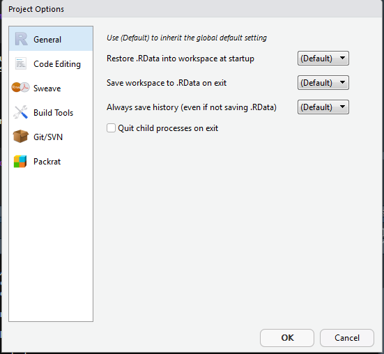
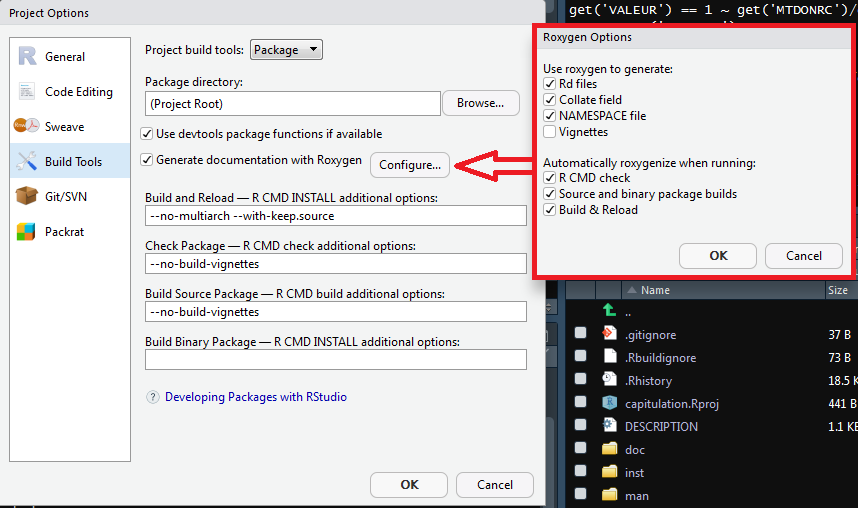
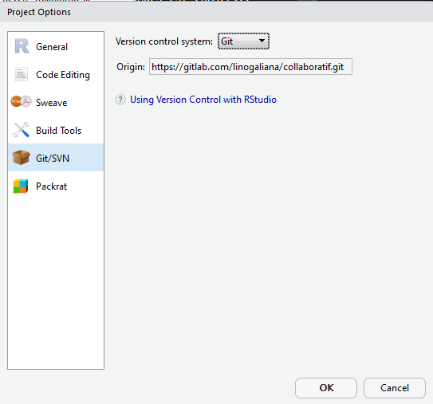
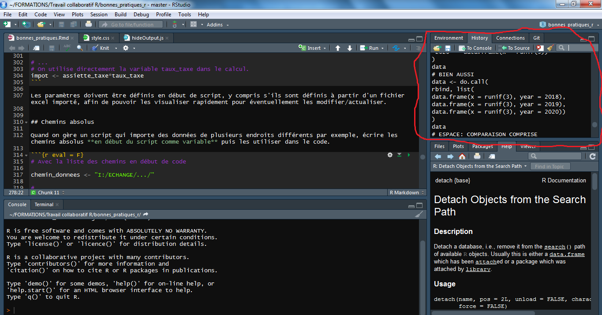

# Projets collaboratifs avec Rstudio

```{r setup, include=FALSE}
knitr::opts_chunk$set(echo = TRUE)
```

Le langage `R` est né dans les années 1990 pour faciliter le traitement de bases de données par rapport à des langages comme `C`. Il s'agit d'un langage *open-source*: n'importe qui peut lire et faire évoluer le code du logiciel. Par conséquent, le fonctionnement du langage `R` est inspiré du fonctionnement du projet le plus poussé dans le domain: le noyau `linux`. Comme dans ce dernier, il existe un écosystème minimal, commun à tous, auquel n'importe qui peut ajouter des fonctionnalités: les *packages*. Par exemple, pour ajouter des fonctionnalités dans le traitement des données textuelles, il existe le package `stringr`. Le socle minimal, commun à tout utilisateur de `R`, est le langage *base*. Celui-ci n'est édité que par la *R Development Core Team* qui, pour assurer la pérénité du langage malgré l'effervescence de la communauté de contributeurs, fait évoluer lentement le langage de base. Face à la multiplication des besoins et des utilisateurs, le nombre de *package* a explosé au cours des dernières années sur le principal dépôt de packages, le `CRAN`:


Le langage `R` a beaucoup évolué au cours des dernières années. Grâce à un certain nombre de *packages*, le langage est plus rapide, plus malléable, plus lisible. Il devient rare d'utiliser exclusivement le langage de base. D'autant que, `R` prend place dans un écosystème offrant, en complément des tâches standards d'un logiciel statistique (maniement de données, programmation...), de nombreuses fonctionalités intéressantes. Cette formation va en aborder un certain nombre: `Rmarkdown` pour intégrer du code dans un document, `Roxygen2` pour documenter un code, `git` pour le contrôle de version, etc. La reproductibilité est au coeur des préoccupations de la communauté `R`, notamment au travers des initiatives de la [ropensci](https://ropensci.org/about/). 

Pour travailler avec `R`, le logiciel le plus pratique est `Rstudio`. Il s'agit d'un environnement de développement (IDE) construit pour `R`, par des utilisateurs de `R`. Il est beaucoup plus pratique que l'éditeur fourni par défaut avec R `R GUI`. `Rstudio` fournit d'abord les fonctionalités traditionnelles d'un IDE, par exemple l'auto-complétion. Mais, il intègre nativement un ensemble de modules facilitant l'utilisation de l'écosystème auquel `R` est intégré. 


## Pourquoi utiliser `Rstudio`?

`Rstudio` est un éditeur de code (IDE) très complet, le plus intégré à l'éco-système `R`. En résumé, `Rstudio`:

* propose de nombreux outils pour écrire et exécuter du code `R`;
* offre la possibilité d'exécuter d'autres langages (`Python`,`C++`...) depuis `R`;
* comprend des extensions pour rédiger et mettre en page facilement des documents avec `R markdown`: documents `LateX`, pages `html`, livres...
* permet d'assurer le contrôle de version avec `git`, de construire et de visualiser des pages `html` et des applications `shiny`.

L'interface a l'aspect suivant^[Pour vos yeux fragile, je vous recommande de changer l'aspect de `Rstudio` pour mettre un fond noir, moins violent `r emo::ji("smile")`. Pour changer le fond, on peut utiliser `Tools > Global Options > Appearance`]:

{width=100%}     

</br></br>

1. La fenêtre *source*: fenêtre où on édite les programmes et fichiers texte. 

2. La fenêtre *console*: fenêtre où le code édité s'exécute. On peut également écrire directement dans la console pour exécuter du code. 

3. La fenêtre `Files`/`Plots`/`Packages`/etc. qui affiche des informations sur l'environnement de travail:
    + *Files*: Naviguer dans les fichiers du dossier de travail;
    + *Plots*: Affichage des graphiques;
    + *Packages*: Liste des packages installés et disponibles;
    + *Help*: Aide des fonctions, ex: `?sum`;
    + *Viewer*: affichage de pages *HTML*, de documents *markdown* compilés.

4. La fenêtre `Environment`/`History`/`git`/etc. qui affiche des informations sur la session `R` active:
    + *Environment*: affichage des objets appartenant à l'environnement global de `R`;
    + *History*: historique des commandes exécutées;
    + *Connections*: connection entre `R` et d'autres systèmes, par exemple serveur `SQL`;
    + Et des onglets optionnels:
        + *Git*: contrôle de version, sur lequel nous reviendrons;
        + *Build*: compilation de packages, sur lequel nous reviendrons également.

## Pourquoi utiliser des projets `Rstudio`?

### Principe

Un programme est reproductible lorsque tout utilisateur est en mesure de faire tourner l'intégralité du programme sans erreur, et de retrouver des résultats identiques. Assurer la reproducibilité d'un programme est une démarche exigeante qui requiert de développer un code propre et clair facilitant une évolution future (le code ne doit jamais être vu comme une production figée).

Les projets `Rstudio` sont des outils qui contribuent à assurer la reproducibilité d'un traitement statistique. Les `projets` Rstudio facilitent la collaboration entre plusieurs développeurs, mais aussi l'organisation du travail lorsqu'on travaille seul.

En résumé, un projet `Rstudio` permet de faire trois choses:

* tenir à jour la liste des programmes qui doivent être exécutés ensemble;
* assurer un suivi précis des modifications de ces programmes;
* de l'ensemble des réglages utilisés pour exécuter les programmes (notamment les options de `R`).

En pratique, un projet `Rstudio` prend la forme d'un fichier `.Rproj`, qui est placé habituellement dans le dossier qui contient les programmes. Voici un exemple minimal:

{width=100%} 


### Avantages des projets `Rstudio`

Un projet `Rstudio` présente de multiples avantages: 

* Il renforce la portabilité: le répertoire de travail par défaut d’un projet est le répertoire où se situe le fichier `.Rproj`. Cela rend les scripts indépendants de l'arborescence de la machine;
* Il centralise l'ensemble des éléments d'un projet: codes, documentation et sorties (articles, présentations);
* Il facilite la compréhension du traitement pour les utilisateurs extérieurs et rend plus aisées les évolutions postérieures du projet;
* Il organise l'interaction entre les fichiers (plusieurs documents codes, R markdown...) et avec les données.

Un point important est qu'un projet `Rstudio` peut rassembler autre chose que des codes `R`:

* Tous les programmes faisant partie du projet, quel qu'en soit le langage (SAS, Stata, R, Python, RMarkdown...);
* Tous les documents utiles pour la compréhension d'un projet (fichiers `txt`, `pdf`...);
* Tous les fichiers nécessaires à l'utilisation d'outils qui sont fréquemment associés aux projets `R` (`git`, `packrat`, `renv`...);
* Eventuellement les données utilisées dans le projet.

Le principe des projets `Rstudio` est d'associer à chaque projet tout le contexte du projet: espace de travail, historique de commandes, variables d'environnement, options de `R`... Par exemple, le package ci-dessous est organisé de manière à ce que les codes (dans le sous-dossier `R`) soient associés à une documentation propre à chaque fonction (sous-dossier `man`) et à une documentation plus globale (sous-dossier `inst`).


## Créer un projet `Rstudio`

### Créer le projet

Pour créer un projet, il suffit de faire `File > New Project`. Il y a trois méthodes pour créer un projet `Rstudio`:

1. Dans un nouveau dossier:
    + Pour un projet tout nouveau.

2. Dans un dossier existant:
    + Commencer à organiser un projet dans lequel des documents ont déjà été produits.

3. Cloner un projet depuis un dépôt:
    + Pour récupérer le projet depuis un dépôt git distant et se connecter à celui-ci. Nous verrons cela plus tard.


{width=100%} 

### Types de projets possibles

Les projets `Rstudio` sont une forme très malléable d'organisation et s'adaptent ainsi facilement à des besoins hétérogènes. `Rstudio` facilite l'organisation du travail en proposant différents projets-types correspondant à des besoins standards: projet de traitement de données, développement d'un package `R`, développement d'une application `shiny`, écriture d'un livre avec `bookdown`... Cela permet d'avoir immédiatement une organisation cohérente avec le besoin: écrire un article ou un livre avec `R` ne demande pas la même organisation des programmes qu'une chaîne de production statistique.

{width=100%}


### A la création du projet: intégrer `git` ?

Un outil supplémentaire pour assurer le suivi du code est le contrôle de version. Cet outil permet d'archiver un code, ainsi que tout l'historique des versions précédentes de ce code, sur un serveur distant. Par exemple, le projet ci-dessous est entreposé sur un dépôt. Il en existe des publics (gitlab, github, framagit) et des dépôts à accès restreints (ex: plateforme innovation). 

{width=100%}

Un logiciel de contrôle de version a deux grands intérêts: il permet d'archiver et de retracer les évolutions d'un code ligne à ligne, et de travailler à plusieurs sur le même code de façon cohérente. Le principal logiciel de contrôle de version est `git`, sur lequel nous reviendrons en détail. 

A ce stade, il faut retenir qu'on peut utiliser `git` dans le cadre d'un projet `Rstudio` de trois façons:

* Initialiser l'usage de `git` en même temps que le projet `Rstudio`;
* Initialiser l'usage de `git` à tout moment, une fois que le projet `Rstudio` est lancé;
* Initialiser le projet `Rstudio` à partir d'un dépôt `git` existant (plus simple, cf. suite).

{width=100%}


### Structure d'un projet `Rstudio`
<!----
Pour les formateurs: plus avancé, pas nécessaire à l'oral
----->

La création d'un projet `Rstudio` se traduit par:

* un fichier `.Rproj` est créé dans le dossier principal. Ce fichier sert à deux choses:
    + Il centralise les options du projet (présentées dans la suite);
    + Il constitue un raccourci pour ouvrir le projet.

* un dossier caché (nommé `.Rproj.user`) est créé dans le dossier principal.
    + les fichiers temporaires du projet sont stockés dans ce dossier (notamment les scripts sauvegardés automatiquement);
    + Ce dossier est notamment automatiquement ignoré par `.Rbuildignore`, `.gitignore` (si vous ne comprenez pas c'est normal).

* le projet est chargé dans `Rstudio` et le nom du projet est affiché dans la barre de projets.


Ci-dessous, en bas à droite, on peut retrouver cette structure avec un fichier `.RProj` et un `.gitignore`:

{width=100%}


On peut accéder aux derniers projets ouverts avec le raccourci en haut à droite:

{width=100%}


## Travailler avec un projet `Rstudio`
<!----
Pour les formateurs: plus avancé, pas nécessaire à l'oral
----->

L'utilisation d'un projet `Rstudio` modifie un certain nombre de réglages de `Rstudio`. Cette section détaille les principaux points.

### A l'ouverture d'un projet
 
Lorsqu'on ouvre un projet `Rstudio` (en double_cliquant sur le fichier `*.Rproj` par exemple):

* Une nouvelle session `R` est ouverte;
* Les fichiers `.Rprofile` (variables d'environnement) et `.RData` (sauvegarde temporaire des données) du projet (si présents) sont chargés;
* Le `.Rhistory` du projet (si présent) est chargé dans le cadre `History` (et permet l'utilisation des boutons haut/bas pour remonter l'histoire des commandes);
* Le *working directory* est par défaut le dossier maître du projet (le dossier dans lequel se situe le fichier `*.Rproj`);
* Les documents précédemment ouverts sont restaurés dans l'éditeur `Rstudio`;
* Les autres paramètres `RStudio` (e.g. position du curseur, etc.) sont restaurés à leur valeur précédent la fermeture du projet.

### A la fermeture du projet

* `.RData` et/ou `.Rhistory` sont sauvegardés dans le projet (si les options du projet l'autorisent);
* Les documents ouverts non sauvegardés sont sauvergardés temporairement (ils sont disponibles dans une version non sauvegardée dans `Rstudio`);
* Les autres paramètres RStudio sont sauvés;
* La session `R` associée au projet est arrêtée.

Sauvegarder et recharger le `.RData` est une **très** mauvaise pratique en termes de reproductibilité. Il se peut très bien que des modifications de la base aient été effectuées sans être inscrite dans un script (via la ligne de commande) ou que celles présentes dans le script n'aient pas été exécutées dans l'ordre. Dans ce cas, la base que vous sauvegardez et à partir de laquelle vous repartez, ne correspondra pas au plan défini par votre script, voire à ce que vous désirez. 

Pour désactiver la sauvegarde du `.RData` à la fermeture du projet, aller dans `Tools > Global Options` et rester dans l'onglet `General`. Chercher `Save workspace to .RData on exit:`, et choisir l'option `Never`


## Définir les options d'un projet

Il est possible de définir des options dans un projet `Rstudio` via `Tools > Project Options...`. Le plus souvent, il suffit de les définir une fois pour toutes, à la création du projet.

### Options générales 

* `(Default)`: utiliser les options globales;
* *Restore .RData into workspace at startup* —  L'option `yes` n'est pas recommandée si les données sont volumineuses (ralentissement du démarrage de la session);
* *Always save history (even when not saving .RData)* — Si on choisit `yes`, le projet conserve l'historique des commandes exécutées. Pour éviter que cet historique soit partagé lorsque `git` est activé (par exemple si vous avez rentré en commande des mots de passe pour accéder à des services type *API*), assurez vous que la ligne `.Rhistory` est présente dans le fichier `.gitignore` (elle y est par défaut mais il vaut mieux vérifier)


{width=60%}

### [Avancé] Options `build`


Dans cet onglet, on peut définir les options de compilation du *package*. Ces options ne sont évidemment utiles que lorsqu'on développe un *package*.
Nous reviendrons dessus plus tard. Il est recommandé de cocher les cases:

* *Use devtools package functions if available*: permet d'utiliser l'outil *devtools* pour créer le package;
* *Generate documentation with Roxygen*: permet d'automatiser la création des fichiers de documentation à partir du package `Roxygen`.

On peut ajouter des options à la compilation. Par exemple, pour gagner du temps, on pourra utiliser l'option `--no-build-vignettes` qui évite de re-compiler les vignettes (qui peuvent mettre du temps à compiler si elles sont longues).

{width=60%}


### [Avancé] Options `git` 

Si vous désirez utiliser un système de gestion de version, sélectionnez `git`. Cela n'est possible que si le logiciel `git` est installé (cf. chapitre dédié). Si vous avez connecté votre projet à un dépôt distant, la ligne *Origin* vous rappelle l'adresse de celui-ci.


{width=60%}


## Edition de code dans `Rstudio`

### Raccourcis utiles

Pour gagner du temps, il est important d'utiliser les raccourcis pour les commandes répétitives. En voici une liste non exhaustive:

* `Ctrl`+`Enter`: exécuter les lignes sélectionnées;
* `Tab`: autocomplétion;
* `Ctrl` + `Alt` + `R`: exécuter l'ensemble d'un script;
* `Ctrl` + `I`: réindenter code;
* `Ctrl` + `Shift` + `A`: reformater code;
* `Alt` + `Up/Down`: déplacer une ligne sans faire copier-coller;
* `Ctrl` + `Deplacement souris`: passage en édition verticale (curseur en colonne);
* `Ctrl` + `Shift` + `M`: insérer pipe `%>%`;
* `Alt`+ `6` (windows): insérer opérateur assignation `<-`;
* `Ctrl` + `Shift` + `F`: rechercher une expression dans plusieurs fichiers;
* `Ctrl` + `Shift` + `K`: compilation d'un *markdown* (*knitter* en bon français);
* `Ctrl` + `Shift` + `Alt` + `M`: renommer la variable dans la portée (*scope*), nous verrons ce dont il s'agit dans la prochaine leçon.


## Addins `Rstudio`

### Addins

Les `addins` sont des outils pratiques pour gagner du temps dans l'édition du code. Ils génèrent automatiquement du code ou du texte utile pour les *markdown*. Par exemple, il est possible d'utiliser un `addin` pour construire un graphique avec le package `ggplot2`, puis de récupérer le code qui produit le graphique.

Les `addins` sont bien intégrés à `Rstudio`, et donc faciles à utiliser. Pour avoir accès à la liste de tous les `addins`, il suffit d'exécuter la commande `install.packages('addinslist')`, puis de cliquer en haut de l'éditeur sur `Addins > Browse Rstudio addins`. 

Pour utiliser un `addin` il faut:
* l'installer. Pour cela on peut utiliser le package `addinslist`, en cliquant en haut de l'éditeur sur `Addins > Browse Rstudio addins`, puis en cliquant sur le nom de l'`addin` qu'on veut installer. [Avancé] Rappel: Les `addins` sur `CRAN` peuvent être installés directement; les `addins` sur `github` nécessitent d'avoir configuré le proxy.
* L'exécuter en cliquant sur son nom en haut de l'éditeur `Addins > [addin_name]`.

{width=100%}

{width=100%}

<!-----------
### Un exemple


---------> 

### Quelques `addins` utiles


* `snippetsaddins`: convertir automatiquement automatiquement les `/` en `\` pour avoir des chemins valides;
    + *"monchemin/toto/fichier.csv"* -> *"monchemin\\toto\\fichier.csv"*
* `ggedit`: aide pour générer un code pour graphiques `ggplot2`;
* `JADD`: en sélectionnant une fonction, on assigne les paramètres par défaut dans l'environnement;
* `questionr`: recodage facilité des variables `factor`;
* `trackmd`: un outil de *track change* pour `markdown`.

{width=90%}

### Cheatsheets

On peut trouver des aides mémoires en ligne grâce aux [cheatsheets](https://www.rstudio.com/resources/cheatsheets/). Celle relative à `Rstudio` est disponible [ici](https://github.com/rstudio/cheatsheets/raw/master/rstudio-ide.pdf)

## Annexe

### Rhistory

\hypertarget{label}{\beamerbutton{Exemple de cadre `History`}}

{width=100%}
    