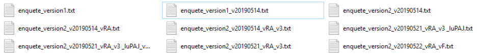
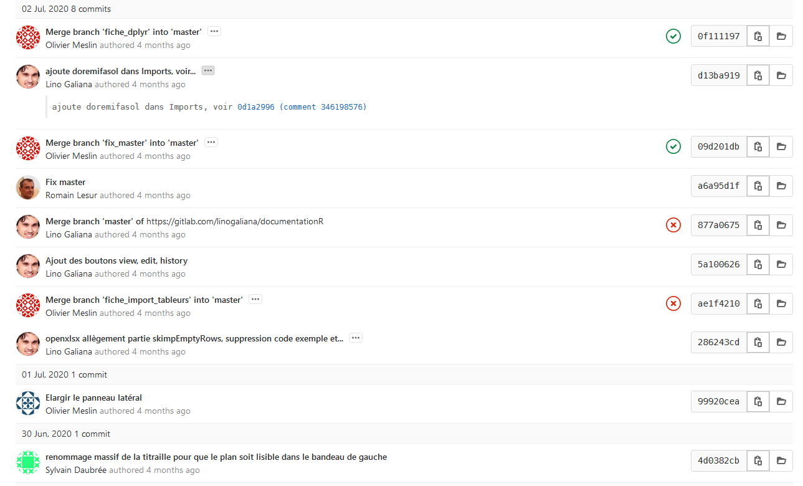
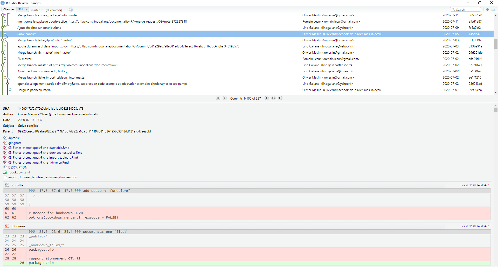
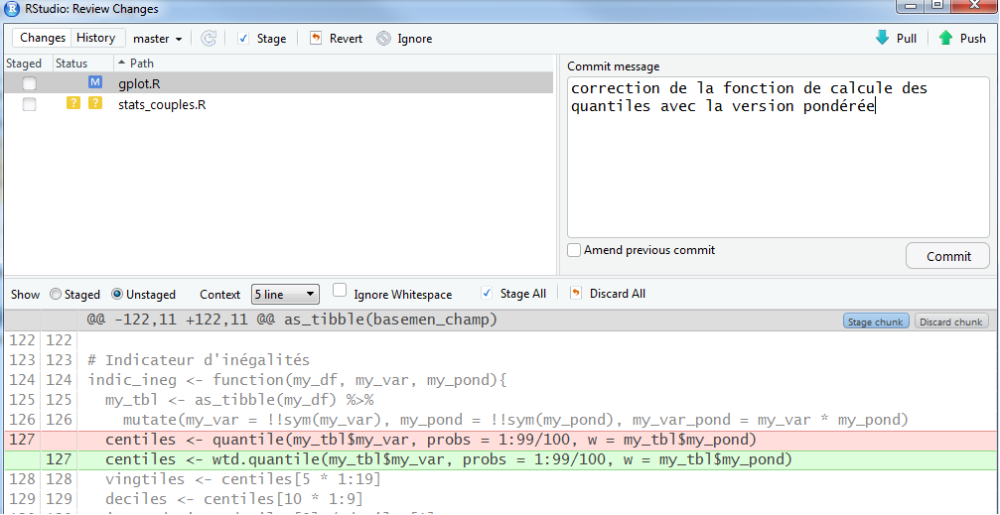

# Pourquoi utiliser la gestion de version ?

```{r setup, include=FALSE}
knitr::opts_chunk$set(echo = TRUE, eval = FALSE)
htmltools::tagList(rmarkdown::html_dependency_font_awesome())
```

Nos travaux statistiques évoluent constamment (productions annuelles, nouvelles enquêtes, etc.) et nous travaillons souvent à plusieurs.
En outre, le maintien de la qualité de nos chaînes de traitement nécessite un archivage détaillé et facilement accessible. 

Tous les statisticiens se sont déjà demandé (ou à leurs collègues) : 

* quelle était la bonne version d'un programme 
* qui était l'auteur d'un bout de code en particulier
* si un changement était important ou juste un essai
* comment fusionner des programmes
* etc.

Souvent l'organisation des programmes partagés est une gageure et ressemble à une longue liste d'archivages manuels et arbitraires.

**Exemple d'une organisation de fichiers à l'ancienne**
{width=100%}  

Pourtant, il existe un outil informatique puissant afin de répondre à tous ces besoins : la gestion de version (*version control system* (VCS) en anglais). Ses avantages sont incontestables et permettent de facilement :

* enregistrer l'historique des modifications d'un ensemble de fichiers 
* revenir à des versions précédentes d'un ou plusieurs fichiers
* rechercher les modifications qui ont pu créer des erreurs
* partager ses modifications et récupérer celles des autres
* proposer des modifications, les discuter, sans pour autant modifier la dernière version existante
* identifier les auteurs et la date des modifications

En outre, ces outils fonctionnent avec tous les langages informatiques (texte, R, Python, SAS, $\LaTeX$, Java, etc.) car reposent sur la comparaison des lignes et des caractères des programmes, indépendamment du langage.

En bref, c'est **LA** bonne manière pour partager des codes et travailler à plusieurs sur un projet statistique (études ou production).

## Conserver et archiver du code

Une des principales fonctionnalités de la gestion de version est de conserver l'ensemble des fichiers de façon sécurisée et de proposer un archivage structuré des codes. Les fichiers sont stockés dans un **dépôt**, qui correspond au projet (par exemple, le modèle Ines). C'est là où sont stockéees toutes les informations utiles au partage des codes.

Dans la gestion de version, tout repose dans la comparaison des changements dans les programmes et la présentation de l'historique de ces modifications. Chaque modification (ajout, suppression ou changement) sur un ou plusieurs fichiers est identifiée par son auteur, sa date et un bref descriptif^[Plus précisément, chaque modification est identifiée de manière unique par un code `SHA` auquel est associé l'auteur, l'horodatage et des méta-données (par exemple le message descriptif associé)]. Chaque changement est donc unique et aisément identifiable quand ils sont classés par ordre chronologique par exemple. Les modifications transmises au dépôt commun sont appelées **commit**. Cette étape joue un rôle central et sera détaillée plus loin.

**Un exemple d'historique d'un projet sur GitLab issu du projet [utilitR](https://gitlab.com/linogaliana/documentationR/-/commits/master/)**
{width=100%}  

**Un exemple d'historique d'un projet via RStudio**
{width=100%} 

Avec la gestion de version, sur son poste de travail, les dizaines (centaines ?) de programmes organisés à la main n'existent plus. Tout est regroupé dans un seul dossier, rassemblant les éléments du dépôt à une date donnée, généralement la plus récente. Au sein du dépôt, tout l'historique est stocké et accessible rapidement. Si l'on souhaite travailler sur la dernière version des programmes (ou sur une ancienne version spécifique), il n'y a plus besoin de conserver les autres fichiers car ils sont dans l'historique du projet. Il est alors possible de choisir sur quelle version on veut travailler (la dernière commune à tout le monde, la sienne en train d'être développée, celle de l'année dernière, etc.).

## Travailler efficacement en équipe

Le deuxième avantage de la gestion de version représente une amélioration notable du travail en équipe sur des codes en commun. Que ce soit au sein d'un modèle cogéré (Ines, Destinie, etc.), de gros projets (Nautile) ou de chaînes de traitement récurrentes (enquête emploi, comptes trimestriels, etc.), la collaboration est courante lors des travaux statistiques. La gestion de version permet de collaborer simplement et avec méthode. De façon organisée, elle permet de:

* travailler en parallèle et fusionner facilement du code
* partager une documentation des programmes grâce :
    + aux commentaires des modifications
    + à la possibilité d'une documentation commune et collaborative
* trouver rapidement des erreurs et en diffuser rapidement la
correction

**Exemple de détails d'une modification**
{width=100%} 

:::: {.remarque data-latex=""}


L'usage individuel, c'est-à-dire seul sur son projet, permet aussi de "travailler en équipe avec soi même" car il permet de retrouver des mois plus tard le contenu et le contexte des modifications. Cela est notamment précieux lors des changements de poste ou des travaux réguliers mais espacés dans le temps (par exemple, un mois par an chaque année).

Même en travaillant seul sur un projet, on collabore avec un *moi* futur (qui aura vraisemblablement oublié le contenu ou la raison de la modification des fichiers). Donc il est également recommandé de travailler en gestion de version sur un projet individuel.

::::


## Améliorer la qualité des codes

Le fonctionnement de la gestion de version, reposant sur l'archivage structuré des modifications et les commentaires les accompagnant, renforce la qualité des programmes informatiques. Ils sont plus documentés, plus riches et mieux structurés. C'est pour cette raison que le contrôle de version est un outil puissant pour toute production statistique : toute personne travaillant sur des programmes, `SAS` y compris, gagne à utiliser du contrôle de version. 

Quand il s'agit de modèles statistiques, ou de chaînes de traitement statistique, constitués de nombreux programmes, la gestion de version permet :

* l'amélioration de la qualité des modèles par des méta-données riches, 
* un gain de place pour stocker les historiques,
* leur diffusion simplifiée et harmonisée. 

En outre, lors de l'ouverture des modèles au format *open source* par exemple, leur diffusion publique correspond aux standards des communautés de logiciels libres et aux usages recommandés pour documenter des programmes informatiques. Cela permet aux utilisateurs ou aux agents découvrant des chaînes de traitement de mieux s'approprier les programmes.

## Usage quotidien : un exemple avec le modèle Ines

Le modèle Ines est co-développé par l'Insee et la Drees ainsi que la Cnaf depuis 2018. Sous licence libre, il est disponible en *open-source*. Il est organisé dans une *forge* qui regroupe le code, un wiki, une documentation, un forum et différents outils collaboratifs (ces éléments seront présentés [plus loin](#gitlab)). Les utilisateurs y ont accès via la [plateforme Adullact](https://adullact.net/projects/ines-libre). Le dépôt regroupe donc les programmes, l'historique des modifications et les archives des différentes versions ('Ines 2018' par exemple). Les chargés d'étude ont une copie locale du projet sur leur poste de travail. Les changements sont mis à jour et disponibles en temps réel. 

**Envoi d'une modification avec TortoiseSVN : commit**

{width=100%}   

**Historique d’un fichier ou dossier : log**
{width=100%}  

**Recherche efficace une erreur : blame**
{width=100%}  

D'une manière générale, il existe plusieurs manières d'utiliser le contrôle de version : 

* en ligne de commande, via [git bash](https://gitforwindows.org/), par exemple ;
* avec une interface graphique spécialisée, par exemple [tortoise git](https://tortoisegit.org/) ou [GitHub Desktop](https://desktop.github.com/) ;
* avec un logiciel de développement : la plupart des logiciels de développement ([RStudio](https://rstudio.com/) pour `R`, [PyCharm](https://www.jetbrains.com/fr-fr/pycharm/) ou [jupyter](https://jupyter.org/) pour `python`, [atom](https://atom.io/), etc.) proposent tous des modules graphiques facilitant l'usage de `git` dont les fonctionnalités sont très proches.

Dans ce support, nous présentons le contrôle de version via `RStudio`, la solution que nous recommandons en raison de sa simplicité. Elle rend le recours à la ligne de commande marginal voire inutile. Elle est également plus rapide et facilement implémentable à l'Insee.

## Avec ou sans gestion de versions

Le tableau suivant compare les usages au temps (pré-historique ?) de la programmation sans gestion de version avec les modes de travail si on y a recours :

|                      |      Avant            |  Gestion de version  |
|:---------------------|----------------------:|---------------------:|
|Archivage             | à la main             | automatique          |
|Envoi de modification | mail, dossier partagé | code partagé         |
|Fusion de code        | copié-collé           | simple, sûr          |
|Versions du modèle    | dossiers archivés     | historique riche     |
|Gestion des erreurs   | à la main             | méthodique           |
|

Beaucoup de supports existent en ligne, il faut parfois s'en méfier car les usages peuvent différer et sont souvent spécifiques aux usages et aux installations (cf. *infra*). Cette présentation [*Git for humans*](https://speakerdeck.com/alicebartlett/git-for-humans) didactique courte mais en anglais présente les avantages de l'usage de `GIT`.

En conclusion, que ce soit au sein d'un travail collaboratif en équipe ou sur ses propres projets individuels, notre temps est consacré à la programmation réellement utile. Plus de temps perdu ! L'organisation du travail est efficace grâce :

* aux améliorations rapides des codes
* au partage efficace des tâches
* à la recherche puissante des erreurs
* à un archivage géré automatiquement avec des méta-données
* à des outils généralisés et documentés en ligne.

La gestion de version est donc le meilleur moyen de partager du code (entre équipes internes,
lors des changements de poste, pour l'archivage, lors de l'ouverture au libre, etc.). Ces outils viennent du développement informatique et de la création des logiciels et applications. Les traitements statistiques sont également des chaînes informatiques et sont donc pleinement adaptés pour s'appuyer sur les outils de gestion de version.
