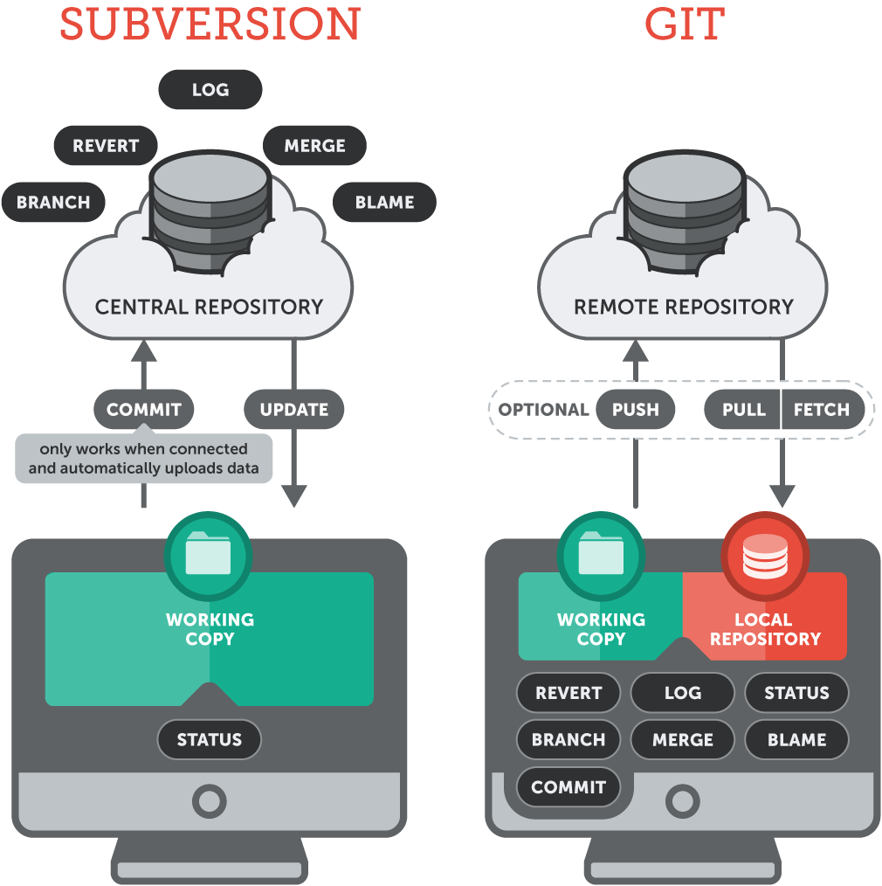
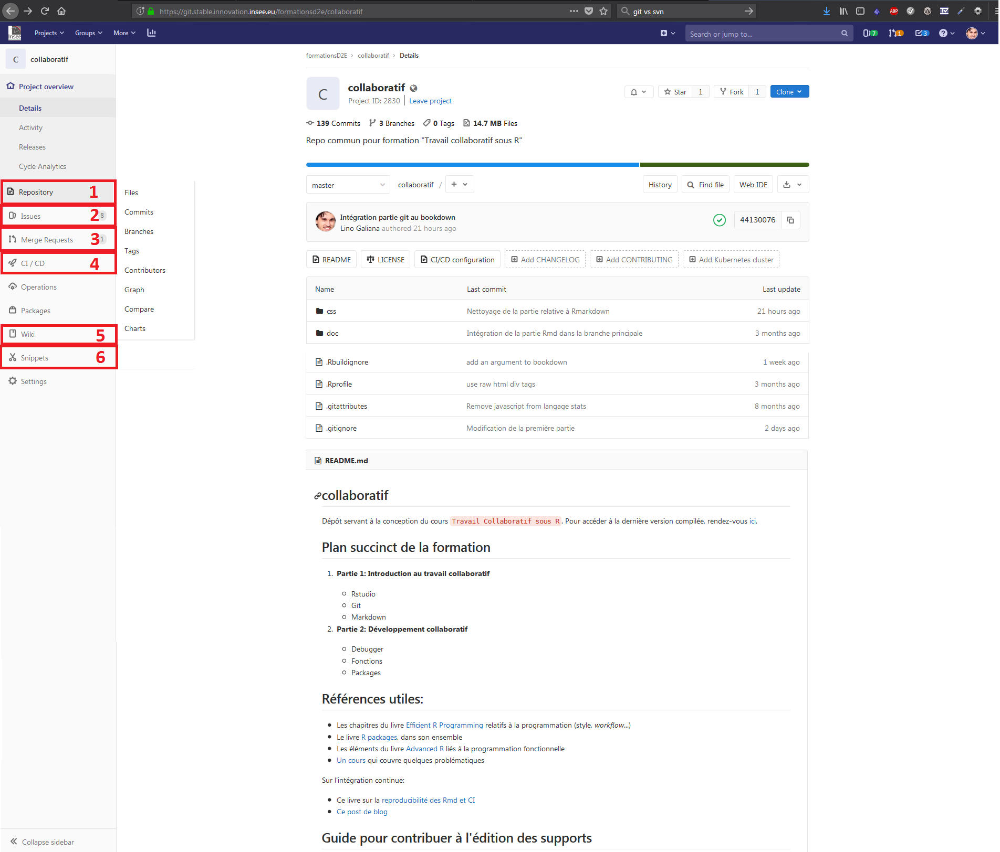
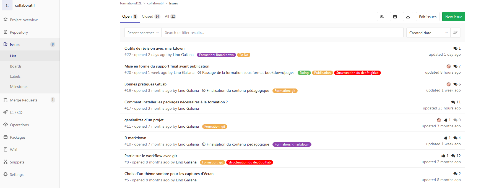
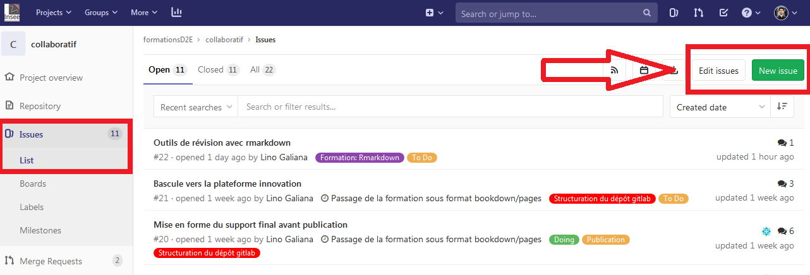
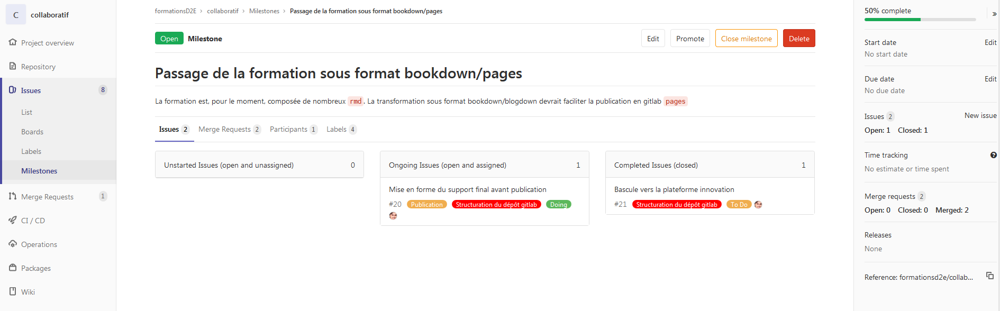
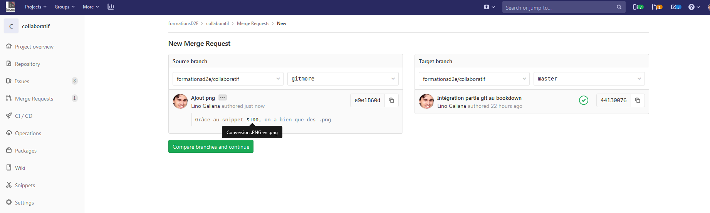
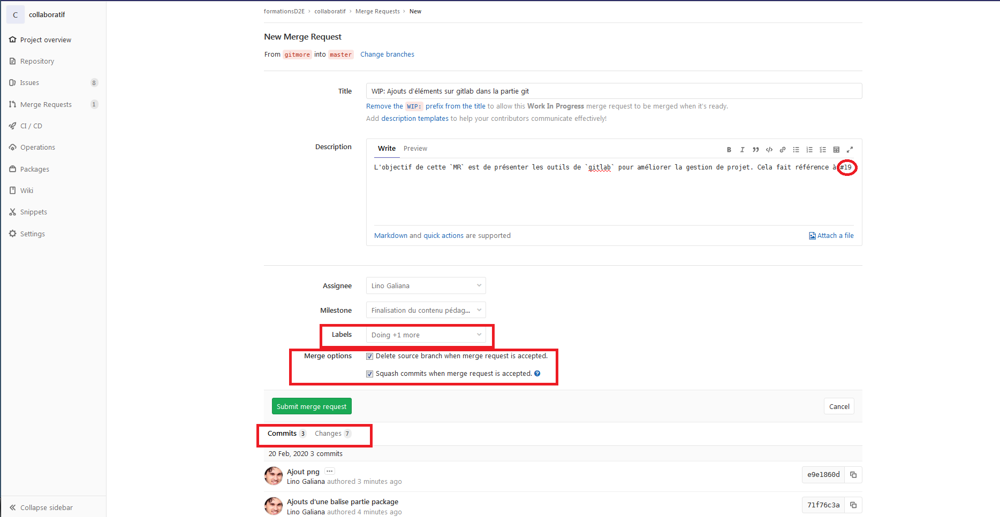
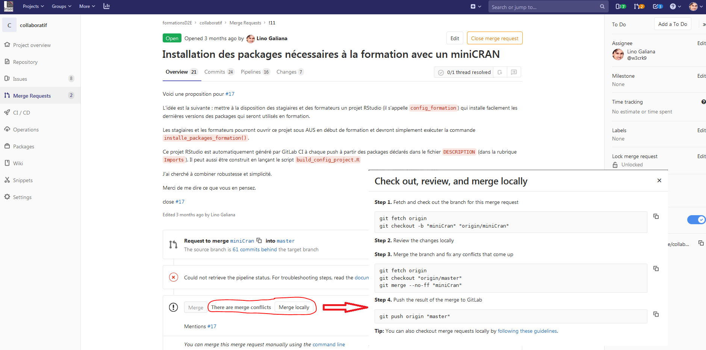
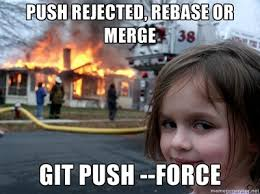
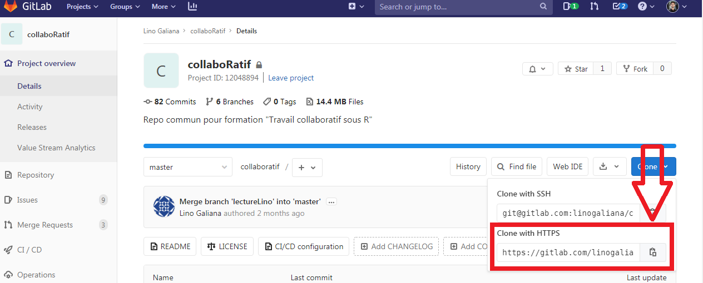

# Utiliser GIT avec R à l'Insee {#git}

```{r setup, include=FALSE}
knitr::opts_chunk$set(echo = TRUE, eval = FALSE)
```


## Pourquoi utiliser la gestion de version ?

Nos travaux statistiques évoluent constamment (productions annuelles, nouvelles enquêtes, etc.) et nous travaillons souvent à plusieurs. En outre, le maintien de la qualité de nos chaînes de traitement nécessite un archivage détaillé et facilement accessible. 

Tous les statisticiens se sont déjà demandé (ou à leurs collègues) : 

* quelle était la bonne version d'un programme 
* qui était l'auteur d'un bout de code en particulier
* si un changement était important ou juste un essai
* comment fusionner des programmes
* etc.

**Exemple d'une organisation de fichiers à l'ancienne**
{width=100%}  

Il existe un outil informatique puissant afin de répondre à tous ces besoins : la gestion de version (*version control system* (VCS) en anglais). Ses avantages sont incontestables et permettent de facilement :

* enregistrer l'historique des modifications d'un ensemble de fichiers 
* revenir à des versions précédentes d'un ou plusieurs fichiers
* rechercher les modifications qui ont pu créer des erreurs
* partager ses modifications et récupérer celles des autres
* proposer des modifications, les discuter, sans pour autant modifier la dernière version existante
* identifier les auteurs et la date des modifications

En outre, ces outils fonctionnent avec tous les langages informatiques (texte, R, Python, SAS, $\LaTeX$, Java, etc.) car reposent sur la comparaison des lignes et des caractères des programmes.

### Conserver et archiver du code

Une des principales fonctionnalités de la gestion de version est conserver l'ensemble des fichiers de façon sécurisée et de proposer un archivage structuré des codes. Les fichiers sont stockés dans un **dépôt**, qui constitue le projet (par exemple, le modèle Ines).

Tout repose dans la gestion et la présentation de l'historique des modifications. Chaque modification (ajout, suppression ou changement) sur un ou plusieurs fichiers est identifiée par son auteur, sa date et un bref descriptif^[Plus précisément, chaque modification est identifiée de manière unique par un code `SHA` auquel est associé l'auteur, l'horodatage et des méta-données (par exemple le message descriptif associé)]. Chaque changement est donc unique et aisément identifiable quand ils sont classés par ordre chronologique. Les modifications transmises au dépôt sont appelées **commit**.

**Un exemple d'historique d'un projet sur GitLab**
{width=100%}  

**Un exemple d'historique d'un projet via RStudio**
{width=100%} 

Sur son poste de travail, les dizaines (centaines ?) de programmes organisés à la main n'existent plus. Tout est regroupé dans un seul dossier, rassemblant les éléments du dépôt. Au sein du dépôt, tout l'historique est stocké et accessible rapidement. Si on souhaite travailler sur la dernière version des programmes (ou sur une ancienne version spécifique), il n'y a plus besoin de conserver les autres fichiers car ils sont dans l'historique du projet. Il est alors possible de choisir sur quelle version on veut travailler (la dernière commune à tout le monde, la sienne en train d'être développée, celle de l'année dernière, etc.).

### Travailler efficacement en équipe

Le deuxième avantage de la gestion de version représente une amélioration notable du travail en équipe sur des codes en commun. Que ce soit au sein d'un modèle cogéré (Ines, Destinie, etc.), de gros projets (Nautile) ou de chaînes de traitement récurrentes (enquête emploi, comptes trimestriels, etc.), la collaboration est courante lors des travaux statistiques. La gestion de version permet de collaborer simplement et avec méthode. De façon organisée, elle permet de:

* travailler en parallèle et fusionner facilement du code
* partager une documentation des programmes grâce :
    + aux commentaires des modifications
    + à la possibilité d'une documentation commune et collaborative
* trouver rapidement des erreurs et en diffuser rapidement la
correction

**Exemple de détails d'une modification**
{width=100%} 

L'usage individuel, c'est-à-dire seul sur son projet, permet aussi de "travailler en équipe avec soi même" car il permet de retrouver des mois plus tard le contenu et le contexte des modifications. Cela est notamment précieux lors des changements de poste ou des travaux réguliers mais espacés dans le temps (par exemple, un mois par an chaque année). Même lorsqu'on travaille tout seul, on collabore avec un *moi* futur qui peut ne plus se souvenir de la modification des fichiers. 


### Améliorer la qualité des codes

Le fonctionnement de la gestion de version, reposant sur l'archivage structuré des modifications et les commentaires les accompagnant, renforce la qualité des programmes informatiques. Ils sont plus documentés, plus riches et mieux structurés. C'est pour cette raison que le contrôle de version ne doit pas être considéré comme un outil réservé à des développeurs : toute personne travaillant sur des programmes informatiques, `SAS` y compris, gagne à utiliser du contrôle de version. 

Quand il s'agit de modèles statistiques, ou de chaînes de traitement statistique, constitués de nombreux programmes, la gestion de version permet :

* l'amélioration de la qualité des modèles par des méta-données riches, 
* un gain de place pour stocker les historiques,
* leur diffusion simplifiée et harmonisée. 

Lors de l'ouverture des modèles, leur diffusion publique correspond aux standards des communautés de logiciels libres et aux usages recommandés pour documenter des programmes informatiques. Cela permet aux utilisateurs ou aux agents découvrant des chaînes de traitement de mieux s'approprier les programmes.

### Usage quotidien : un exemple avec le modèle Ines

Le modèle Ines est co-développé par l'Insee et la Drees ainsi que la Cnaf depuis 2018. Sous licence libre, il est disponible en *open-source*. Il est organisé dans une *forge* qui regroupe le code, un wiki, une documentation, un forum et différents outils collaboratifs (ces éléments seront développés dans la partie ***). Les utilisateurs y ont accès via la [plateforme Adullact](https://adullact.net/projects/ines-libre). Le dépôt regroupe donc les programmes, l'historique des modifications et les archives des différentes versions ('Ines 2018' par exemple).

Les chargés d'étude ont une copie locale du projet sur leur poste de travail. Les changements sont mis à jour et disponibles en temps réel. Il existe plusieurs manières d'utiliser le contrôle de version : 

* en ligne de commande, via [git bash](https://gitforwindows.org/), par exemple ;
* avec une interface graphique spécialisée, par exemple [tortoise git](https://tortoisegit.org/) ou [GitHub Desktop](https://desktop.github.com/) ;
* avec un logiciel de développement : la plupart des logiciels de développement ([RStudio](https://rstudio.com/) pour `R`, [PyCharm](https://www.jetbrains.com/fr-fr/pycharm/) ou [jupyter](https://jupyter.org/) pour `python`, [atom](https://atom.io/), etc.) proposent tous des modules graphiques facilitant l'usage de `git` dont les fonctionnalités sont très proches.

Dans ce chapitre, nous proposons d'utiliser le contrôle de version via `RStudio`. Cela rend le recours à la ligne de commande marginal. 

**Envoi d'une modification avec TortoiseSVN : commit**

{width=100%}   

**Historique d’un fichier ou dossier : log**
{width=100%}  

**Recherche efficace une erreur : blame**
{width=100%}  


### Avec ou sans gestion de versions

Le tableau suivant compare les usages au temps (pré-historique ?) de la programmation sans gestion de version avec les modes de travail si on y a recours.

|                      |      Avant            |  Gestion de version  |
|:---------------------|----------------------:|---------------------:|
|Archivage             | à la main             | automatique          |
|Envoi de modification | mail, dossier partagé | code partagé         |
|Fusion de code        | copié-collé           | simple, sûr          |
|Versions du modèle    | dossiers archivés     | historique riche     |
|Gestion des erreurs   | à la main             | méthodique           |
|

Beaucoup de supports existent en ligne, il faut parfois s'en méfier car les usages peuvent différer (cf. *infra*). Cette présentation [*Git for humans*](https://speakerdeck.com/alicebartlett/git-for-humans) didactique courte mais en anglais présente les avantages de l'usage de `GIT`.

En conclusion, que ce soit au sein d'un travail collaboratif en équipe ou sur ses propres projets individuels, notre temps est consacré à la programmation réellement utile. L'organisation du travail est efficace grâce :

* aux améliorations rapides des codes
* au partage efficace des tâches
* à la recherche puissante des erreurs
* à un archivage géré automatiquement avec des méta-données
* à des outils généralisés et documentés en ligne.

La gestion de version est donc le meilleur moyen de partager du code (entre équipes internes,
lors des changements de poste, pour l'archivage, lors de l'ouverture au libre, etc.). Ces outils viennent de l'informatique et de la création des logiciels et applications. Les traitements statistiques sont également des chaînes informatiques et sont donc pleinement adaptés pour être traités avec les outils de gestion de version.

## Des bases de GIT 

Les deux outils de gestion de version les plus répandus sont GIT et SVN. L'Insee a utilisé SVN pendant un temps mais privilégie GIT maintenant en raison de plusieurs avantages. 

GIT est un logiciel qui est installé sur son poste et celui de ses collaborateurs. Il est open source, gratuit et très répandu. Ainsi, une vaste documentation est disponible en ligne ou les forums d'entraide de type `stackoverflow` (voir par exemple le tag ['GIT'](https://stackoverflow.com/questions/tagged/git) ). Sur la plateforme `GitHub`, la [page de tutoriel](http://try.github.io/) regroupe différents supports. Des vidéos pédagogiques sont fournies sur [git-scm.com](https://git-scm.com/videos).

Cependant, face au foisonnement des pratiques et des ressources en ligne, il est recommandé d'adopter et suivre les bonnes pratiques pour chaque projet. Les configurations et les habitudes diffèrent et une solution proposée sur un forum ou dans un livre peut ne pas être adaptée dans notre cas précis. C'est l'objectif de ce support de rassembler les pratiques les plus courantes et présenter l'utilisation recommandée de la gestion de version avec RStudio à l'Insee.

La genèse de Git correspond au noyau du système d'exploitation Linux qui gérait les patchs et les archives pendant les années 1990. À partir de 2005, Linus Torvalds, aussi inventeur de Linux, développe un successeur avec pour objectifs, la vitesse, la simplicité, la possibilité de développements en parallèle (les futures **branches**), le tout avec un usage compact des données. Depuis, son usage a largement dépassé celui de SVN.

SVN est dit centralisé alors que GIT est dit distribué. Cela signifie notamment que chaque collaborateur possède une copie en propre de l'ensemble du projet sur son poste de travail. Cela implique un avantage important de GIT en terme de sécurité des codes (qui risquent beaucoup moins d'être perdus) et la  rapidité des partages des modifications. En outre, contrairement à SVN pour lequel il faut être connecté à un serveur, il n'est pas besoin d'être connecté avec GIT et on peut travailler en local. Ainsi, on transmet ses modifications quand on le souhaite ou peut et cela facilite le travail distant.

Enfin, un des grands avantages pratiques de GIT est son intégration native dans l’interface RStudio ainsi que dans les plateformes GitHub et GitLab (voir parties ci-après). À l'origine utilisé en ligne de commandes (et utilisé comme tel par les développeurs), les interfaces graphiques actuelles permettent de s'en passer dans l'immense majorité des situations.




### Le B.A-BA

Les programmes s’organisent sur un répertoire distant commun
(dépôt ou `r with_def("repository")`) et sont manipulés sur les postes indidivuels dans des
dossiers locaux (**working directory**). Le dépôt distant peut par exemple être hébergé sur une plateforme de type **GitLab**.

Les trois manipulations les plus courantes sont les suivantes et représentées sur le diagramme ci-après : 

+ `r with_def("pull")` : je récupère la dernière version des codes du dépôt distant
+ `r with_def("commit")` : je valide mes modifications avec un message qui les expliquent
+ `r with_def("push")` : je transmets mes modifications validées au dépôt distant


{width=100%} 

De manière plus précise, il y a trois étapes avant d'envoyer les modifications validées (`r with_def("commit")`) au dépôt. Elles se définissent en fonction des commandes qui permet de les appliquer quand Git est utilisé en ligne de commandes :

* `diff` : inspection des modifications. Cela permet de comparer les fichiers modifiés et de distinguer les fichiers ajoutés ou supprimés
* `staging area` : sélection des modifications. L'un des intérêts de `git` est que le choix des modifications à soumettre est très fin: on peut découper les modifications d'un fichier en plusieurs morceaux cohérents
* `r with_def("commit")` :  validation des modifications sélectionnées (avec commentaire).

Les deux diagrammes ci-dessous représentent ces différences étapes et les commandes qui permet de passer d'un état à l'autre.

{width=100%} 

{width=100%} 


Lors d'un `r with_def("commit")`, le message de validation est très important:

* décrit les modifications contenues dans le commit
* importance de l’homogénéité des modifications contenues dans un commit
* à l’attention des autres développeurs

Chaque `r with_def("commit")` est identifié de façon unique par un `r with_def("hash")` (ex: `441300764de91c376`), un numéro peu intelligible pour un humain mais qui permet au système de contrôle de version de gérer proprement chaque modification.

Ensuite, les deux fonctions `r with_def("push")` et `r with_def("pull")` permettent la mise à jour du projet local par rapport au distant et réciproquement. Lors de ces étapes des **conflits** peuvent apparaître, c'est par exemple le cas lors que deux personnes ont modifié le même programme simultanément. 

Tout d'abord, il est possible de minimiser l'apparition de conflits en amont en validant souvent les modifications (`commit`) :

* par petits lots homogènes et en préférant peu de fichiers
* en communiquant avec les autres membres de l’équipe en disant sur quoi on travaille et en prévenant en cas de grosse modification
* mettre à jour sa copie locale régulièrement via `r with_def("pull")` ou `r with_def("fetch")`, voire dès qu'on commencer à travailler sur un projet.


:::: {.rmdimportant data-latex=""}

De manière générale, **il ne faut pas avoir peur des conflits**. Les outils sont faits pour les gérer avec rigueur et méthode (voir EXERCICE). Avec GIT, il est très rare de faire des bêtises et on peut toujours réparer **à condition de s'en tenir aux commandes de base** (`r with_def("commit")`, `r with_def("push")`, `r with_def("pull")` et `r with_def("merge")`). Cependant, il existe des commandes qui peuvent définitivement endommager votre projet, la plus destructrice étant `git push --force` que vous ne devriez jamais utiliser. Faites très attention en lisant des tutoriels en ligne car certains sont à destination d'utilisateurs avancés et comprennent ces commandes "à risque". 

::::

### Les branches

C'est une des fonctionnalités les plus pratiques de la gestion de version. La création de `r with_def("branches")` dans un projet (qui devient ainsi un arbre) permet de développer en parallèle des correctifs ou une nouvelle fonctionnalité sans perturber le dépôt commun. Cela permet de séparer le nouveau développement et de faire cohabiter plusieurs versions, pouvant évoluer séparément ou pouvant être facilement rassemblées. Git est optimisé pour le travail sur les branches.

<blockquote class="twitter-tweet"><p lang="fr" dir="ltr">Petite révélation du jour : <a href="https://twitter.com/hashtag/git?src=hash&amp;ref_src=twsrc%5Etfw">#git</a>, c&#39;est le meilleur outil pour te rappeler que nous sommes proches des singes : si t&#39;es pas sur une branche, t&#39;es dans la merde</p>&mdash; Nicolas Delsaux (\@riduidel) <a href="https://twitter.com/riduidel/status/1229768054109855747?ref_src=twsrc%5Etfw">February 18, 2020</a></blockquote> <script async src="https://platform.twitter.com/widgets.js" charset="utf-8"></script> 

Les branches peuvent avoir des durées de vie plus ou moins longues selon leurs objectifs : nouvelle fonctionnalité, résolution de bugs, environnement de développement ou de production, etc.

Trois principales fonctionnalités existent :

* `git branch` : création d'une branche
* `git checkout` : pour changer de branche
* `git merge` : fusion de branche

Dans un projet collaboratif, une branche dite **master** joue le rôle du tronc. C'est autour d'elle que vont pousser ou se greffer les branches comme le montre l'exemple ci-dessous.

{width=100%} 

### Quelques compléments de GIT 

L'outil GIT permet un grand nombre de fonctionnalités avancées. Les manipulations les plus complexes ne peuvent être effectuées qu'en ligne de commande, mode de fonctionnement privilégié des développeurs avancés. Mais pour les statisticiens, il est possible d'effectuer des commandes avancées de façon intégrée.

Une des commandes les plus utiles pour un travail collaboratif pour les statisticiens permet de ne pas partager les bases de données ou tout type de fichier, soit trop volumineux, soit confidentiel : 

* `git ignore` : modifier le fichier permet de conserver des fichiers en privé, c'est-à-dire qu'ils n'apparaissent pas dans le dossier partagé. 

Ainsi, il est crucial de ne pas partager les données et exclure les fichiers de la forme `*.csv` ainsi que tous les fichiers de sortie, notamment au format `*.html` ou `*.pdf`. Les fichiers à exclure du contrôle de version sont listées dans un fichier nommé `.gitignore` (ex [ici](https://git.stable.innovation.insee.eu/formationsd2e/collaboratif/blob/master/.gitignore)). Si le dossier de travail ne comporte pas ce fichier et que vous désirez exclure un type de fichier, par exemple `csv`, vous pouvez le package `usethis` avec lequel vous deviendrez familier dans la partie \@ref(#package):

```{r, eval = FALSE}
# Taper dans la console RStudio
usethis::use_git_ignore("*.csv")
```

:::: {.rmdimportant data-latex=""}

On ne met sous contrôle de version avec git que les fichiers "source" qui sont des fichiers texte.

En particulier, il ne faut pas mettre sous contrôle de version et il faut donc inclure dans le fichier `.gitignore` :

- les données (`.csv`, `.xlsx`, `.sas7bdat`, `.Rdata`...)
- les fichiers produits grâce au code source (`.pdf`, `.html`, `.odt`, `.docx`, `.xlsx`...)

Il faut être **extrêmement vigilant** à **ne jamais** mettre sous contrôle de version **des mots de passe** ou des jetons d'accès à des API.

::::

La CNIL fournit des conseils aux développeurs pour compléter ces bonnes pratiques ([lien](https://linpricnil.github.io/Guide-RGPD-du-developpeur/)).


D'autres fonctionnalités plus avancées existent et pourront être mises à profit si elles sont correctement utilisées: 

* `git tag` : sauvegarder une version figée, comme une "photographie" à un instant donné
* `git blame` : lister les modifications d'un fichier donné à une ligne donnée

Le `git blame` permet ainsi de filtrer sur les différences précédentes afin de régler des problèmes ou trouver un commit particulier à l'origine d'un bug ou d'une erreur. `git log` peut aussi permettre de filtrer les contenus des différences pour rechercher le commit à l'origine d'un changement en particulier.


D'autres commandes, **plus périlleuses** peuvent permettre un retour en arrière dans l'historique, appelé *rebasage*. La **réécriture de l'historique** est un usage **non recommandé** pour une utilisation non approfondie comme un projet statistique en équipe. Si vous souhaitiez toutefois vous écarter des sentiers battus et tester ces commandes (telles que `git rebase`^[Le `r with_def("rebase")` est un type particulier de `merge` qui réécrit l'histoire d'une branche ([plus de détails](https://git-scm.com/book/fr/v2/Les-branches-avec-Git-Rebaser-Rebasing)). C'est donc une pratique **dangereuse** car elle risque de rrendre obsolète les branches de vos collaborateurs sur lesquelles ils ont potentiellement déjà travailler.] ou `git push --force`), appliquez le **conseil de survie** suivant avant toute manipulation : effectuez une sauvegarde manuelle de votre repository. Sans cela, vous risqueriez d'endommager votre repository et de perdre définitivement des informations.

Pour aller plus loin, des ressources internes existent (plutôt destinées à des développeurs) :

* [`GIT` au quotidien](https://romain-warnan.github.io/git-au-quotidien) par Romain Warnan  
* des supports du SNDI sur les [bases de `GIT`](http://formation-git-sndi-lille.pages.innovation.insee.eu/cours/#/)

Les ressources externes très complètes sont disponibles, citons notamment un [livre en français](https://git-scm.com/book/fr/v2) accessible en ligne et la [documentation en ligne](https://git-scm.com/doc) de `GIT`.


<!----
### Vocabulaire 

En résumé, voilà les principaux concepts présentés et qui seront utiles pour la pratique de la gestion de version :

* `repository` : le dossier partagé qui contient toutes les informations
* `commit` : modification validée à un instant donné, par extension l'état du projet à cet instant
* `hash` : un identifiant unique pour chaque commit, contenant notamment l'horodatage
* `checkout` : un déplacement vers un commit
* `branche` : une ligne de développement parallèle au sein du dossier
* `merge` : la fusion de une ou plusieurs branches
* `remote` : un serveur distant ayant une copie de repository
* `clone` : récupération du dossier depuis le remote (pour la première fois)
* `pull` : récupération des nouveaux commits en local depuis le remote
* `push` : envoi de ses nouveaux commit vers le remote
------>

## GitLab, aperçu de la plateforme de partage de code

GitLab est une plateforme facilitant l’utilisation de git, qui permet de travailler de façon collaborative dans le développement informatique, par équipe ou non, pour un code qui évolue constamment. Elle comporte une dimension de réseau social du code qui permet de suivre un projet et y participer.

Un projet sous GitLab se présente de la manière suivante:



Le fichier `README.md` s'affiche automatiquement, mis en forme. Il présente des informations utiles pour la compréhension de l'objectif du projet, son installation, etc. On peut naviguer dans l'arborescence d'un dépôt facilement mais certains types de fichiers s'affichent mal (ex: `html` car ils n'ont pas vocation à être partagé).

Les principales fonctionalités sont présentes dans les onglets: 

1. `Repository`: coeur du contrôle de version
2. `Issues`: espace de discussion, de suggestions ou demandes. 
3. `Merge Requests`: suggestion de modifications en proposant au(x) gestionnaire(s) du dépôt de fusionner des branches
2. `CI/CD`: espace dédié à l'`r with_def("intégration continue")` (cf. Section avancée ** sur le sujet)
2. `Wiki`: espace de documentation collaboratif séparé des fichiers du dépôt ([exemple](https://github.com/Rdatatable/data.table/wiki)). Cela implique que la documentation n'est pas associée à un fichier du dépôt. Il s'agit également d'un dépôt git.
2. `Snippets`: morceaux de code à conserver qui peuvent être utiles dans le futur ([exemple](https://git.stable.innovation.insee.eu/formationsd2e/collaboratif/snippets))

Arrêtons-nous sur les trois premiers points

### `Repository`

Le coeur des fonctionalités reliées au contrôle de version. C'est notamment pratique pour visualiser les branches et leur trajectoire. On peut notamment comparer les branches entre elles avant de proposer une `merge request` (cf. suite).


### `Issues`

L'espace de discussion du projet. Un [exemple](https://git.stable.innovation.insee.eu/formationsd2e/collaboratif/issues). Il s'agit de l'espace où on peut 

* faire connaître des *bugs* (à la manière d'un *ticket*)
* discuter des évolutions d'un projet
* évoquer des pistes de modification qui sont à creuser
* regrouper et explorer les *issues* grâce à des labels 



Pour ouvrir une nouvelle *issue*, on clique en haut à droite sur le bouton dédié:



On peut faire référence aux *issues* dans les messages de `commit` en utilisant le numéro de l'issue précédé du signe dièse, par exemple `#12`. Dans ce cas, automatiquement, `GitLab` affichera une référence au `commit` dans la page de l'*issue*. 

On peut aussi avoir un affichage en tableau en cliquant à gauche sur `Boards`. On peut associer des *issues* à des `milestones` qui sont des jalons pour faire évoluer le projet




L'affichage est similaire à celui de [Trello](https://trello.com/) mais a l'avantage d'évoluer de manière automatique au gré des ouvertures et fermetures *d'issues*. 


### Merge requests

Espace pour gérer des fusions de branches. Normalement, on arrive dans un deuxième temps dans cet espace:

* une ou plusieurs *issues* sont créées et discutées
* si on possède une solution, on crée une branche et propose une `merge request`


`GitLab` facilite énormément le travail de fusion de branches par rapport à la ligne de commande. Si les modifications proposées sont propres, on évite souvent le passage fastidieux par la ligne de commande.  Pour créer une nouvelle *merge request*, on clique en haut à droite sur `New Merge request`. On sélectionne la branche `source` (celle où on a fait les modifications) et la branche `target` (celle qu'on veut modifier)



On clique sur `Compare branches and continue`. On arrive sur la page permettant de décrire la `merge request`. On aide le(s) gestionnaire(s) du projet en faisant en sorte d'être explicite sur l'objectif de la `merge request`. On peut notamment faire référence à des *issues* comme `#19` dans l'exemple ci-dessous. On donne un titre explicite à la merge request en ajoutant le préfixe `WIP:` si celle-ci n'est pas encore finalisée (permet de mentionner précocément au gestionnaire qu'on avance sur le développement d'une branche)

Une bonne pratique est de proposer les options:

* `Delete source branch when merge request is accepted`: effacer la branche sur le dépôt commun pour éviter que quelqu'un l'édite alors qu'elle n'est plus d'actualité. 
* `Squash commits when merge request is accepted`: Regrouper tous les `commits` (potentiellement très nombreux) en un seul dans la branche de destination. Cela évite, sur les gros projets, des branches avec des milliers de *commits*.



Vous pouvez voir, en dessous, les changements induits si la MR est acceptée. Lorsque la `MR` est soumise, `GitLab` inspecte les conflits entre les fichiers. S'il n'y a pas de conflit, la `MR` peut être acceptée directement depuis `GitLab` en cliquant sur le bouton vert `Merge`:


En cas de conflit, `GitLab` refuse le `merge` automatique et propose des commandes:



Il y a deux philosophies dans le domaine:

* C'est à la personne qui propose la `merge request` de proposer une copie propre
* C'est au(x) gestionnaire(s) de nettoyer et harmoniser 

Les gros projets *open-source* fonctionnent plutôt de la première manière. Il s'agit de la pratique la plus prudente. 

La capture d'écran ci-dessus correspond à la seconde. Si vous l'utilisez, n'oubliez surtout pas l'option `--no-ff` lors de l'étape de `merge` sans quoi vous réécrirez l'historique ce qui peut endommager votre repository.

### Les groupes


Quand un projet est important, on peut créer un groupe qui permet d'avoir une arborescence de dossiers:

{width=100%} 

:::: {.rmdcaution data-latex=""}
Le rôle de gestionnaire des `merge request` dans un projet collaboratif est important. Il faut **absolument** bannir les usages de `push force` qui peuvent déstabiliser les copies locales des collaborateurs. S'il est nécessaire de faire un `push force`, c'est qu'il y a un problème dans la branche, à identifier et régler **sans** faire `push force`


::::


## Configurer un projet `GIT` avec RStudio à l'Insee

Dans une configuration classique, la première étape constisterait à installer le logiciel `GIT` sur son poste. C'est par exemple le cas sur son ordinateur personnel ou sur son poste de travail. Cependant, cette formation adopte un cadre de travail sécurisé et partagé, permettant à la fois d'utiliser la version de `RStudio` recommandée et d'avoir accès aux coffres. Elle se déroulera donc sur le serveur de calcul `AUS`. Il est également possible de collaborer à des projets via son poste local. Nous présentons cette configuration dans un premier temps.

La seconde brique afin de pouvoir travailler sur un projet partagé est le choix de la plateforme où est stocké le `repository`. Cela peut être sur `github.com`, `gitlab.com` ou une autre forge en ligne. À l'Insee, il est recommandé de s'appuyer sur la [plateforme innovation](https://onyxia.beta.innovation.insee.eu/accueil) qui héberge un [`GitLab` interne](https://git.stable.innovation.insee.eu/).

Il est d'abord nécessaire de créer son accès à la plateforme et ensuite de configurer l'acccès au `GitLab`. Ces manipulations sont à faire une seule fois pour un poste de travail. Ensuite, les manipulations pour accéder à un projet déjà existant sont plus simples. C'est l'étape fondamentale pour pouvoir lire et modifier un dossier partagé.

### La première fois 

#### Accéder au `GitLab` de la plateforme

Le `GitLab` est accessible via ce lien : [git.stable.innovation.insee.eu/](https://git.stable.innovation.insee.eu/). Après avoir créé un compte sur la plateforme en y accédant pour la première fois, il est nécessaire de se connecter avec son profil individuel. Pour y accéder, il suffit de cliquer sur `Sign In` en haut à droite: 

{width=100%} 

L'authentification sur la plateforme est alors automatique depuis le poste de travail Insee via le login `Insee SSO`. Il suffit alors de cliquer pour être connecté en tant qu'utilisateur:

{width=100%} 

#### Générer et ajouter une clé SSH

La deuxième étape pour mener à bien la configuration initiale revient à permettre le dialogue entre la plateforme (ici `GitLab`) et le logiciel `GIT` en local. Pour ce faire, le contrôle de version repose sur un protocole sécurisé, chiffrant les échanges. Ce processus d'authenfication s'appuie sur les clés SSH, l'une publique qu'on envoie à la plateforme distante, l'autre privée que l'on conserve sur son poste. C'est la combinaison des deux qui identifie un utilisateur de façon unique et sécurise les échanges. Un utilisateur peut générer autant de clés SSH qu'il souhaite, par exemple pour échanger avec plusieurs systèmes distants.

Il est d'abord nécessaire de télécharger des utilitaires  via l'application `Si@moi`, et de suivre le chemin suivant : "Faire une demande" > "Catalogue à l'usage de tous les agents" > "3 Installation de logiciels" > Rubrique "Développement" > "Git Pack".

Ensuite, le logiciel "Paramétrage SSH" permet de créer une clé sur son poste local :


On sélectionne ensuite "Générer une nouvelle clé" ; cette clé sera créée et sauvegardée en général dans le chemin suivant : D:/idep/Données d'application/.ssh, et sera constituée de deux fichiers texte :

* un fichier en .pub, qui fournit la partie publique de la clé, et qui a vocation à être diffusée (donc c'est ce fichier qu'on chargera sur `GitLab` pour permettre l'authentification) ;
* un fichier .ppk (comme Private Key) qui est la partie privée de la clé, et qui ne doit en aucun cas être diffusée.

L'outil propose ensuite de télécharger la partie publique de la clé sur un dépôt distant à spécifier ; un message d'erreur s'affiche dans certains cas mais il ne faut pas s'y fier. Nous allons confirmer manuellement après l'accès à `GitLab`. Enfin, l'outil propose de configurer l'utilitaire `Putty` (que Git utilise pour générer une connexion sécurisée entre le dépôt distant et le dépôt local) ; il faudra renseigner les éléments suivants :

* Identifiant : idep de l'utilisateur
* Hôte : gitlab.stable.innovation.insee.eu
* Port : 22222

Il faut ensuite charger la clé dans le cache de `Putty` ; pour cela, il faut ouvrir `Putty` (dans Menu Démarrer > Tous les programmes > INSEE atelier de développement V2 > utilitaire > putty), sélectionner "gitlab.stable.innvation.insee.eu", "Load", "Open". Le système renvoie une erreur, mais la clé est normalement chargée dans le cache, il reste à configurer GitLab pour que ce dernier reconnaisse la clé SSH comme étant celle de l'utilisateur.

Pour ce faire, il est nécessaire de retourner sur les paramètres du profil sur `GitLab` et accéder aux réglages de l'espace personnel : 


En sélectionnant `SSH Keys` dans le bandeau latéral gauche, il faut copier-coller dans la fenêtre le texte du fichier `.pub` de la clé SSH (en veillant à ne pas laisser l'éventuel texte en fin du type `imported-openssh-key`).


Après avoir cliqué sur le bouton `Add Key` et en modifiant éventuellement le `Title` (nom de la clé), `GitLab` est configuré et il est possible d'échanger avec `GIT` en local. La [documentation de la plateforme Innovation](http://innovation.pages.innovation.insee.eu/documentation-plateforme-innovation/gitlab/clef-ssh/) détaille également la procédure pour l'ajout d'une clé SSH.

### Au lancement de chaque projet 


Afin de pouvoir travailler avec les outils intégrés de `GIT` , il est nécessaire d'accéder à une version améliorée de `RStudio` disponible via le chemin `Y:\Logiciels\R\RStudio avec git et Rtools` (cliquer sur le raccourci afin de lancer l'application).

La première étape consister à récupérer le chemin du dossier partagé. Il est disponible via le bouton `clone` du projet. Prenons l'exemple du support de cette formation, créé avec `RStudio` et `GIT` via le projet disponible sur [cette page du `GitLab`](https://git.stable.innovation.insee.eu/formationsd2e/collaboratif). 

Pour récupérer (*cloner* en vocabulaire `GIT`) le dossier partagé, copier l'adresse indiquée sous la boîte *Clone with SSH*.


Ensuite, il est nécessaire d'indiquer à `RStudio` comment s'y connecter. Dans "File / New Project", sélectionner `Version control` puis `GIT` :  

 

Il suffit ensuite de remplir les trois paramètres : 

* *Repository URL* : coller l'adresse `https` copiée depuis la plateforme.
* *Projet directory name* : le nom du dossier où va sera la copie locale du `repository`, c'est là où vous allez modifier les programmes et où se situera votre code
* *Create project as subdirectory of* : le chemin physique où se situera le projet, par exemple `D:/idep`.

Cliquer sur `Create project` copier les fichiers du dossier partagé et vous permet de travailler sur `RStudio` avec l'interface `GIT` qui va être décrite dans la partie suivante.

La section qui suit décrit la même configuration pour un dépôt externe. Si vous rencontrez des problèmes pour configurer un dépôt, une [vidéo d'installation](http://formation-git-sndi-lille.pages.innovation.insee.eu/installation-git/ ) a été produite par le SNDI ainsi qu'une [documentation de configuration](https://git.stable.innovation.insee.eu/formation-git-sndi-lille/installation-git). 

### Pour des projets externes

En cas de collaboration avec des personnes extérieures ou pour des projets personnels non hébergés en interne, il est possible de s'affranchir de la configuration d'une clé SSH. Le protocole d'échanges sécurisés s'appuie alors sur la technologie `https`.

Par exemple, en ayant un profil sur `github.com` ou `gitlab.com`, il suffit alors de copier l'url : 



Ensuite, les étapes sont identiques à la section précédente: à partir du menu "File / New Project", sélectionner `Version control` puis `GIT`; remplir les paramètres du dossier local et cliquer sur `Create project`.


## Bonnes pratiques de `GIT` et `GitLab` 

Dans cette partie, nous allons adopter un fil rouge en créant un document collaboratif commun et en pratiquant par des exercices les principales situations d'un statisticien qui travaille avec R et GIT via RStudio et GitLab. 


### Pré-requis : organiser le travail collaboratif

Cette section propose une synthèse des usages de `Git` dans la communauté R, adaptés à fois à la configuration à l'Insee et au mode de travail des statisticiens. Quand on rentre dans le détail de toutes les fonctionnalités, il existe de multiples façon de travailler avec les outils de gestion de version. 

Cette formation adopte le parti pris de suivre le `GitHub flow` dont une rapide description peut être trouvée sur [cette page](https://guides.github.com/introduction/flow/) et qui a pour mérite d'être le plus simple.  
En effet, vous devez savoir que des "habitudes" se sont imposées dans la communauté R, essentiellement au travers des collaborations sur la plateforme GitHub (GitLab fonctionne de la même façon mais est open source contrairement à GitHub). Au fur et à mesure des collaborations, une forme de "norme sociale" s'est peu à peu imposée. Nous allons vous décrire ces habitudes. Cela vous donnera une première base, autant de points de repères. Vous pourrez ainsi contribuer à vos packages préférés sur GitHub. Au fur et à mesure de vos projets et quand vous aurez acquis une certaine maîtrise de `git`, vous adapterez certainement ces règles à vos besoins. Cela n'est absolument pas gênant... à partir du moment où vous comprenez ce que vous faites.

Voici la marche à suivre lors de la création d'un nouveau projet :

- Vous devez identifier les responsables de la maintenance du projet. Dans `GitLab`, c'est facile, c'est le rôle de _Maintener_ (droits d'écriture sur `master`).
- Chaque mainteneur a une responsabilité identique et élevée : n'accordez pas les droits de mainteneur sur votre repository à la légère, vous pourriez le regretter.
- C'est au(x) mainteneur(s) du repository de définir les règles d'organisation du travail (ici, ce sera le `GitHub flow`).
- Idéalement, ces règles doivent être précisément décrites dans un fichier nommé `CONTRIBUTING.md` placé à la racine du projet.
- Il est essentiel que chaque personne qui contribue au projet se conforme à ces règles.
- `git` est un outil extrêmement puissant et flexible, adaptable à tout type d'organisation du travail. Dès lors, les problèmes que vous rencontrerez ne seront pas liés à `git` mais à une mauvaise définition de l'organisation du travail ou bien à son non respect par les mainteneurs. 
- D'expérience, si vous n'avez pas réfléchi à l'organisation du travail, il est à peu près certain que vous rencontrerez des problèmes. Des difficultés peuvent en particulier apparaître dans une équipe dont personne n'aurait d'expérience avec `git`.
- Vous devez savoir qu'il y a plusieurs méthodes de travail avec `git` (_flow_, en anglais). Vous pourrez trouvez des dizaines d'articles et d'ouvrages sur ce sujet dont chacun prétend avoir trouvé la meilleure organisation du travail (`Git flow`, `GitHub flow`, `GitLab flow`...). Ne lisez pas trop ces livres et articles sinon vous serez perdus (un peu comme avec les magazines destinés aux jeunes parents,...).


Pour les modifications quotidiennes, il est possible d'effectuer un `commit` sur `master`. Cela est possible si dans l'organisation du travail, vous avez les droits de type _Maintener_. C'est l'objet de la première section **`Git` en local**.

Cependant, pour des changements plus profonds, il est recommandé d'organiser le travail selon les cinq étapes Suivantes.

#### Créer une branche

Une branche permet de développer "dans son coin" (seul ou à plusieurs) et d'expérimenter des modifications et des améliorations avant de les proposer au dépôt commun.


#### Modifier et valider ces changements 

C'est l'étape des `commits`. Le travail se fait sur la branche en veillant à bien commenter les modifications et à bien les distinguer (il vaut mieux trop de `commit` que pas assez). 


#### Ouvrir une demande de fusion 

Une fois la série de modifications terminée ou le temps venu de rassembler les différents travaux, c'est par l'intermédiaire de la fusion entre la branche et le `master` (`Pull Request` sur `GitHub` ou `Merge Request` sur `GitLab`). Il faut alors "demander" de fusionner et c'est très bien intégré dans l'environnement `GitLab` (cf. ci-après). Cela initie un échange sur les modifications apportées.


#### Échanger entre collaborateurs et vérifier le code

Une fois la `Merge Request` ouverte, il est possible d'échanger des images, de commenter, de poser des questions et d'y répondre. Il est par exemple possible de mentionner un membre de l'équipe par l'intermédiaire de `@personne`.


#### Fusionner la branche avec `master`

Une fois les vérifications faites, la fusion conserve l'historique des modifications et l'ensemble des `commits`.


### Exercices

#### Exercice 1: Premiers pas avec `git` en local

Dans le cadre de cette formation, un projet commun a été créé pour vous. Vous allez travailler en binôme avec votre voisin. La première étape est de le clôner le dépôt qui vous est associé (la page du projet vous sera fournie le jour j).


:::: {.exercice data-latex=""}

<titreexo>Exercice 1 : Git en local</titreexo>


Pour commencer, tout se passe dans l'onglet `git` de `RStudio` (en haut à droite) : 


**Question a.** *`gitignore`*

Après avoir clôné le dossier de votre projet, modifier le fichier `gitignore` en y ajoutant les fichiers `.pdf` et au `.html`. Penser à sauvegarder le fichier.  

**Question b.** *`staging`*

Créer un fichier `votre_idep.md` et y écrire une phrase au format, sujet-verbe-complément mais majuscule ni ponctuation. Observer le statut du fichier dans l'onglet `git`.

**Question c.** *`commit`*

Valider cet ajout via le bouton `commit` en ajoutant un message clair mais bref.

**Question d.** *`push`*

Envoyer cette modification au projet partagé via le bouton `push` (flèche verte montante).

**Question e.** *`pull`*

Récupérer les modifications du dépôt commun (= le fichier de votre voisin à ce stade) via le bouton `pull` (flèche bleue descendante).

**Question f.** *`commit-push-pull`*

Recommencer les mêmes opérations modifiant cette fois-ci le fichier de votre voisin. Compléter le texte par une autre phrase.

:::: 


#### Exercice 2 : Ouvrir et organiser les *issues* {-}

Au début d'une tâche particulière ou d'un projet, il est recommandé d'ouvrir des *issues*. Prenant la forme d'un espace de discussion, elles correpondront à la fin à des nouvelles fonctionnalités (en anglais, _features_). Les *issues* permettent également de signaler des bugs constatés, de se les répartir et d'indiquer s'ils sont réglés ou s'ils ont avancés.

Ces *issues* seront fermées au fur et à mesure que les fonctionnalités seront implémentées ou bien que vous aurez abandonné vos idées. Des labels peuvent être utilisés pour classer les *issues*. Il est possible de les affecter à une personne en particulier, fixer une date de rendu, etc.

Tout se passe sur la page du projet `GitLab` (menu déroulant à gauche) :


:::: {.exercice data-latex=""}

<titreexo>Exercice 2 : Premiers pas sur Gitlab </titreexo>

**Question a.** *Ouverture et attribution*

Ouvrir une *issue* concernant le fichier de votre voisin et indiquant qu'il faut corriger les majuscules et la ponctuation. Lui attribuer l'*issue* via `@idep`.

**Question b.** *Règlement*

Corriger votre fichier `votre-idep.md` par un `commit` puis un `push`.

**Question c.** *Clôture*

Vérifier via un `pull` que votre voisin a corrigé son texte et clôturer l'*issue* sur `GitLab`.

::::


#### Exercice 3 : Branches et `master` {-}

La branche `master` est la branche principale. Elle se doit d'être "propre". On ne pousse pas des travaux non aboutis sur `master`, c'est très mal vu.  

Peut-on pousser directement sur `master` ? oui, pour des petites corrections, des modifications mineures dont vous êtes certains qu'elles vont fonctionner. Mais sachez que dans le cadre de projets sensibles, c'est strictement interdit. N'ayez pas peur de fixer comme règle l'interdiction de pousser sur `master` (voir section précédente), cela obligera l'équipe projet à travailler professionnellement. 

Au moindre doute, créez une branche. Les branches sont utilisées pour des travaux significatifs :

- vous travaillez seul sur une tâche qui va vous prendre plusieurs heures ou jours de travail (vous ne devez pas pousser sur `master` des travaux non aboutis);
- vous travaillez sur une fonctionnalité nouvelle et vous souhaiterez recueillir l'avis de vos collègues avant de modifier `master`;
- vous n'êtes pas certain de réussir vos modifications du premier coup et préférez faire des tests en parallèle.

Les branches ne sont pas personnelles : **Toutes les branches sont publiées, le `rebase` est interdit. Le push force est également interdit.** (carton rouge)

**Tous les merges dans `master` doivent se faire par l'intermédiaire d'une merge request dans `GitLab`**. En effet, il est très mal vu de merger une branche dans master localement (carton rouge).

Comment nommer les branches ? Là encore, il y a énormément de conventions différentes. Une fréquemment observée est :

- pour les nouvelles fonctionnalités : `feature/nouvelle-fonctionnalite` où `nouvelle-fontionnalite` est un nom court résumant la fonctionnalité
- pour les corrections de bug : `issue-num` où `num` est le numéro de l'issue

N'hésitez pas à aller encore plus loin dans la normalisation  !

But de l'exercice : on va faire un cadavre exquis.

:::: {.exercice data-latex=""}

<titreexo>Exercice 3 : Cadavre exquis</titreexo>

**Question a.** *Création d'une branche locale*

Placez-vous sur la branche `master` dans votre dépôt local. Créez une branche dans le dépôt local, en lui donnant un nom comportant votre prénom.

**Question b.** *Modification au sein d'une branche*

Ouvrez le fichier **A COMPLETER** figurant dans le dépôt local, et ajoutez-y deux phrases sans aucune ponctuation. Sauvegardez cette modification en faisant un `commit`. N'oubliez pas de rédiger un message le plus clair possible.

**Question c.** *Publication d'une branche*

Poussez votre branche vers le dépôt commun (avec `push`).

**Question d.** *Récupération de la branche créée par votre voisin*

Récupérez la branche créée par votre voisin (avec `pull`).

**Question e.** *Modifier une autre branche*

Placez-vous sur la branche créée par votre voisin. Ouvrez le fichier **A COMPLETER** figurant dans votre dépôt local. Vous devez normalement voir les deux phrases écrites par votre voisin. Ajoutez la ponctuation à ces deux phrases. Sauvegardez cette modification en faisant un `commit`. N'oubliez pas de rédiger un message le plus clair possible. Publiez cette modification sur le dépôt distant (avec `push`).

**Question f.** *Récupération des corrections de l'autre personne du binôme*

Placez-vous sur la branche que vous avez créée à la question a. Récupérer les modifications apportées à cette branche (avec `pull`). Ouvrez le fichier **A COMPLETER**. Vous devez normalement constater que les deux phrases que vous avez écrites ont maintenant une ponctuation correcte.

::::

#### Exercice 4 : Fusionner les travaux avec des `Merge Requests` {-}

Les `merge requests` (MR) sont sans doute la fonctionnalité la plus pratique. En ouvrant une MR, il est crucial de :

- donner un titre explicite (comme on donne un objet à un mail);
- donner des détails dans le message (comme pour les `commit`).

Le cas échéant, il est très pratique d'ajouer dans le corps du message `close #xx` où `xx` est le numéro de l'*issue* décrivant la fonctionnalité que la MR implémente. Lorsque la MR sera fusionnée, l'*issue* sera automatiquement fermée et un lien sera créé entre l'*issue* et la MR. Cela vous permettra de comprendre, plusieurs mois ou années plus tard comment et pourquoi telle ou telle fonctionnalité a été implémentée.

Une fois une MR ouverte, il est précieux de solliciter une relecture. En effet, personne (même les meilleurs!) n'est à l'abri d'une erreur. 

**Les merge requests sont des espaces de discussion**. Vous pouvez commenter une proposition de modification en particulier ou bien suggérer une modification.

Lorsqu'elles sont acceptées, les suggestions sont appliquées au moyen d'un commit. Cela permet une parfaite traçabilité des modifications.

:::: {.exercice data-latex=""}

<titreexo>Exercice 4 : Merge Request </titreexo>

**Question a.** *Ouvrir une MR*

Créez une `merge request` dans GitLab. Dans cette `merge request`, vous devez proposer d'ajouter à la branche `master` du dépôt commun les modifications qui ont été développées dans la branche que vous avez créée au cours de l'exercice 2. Autrement dit, vous proposez d'ajouter au fichier **A COMPLETER** les deux phrases que vous avez écrites dans votre branche, et que votre voisin a corrigées.

**Question b.** *Contribuer à une MR*

Dans GitLab, allez dans la `merge request` créée par votre voisin, et contribuez à la discussion par un message donnant votre avis sur les modifications proposées.

**Question c.** *Régler une MR*

Dans GitLab, fusionnez la branche de votre voisin avec la branche `master`. Retournez dans Rstudio. Placez-vous sur la branche `master` de votre dépôt local, puis récupérez depuis le dépôt commun les modifications apportées à cette branche (avec `pull`). Ouvrez le fichier **A COMPLETER**. Vous devez normalement constater que le fichier contient désormais les phrases que vous et votre voisin avez écrites.

::::

Usuellement, c'est la seule responsabilité spécifique des mainteneurs : seuls eux peuvent fusionner dans `master`. Il leur appartient de veiller à la bonne qualité des `merge requests`.

Notes : 
- suppression branche 
-  squash and merge ou pas ?  
Là, vous devrez faire preuve de discernement. L'habitude est de faire des squash and merge (pratique la plus largement répandue). Cependant, il peut y avoir des cas où vous préférerez conserver l'historique des commits (c'est plus rare). Très franchement, ce sujet n'est pas le plus important.

#### Exercice 5 : Résoudre les conflits, c'est facile. {-}

Si vous adoptez les règles précédentes, master sera surtout modifié via des merge requests. Vous ne devriez donc jamais avoir de conflits sur master.

Tous les conflits devraient donc survenir dans les branches. Les merge requests en conflit sont impossibles à merger. Il n'y a donc pas de possibilité de commettre un erreur par mégarde (c'est la raison pour laquelle il est interdit de merger dans master localement).

Si votre branche est en conflit, **le conflit doit être résolu dans la branche et pas dans master**. Voici la marche à suivre :

- appliquez le conseil de survie : faites une copie de sauvegarde de votre clone (avec l'expérience, vous pourrez vous passer de cette étape)
- dans votre clone, placez vous sur la branche en question `git checkout nom-de-la-branche`
- mergez master dans la branche `git merge master`
- résolvez les conflits
- finalisez le commit de merge
- poussez vers GitLab

Rappel : **Il est interdit de faire l'inverse (merger localement la branche dans master)**

Une référence sur GitHub : https://happygitwithr.com/ 

EXERCICE : ouvrir une MR, l'assigner, la résoudre sur GitLab
Usage des issues et ToDo

EXERCICE : comment on peut contribuer à un repo pour lequel on n'a pas les droits en écriture à l'aide d'un fork


