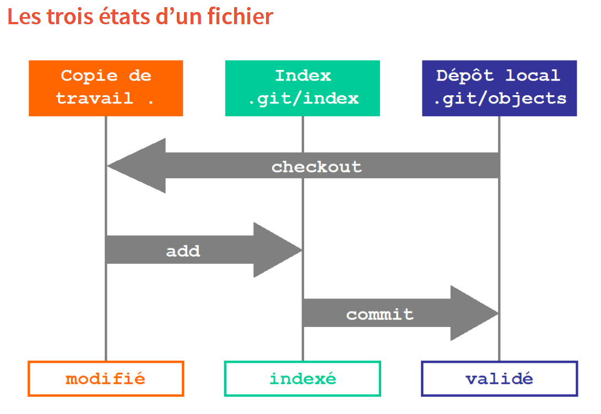

# Des bases de GIT <i class="fas fa-code-branch"></i>

Les deux outils de gestion de version les plus répandus sont GIT et SVN (pour Subversion). L'Insee a utilisé SVN pendant un temps mais privilégie GIT maintenant en raison de plusieurs avantages, comme le travail hors ligne plus stable, une meilleure flexibilité et une plus grande vitesse (cf. infra).

GIT est un logiciel qui est installé sur son poste et celui de ses collaborateurs. Il est open source, gratuit et très répandu. Ainsi, une vaste documentation est disponible en ligne ou les forums d'entraide de type `stackoverflow` (voir par exemple le tag ['GIT'](https://stackoverflow.com/questions/tagged/git) ). Sur la plateforme `GitHub`, la [page de tutoriel](http://try.github.io/) regroupe différents supports. Des vidéos pédagogiques sont fournies sur [git-scm.com](https://git-scm.com/videos).

:::: {.conseil data-latex=""}

Face au foisonnement des pratiques et des ressources en ligne, il est recommandé d'adopter et suivre les bonnes pratiques pour chaque projet, et de prendre avec vigilance ce qui est trouvé en ligne. Les configurations et les habitudes diffèrent et une solution proposée sur un forum ou dans un livre peut ne pas être adaptée dans votre cas précis. 

C'est l'objectif de ce support de rassembler les pratiques les plus courantes et présenter l'utilisation recommandée de la gestion de version avec RStudio à l'Insee.

::::


La genèse de Git correspond au noyau du système d'exploitation Linux qui gérait les patchs et les archives pendant les années 1990. À partir de 2005, Linus Torvalds, aussi inventeur de Linux, développe un successeur avec pour objectifs, la vitesse, la simplicité, la possibilité de développements en parallèle (les futures **`r with_def("branche")`s**), le tout avec un usage compact des données. Depuis, son usage a largement dépassé celui de SVN.


:::: {.remarque data-latex=""}
SVN est dit centralisé alors que GIT est dit distribué. Cela signifie notamment que chaque collaborateur possède une copie en propre de l'ensemble du projet sur son poste de travail. Cela implique un avantage important de GIT en terme de sécurité des codes (qui risquent beaucoup moins d'être perdus) et la  rapidité des partages des modifications.

En outre, contrairement à SVN pour lequel il faut être connecté à un serveur, il n'est pas besoin d'être connecté avec GIT et on peut travailler en local. Ainsi, on transmet ses modifications quand on le souhaite ou peut et cela facilite le travail distant.
::::

Enfin, un des grands avantages pratiques de `GIT` est son intégration native dans l’interface `RStudio` (et réciproquement) ainsi que dans les plateformes `GitHub` et `GitLab` (voir parties ci-après). À l'origine utilisé en ligne de commandes (et utilisé comme tel par les développeurs), les interfaces graphiques actuelles permettent de s'en passer dans l'immense majorité des situations.


## Le B.A-BA

Les programmes s’organisent sur un répertoire distant commun
(dépôt ou `r with_def("repository")`) et sont manipulés sur les postes indidivuels dans des
dossiers locaux (**working directory**). Le dépôt distant peut par exemple être hébergé sur une plateforme de type **GitLab** <i class="fab fa-gitlab"></i> ou **GitHub** <i class="fab fa-github"></i>.

:::: {.remarque data-latex=""}

**GitHub, GitLab, quesaquo ?**

Le travail collaboratif avec `Git` s'organise autour d'un serveur auquel chaque contributeur transmet ses modifications et depuis lequel les différents contributeurs récupèrent le travail des collègues.

Comme tout serveur, ceux-ci peuvent être accessibles sur un réseau interne ou être accessibles sur internet. Sur ces serveurs, on installe un logiciel qui offre une interface utilisateur. Il existe différents types d'interface utilisateur, les deux plus populaires s'appelant "GitHub" ou "GitLab".

Dans le contexte de travail de l'Insee, vous pourrez être amenés à travailler avec différents serveurs que nous différencions ici grâce à leurs adresses web : 

- [gitlab.insee.fr](https://gitlab.insee.fr) : serveur interne au réseau de l'Insee avec une interface utilisateur de type "GitLab" maintenu par la DSI de l'Insee (projet SOFA)
- [git.lab.sspcloud.fr](https://git.lab.sspcloud.fr) : serveur du SSP Cloud exposé sur internet avec une interface utilisateur de type "GitLab" maintenu par la division innovation
- [github.com](https://github.com) : serveur public exposé sur internet avec une interface utilisateur de type "GitHub" maintenu par Microsoft
- [gitlab.com](https://gitlab.com) : serveur public exposé sur internet avec une interface utilisateur de type "GitLab" maintenu par l'entreprise GitLab

Tous les serveurs `Git` connaissent une structure similaire : 

- chaque utilisateur possède un espace personnel pour stocker ses projets. Par exemple, sur le serveur GitLab de l'Insee, chaque agent a un espace accessible à l'adresse <https://gitlab.insee.fr/IDEP>
- il est possible de créer des espaces communs pour une structure ou pour un projet donné. Par exemple, l'Insee dispose d'un espace institutionnel sur GitHub nommé <https://github.com/InseeFr> qui héberge des projets open source de l'Insee utilisés en production ainsi qu'un espace pour les projets open source expérimentaux nommé <https://github.com/InseeFrLab>  

::::


Les trois manipulations les plus courantes sont les suivantes et représentées sur le diagramme ci-après : 

+ `r with_def("pull")` : je récupère la dernière version des codes du dépôt distant
+ `r with_def("commit")` : je valide mes modifications avec un message qui les expliquent
+ `r with_def("push")` : je transmets mes modifications validées au dépôt distant


{width=100%} 

De manière plus précise, il y a trois étapes avant d'envoyer les modifications validées (`r with_def("commit")`) au dépôt. Elles se définissent en fonction des commandes qui permet de les appliquer quand Git est utilisé en ligne de commandes :

* `diff` : inspection des modifications. Cela permet de comparer les fichiers modifiés et de distinguer les fichiers ajoutés ou supprimés
* `staging area` : sélection des modifications. 
* `r with_def("commit")` :  validation des modifications sélectionnées (avec commentaire).

L'un des intérêts de `git` est que le choix des modifications à soumettre est très fin: il est possible de découper les modifications d'un fichier en plusieurs morceaux cohérents. 

Les deux diagrammes ci-dessous représentent ces différences étapes et les commandes qui permet de passer d'un état à l'autre.

{width=100%} 
/* Ce serait bien d'expliquer briévement à quoi correspondent ces états (au moins pour indexé qui semble mins naturel au milieu des deux autres) */
/* A quoi sert le point dans le titre "Copie de travail ." ? */

{width=100%} 
/* Ce serait bien d'expliquer briévemeent les intitulés */

Lors d'un `r with_def("commit")`, le message de validation est très important:

* il décrit brièvement les modifications contenues dans le commit
* il s'adresse aux autres et doit donc être intelligible

Chaque commit doit rassembler des modifications homogènes. Il ne faut donc pas hésiter à séparer les changements qui ne sont pas directement reliés car il est plus facile de rechercher au sein de plusieurs modifications différentes qu'une seule trop vaste.

Chaque `r with_def("commit")` est identifié de façon unique par un `r with_def("hash")` (ex: `441300764de91c376`), un numéro peu intelligible pour un humain mais qui permet au système de contrôle de version de gérer proprement chaque modification.

Ensuite, les deux fonctions `r with_def("push")` et `r with_def("pull")` permettent la mise à jour du projet local par rapport au distant et réciproquement. C'est donc avec un `r with_def("push")` qu'on envoie les modifications qui ont été sélectionnées puis validées.

Lors des étapes de push et pull, des **conflits** peuvent apparaître, par exemple lorsque deux personnes ont modifié le même programme simultanément. 

Tout d'abord, il est possible de minimiser l'apparition de conflits en amont en validant souvent les modifications (`commit`) :

* en commençant par mettre à jour sa copie locale régulièrement via `r with_def("pull")` ou `r with_def("fetch")`, voire dès qu'on commencer à travailler sur un projet
* en regroupant les commit par petits lots homogènes et en préférant peu de fichiers
* en communiquant avec les autres membres de l’équipe en disant sur quoi on travaille et en prévenant en cas de grosse modification


:::: {.recommandation data-latex=""}

De manière générale, **il ne faut pas avoir peur des conflits**. Les outils sont faits pour les gérer avec rigueur et méthode (voir [les exercices](#gitexo)). Avec GIT, il est très rare de faire des bêtises et on peut toujours réparer **à condition de s'en tenir aux commandes de base** (`r with_def("commit")`, `r with_def("push")`, `r with_def("pull")` et `r with_def("merge")`).

Cependant, **il existe des commandes qui peuvent définitivement endommager votre projet**, la plus destructrice étant `git push --force` que vous ne devriez jamais utiliser. Faites très attention en lisant des tutoriels en ligne car certains sont à destination d'utilisateurs avancés et recommandent ces commandes "à risque". 

::::


## Exercice 1: Premiers pas avec `git` en local {#gitlocal}

Dans le cadre de cette formation, un projet d'exemple a été créé pour vous. L'idée est de former des groupes de deux, chaque groupe représentant une équipe. Vous allez donc travailler en binôme avec votre voisin (ou avec une personne de la visio si la formation n'a pas lieu en présentiel).

Dans cette partie, nous allons adopter un fil rouge en créant un document collaboratif commun et en pratiquant par des exercices les principales situations d'un statisticien qui travaille avec `R` et `GIT` via `RStudio` et `GitLab`.

:::: {.recommandation data-latex=""}

**Préliminaire: forker le projet** Même si c'est techniquement possible, être plus de 10
à faire des modifications en simultané sur la branche `master` est périlleux. Il convient
donc d'éviter d'être tous en même temps sur le même projet.

Pour cela, dans chaque équipe
de 2, une personne doit faire un `r with_def("fork")` qui revient à dupliquer le projet pour chacune des équipes. Pour cela, il faut cliquer en haut à droite du projet exemple, qui sert de base à l'exercice.

La personne qui a initié le `fork` (pas besoin d'être deux à le faire) doit
ensuite donner des droits à son/sa binôme (dans `members` du menu à gauche ). Accorder le droit de `maintainer` pour commencer.

::::

:::: {.exo data-latex=""}
Exercice 1 : Git en local

`r emo::ji("warning")` N'oubliez pas qu'il faut avoir fait un `fork` du projet.


Pour commencer, tout se passe dans l'onglet `git` de `RStudio` (en haut à droite) : 


**Question a.** *`clone` et modification du fichier`.gitignore`*

Clôner le dossier de votre projet d'équipe avec `RStudio` via le lien `SSH` du projet sur `Gitlab`. Ensuite, modifier le fichier `.gitignore` en y ajoutant les fichiers `.pdf` et au /* A quoi sert ce au ?*/ `.html`. Penser à sauvegarder le fichier.

**Question b.** *`staging`*

Créer un fichier `votre_idep.md` et y écrire une phrase au format, sujet-verbe-complément mais majuscule ni ponctuation. Observer le statut du fichier dans l'onglet `git`.

**Question c.** *`commit`*

Valider cet ajout via le bouton `commit` en ajoutant un message clair mais bref.

**Question d.** *`push`*
    
Envoyer cette modification au projet partagé via le bouton `push` (flèche verte montante).
:boom: Un des deux membres du groupe (celui qui a été moins rapide) devrait avoir un rejet
du `push`. Pas de problème, passer à l'étape suivante (`pull`) puis refaire cette étape (`push`)

**Question e.** *`pull`*

Récupérer les modifications du dépôt commun (= le fichier de votre voisin à ce stade) via le bouton `pull` (flèche bleue descendante).

**Question f.** *`commit-push-pull`*

Recommencer les mêmes opérations modifiant cette fois-ci le fichier de votre voisin. Compléter le texte par une autre phrase.

:::: 


## Les branches : principes

C'est une des fonctionnalités les plus pratiques de la gestion de version. La création de `r with_def("branches")` dans un projet (qui devient ainsi un arbre) permet de développer en parallèle des correctifs ou une nouvelle fonctionnalité sans modifier le dépôt commun. Cela permet de séparer le nouveau développement et de faire cohabiter plusieurs versions, pouvant évoluer séparément ou pouvant être facilement rassemblées. Git est optimisé pour le travail sur les branches.

<blockquote class="twitter-tweet"><p lang="fr" dir="ltr">Petite révélation du jour : <a href="https://twitter.com/hashtag/git?src=hash&amp;ref_src=twsrc%5Etfw">#git</a>, c&#39;est le meilleur outil pour te rappeler que nous sommes proches des singes : si t&#39;es pas sur une branche, t&#39;es dans la merde</p>&mdash; Nicolas Delsaux (\@riduidel) <a href="https://twitter.com/riduidel/status/1229768054109855747?ref_src=twsrc%5Etfw">February 18, 2020</a></blockquote> <script async src="https://platform.twitter.com/widgets.js" charset="utf-8"></script> 


Les branches peuvent avoir des durées de vie plus ou moins longues selon leurs objectifs : nouvelle fonctionnalité, résolution de bugs, environnement de développement ou de production, etc.

Trois principales fonctionnalités existent, définies par leur nom de commande :

* `git branch` : création d'une branche
* `git checkout` : pour changer de branche
* `git merge` : fusion de branche

Dans un projet collaboratif, une branche dite **master** joue le rôle du tronc. C'est autour d'elle que vont pousser ou se greffer les branches comme le montre l'exemple ci-dessous.

{width=100%} 

## Branches et lien avec `master`

La branche `master` est la branche principale. Elle se doit d'être "propre".
On ne pousse pas des travaux non aboutis sur `master`, c'est assez mal vu et sources de futurs problèmes.  

Peut-on pousser directement sur `master` ? Oui, pour des petites corrections, des modifications mineures dont vous êtes certains qu'elles vont fonctionner. Mais sachez que dans le cadre de projets sensibles, c'est strictement interdit. Il y a justement des meilleurs outils pour proposer des changements substantiels. Dans votre organisation, n'ayez pas peur de fixer comme règle l'interdiction de pousser sur `master`
(cf. [section précédente](#orgagit)), cela obligera l'équipe
projet à travailler avec rigueur. 

Au moindre doute, créez une branche ! Les branches sont utilisées pour des travaux significatifs :

- vous travaillez seul sur une tâche qui va vous prendre plusieurs heures ou jours de travail (vous ne devez pas pousser sur `master` des travaux non aboutis);
- vous travaillez sur une fonctionnalité nouvelle et vous souhaiteriez recueillir l'avis de vos collègues avant de modifier `master`;
- vous n'êtes pas certain de réussir vos modifications du premier coup et préférez faire des tests en parallèle.

:::: {.recommandation data-latex=""}

`r emo::ji("no_entry")` Les branches ne sont pas personnelles : **Toutes les branches sont publiées, le `r with_def("rebase")` est interdit. Le `r with_def("push")` force est également interdit.** 

`r emo::ji("no_entry")` **Tous les merges dans `master` doivent se faire par l'intermédiaire d'une merge request dans `GitLab`**. En effet, il est très mal vu de merger une branche dans master localement.

::::

Comment nommer les branches ? Là encore, il y a énormément de conventions différentes. Une fréquemment observée est :

- pour les nouvelles fonctionnalités : `feature/nouvelle-fonctionnalite` où `nouvelle-fontionnalite` est un nom court résumant la fonctionnalité
- pour les corrections de bug : `issue-num` où `num` est le numéro de l'issue
- pour les branches liées à une issue: `num-blabla` où `num` est le numéro de l'issue et `blabla` un titre permettant de comprendre l'objet de la merge request.

N'hésitez pas à aller encore plus loin dans la normalisation  !


Jusqu'à présent, vous ne travailliez pas simultanément sur un fichier. Les conflits
étaient donc limités. A partir de maintenant, vous allez découvrir l'une des
forces de `Git`: on peut travailler sur le même fichier en même temps. 

:::: {.exo data-latex=""}
Exercice 2 : Cadavre exquis


**Question a.** *Création d'une branche locale*

Placez-vous sur la branche `master` dans votre dépôt local.
Créez une branche dans le dépôt local, en lui donnant un nom comportant votre prénom.

**Question b.** *Modification au sein d'une branche*

Ouvrez (ou créez) le fichier `cadavre_exquis.md` dans le dépôt local, et ajoutez-y deux phrases sans aucune ponctuation. Sauvegardez cette modification en faisant un `commit`. N'oubliez pas de rédiger un message le plus clair possible.

**Question c.** *Publication d'une branche*

Poussez votre branche vers le dépôt commun (avec `push`).

**Question d.** *Récupération de la branche créée par votre voisin*

Récupérez la branche créée par votre voisin (avec `pull`).

**Question e.** *Modifier une autre branche*

Placez-vous sur la branche créée par votre voisin. Ouvrez le fichier `cadavre_exquis.md` figurant dans votre dépôt local. Vous devez normalement voir les deux phrases écrites par votre voisin. Ajoutez la ponctuation à ces deux phrases. Sauvegardez cette modification en faisant un `commit`. N'oubliez pas de rédiger un message le plus clair possible. Publiez cette modification sur le dépôt distant (avec `push`).

**Question f.** *Récupération des corrections de l'autre personne du binôme*

Placez-vous sur la branche que vous avez créée à la question `a`. Récupérer les modifications apportées à cette branche (avec `pull`). Ouvrez le fichier `cadavre_exquis.md`. Vous devez normalement constater que les deux phrases que vous avez écrites ont maintenant une ponctuation correcte.

::::


## Quelques compléments de GIT 

L'outil `GIT` permet un grand nombre de fonctionnalités avancées. Les manipulations les plus complexes ne peuvent être effectuées qu'en ligne de commande, mode de fonctionnement privilégié des développeurs avancés. Mais pour les statisticiens, il est possible d'effectuer des commandes avancées de façon intégrée à RStudio.

Une des commandes les plus utiles pour un travail collaboratif pour les statisticiens permet de ne pas partager les bases de données ou tout type de fichier, soit trop volumineux, soit confidentiel : 

* `git ignore` : modifier le fichier permet de conserver des fichiers en privé, c'est-à-dire qu'ils n'apparaissent pas dans le dossier partagé. 

Ainsi, **il est crucial de ne pas partager les données** et exclure les fichiers de la forme `*.csv` ainsi que tous les fichiers de sortie, notamment au format `*.html` ou `*.pdf`. Les fichiers à exclure du contrôle de version sont listées dans un fichier nommé **`.gitignore`** ( [exemple ici](https://gitlab.com/linogaliana/collaboratif/-/blob/master/.gitignore)). Il est normalement créé par défaut dans le répertoire du dépôt. Il suffit alors de le modifier en ajoutant à la ligne les fichiers que l'on souhaite ignorer, par exemple "mon_graphique.pdf" /*Ne serait il pas préférable d'enlever les quottes autour des noms de fichiers, puisqu'elles n'apparaissent pas dans le gitignore ?*/ ou alors tous les fichiers au format xls en ajoutant "*.xls" /*même remarque*/.

Si le dossier de travail ne comporte pas ce fichier et que vous désirez exclure un type de fichier, par exemple `csv`, pour le créer et y ajouter les fichiers `*.csv` par exemple, vous pouvez utiliser le  package `usethis` avec lequel vous deviendrez familier dans la [Partie Package](#package) :

```{r, eval = FALSE}
# Taper dans la console RStudio
usethis::use_git_ignore("*.csv")
```

:::: {.recommandation data-latex=""}

On ne met sous contrôle de version avec git que les fichiers de programmes, semblables à des fichiers texte ( `.Sas `,  `.R `). Il est important d'exclure les fichiers volumineux (données ou résultats) et bien sûr, les fichiers confidentiels.

En particulier, il ne faut pas mettre sous contrôle de version, c'est-à-dire qu'il faut inclure dans le fichier `.gitignore` :

- les données (`.csv`, `.xlsx`, `.sas7bdat`, `.Rdata`, etc.)
- les fichiers produits grâce au code source (`.pdf`, `.html`, `.odt`, `.docx`, `.xlsx`, etc.)

En particulier, il faut être **extrêmement vigilant** à **ne jamais** mettre sous contrôle de version **des mots de passe** ou des **jetons d'accès** à des API.

::::

La CNIL fournit des conseils aux développeurs pour compléter ces bonnes pratiques ([lien](https://linpricnil.github.io/Guide-RGPD-du-developpeur/)).

:::: {.conseil data-latex=""}
Le site [gitignore.io](https://www.toptal.com/developers/gitignore) fournit des modèles de fichiers `.gitignore` selon le langage utilisé. Ils peuvent servir de base à enrichir en fonction des besoins.
::::


L'un des avantages de `Git` est qu'on peut toujours revenir en arrière. Ce
filet de sécurité permet d'oser des expérimentations, y compris au sein
d'une branche. Il faut être prêt à aller dans la ligne de commande pour cela
mais l'exercice suivant permettra de dédramatiser ceci. 

:::: {.exo data-latex=""}
Exercice 3 : J'ai supprimé un fichier par erreur ? Ouf, j'utilise Git ! 

Maintenant, on va montrer que `Git` vous évitera une crise de panique
si vous supprimez un fichier sans faire exprès. 

1. Dans votre branche, ajouter deux fichiers `fichier_important.md` et `brouillon.md`
contenant chacun une phrase. Faire un `commit` de ce fichier. Pusher.
2. Revenir sur `master`. Regardez l'arborescence des fichiers (dans RStudio ou via
Windows) : le fichier `modification_importante.md` /* Sûr du nom du fichier ? */ n'est plus là: cela vous inquiète-t-il ?
3. Retournez sur votre branche. Vous allez faire une bêtise et supprimer les deux fichiers à la fois :
  + Avec une organisation sans `Git`, vous pouvez maintenant paniquer.
  + Grâce à `Git`, vous pouvez rester serein. En effet, vous pouvez retourner en arrière.
4. Ouvrir le menu `commit` de `RStudio` et faites `Discard All` (fonctionne également avec `Revert`) et répondez oui à la boîte de dialogue qui s'ouvre (après l'avoir lue et comprise). Et vous retrouvez vos deux fichiers.

Maintenant, une manipulation plus avancée mais qui permet de rassurer :

1. /* Devraoit être le 5, non ? */ Supprimez à nouveau les deux fichiers. Cependant, cette fois vous faites un `commit` (nommer le commit "je suis étourdi") et un `push`.
2. /* même remarque */ Vous allez sur la branche de votre camarade et vous rendez compte que le fichier  `fichier_important.md` a disparu. Vous allez essayer de le rétablir.
3. /* même remarque */ Pour cela, aller dans l'historique des commits et identifier le `SHA` /* Qu'est-ce ? */ du commit responsable. Taper

```shell
git checkout <commit hash> -- fichier_important.md
```
/* le SHA n'intervient pas dans l'écriture ? Si non, où sert-il alors ?*/
:::: 

D'autres fonctionnalités plus avancées existent et pourront être mises à profit si elles sont correctement utilisées: 

* `git tag` : sauvegarder une version figée, comme une "photographie" à un instant donné
* `git log` : filtrer les contenus des différences pour rechercher le commit à l'origine d'un changement en particulier.
* `git blame` : lister les modifications d'un fichier donné à une ligne donnée

Le `git blame` est très pratique car il permet de filtrer sur les différences précédentes afin de régler des problèmes ou trouver un commit particulier à l'origine d'un bug ou d'une erreur. Il est facilement accessible sur `gitlab.com` en cliquant sur les fichiers (*files*) du dépôt (*repository*), en haut à droite pour chaque fichier de programme (cf. infra).


D'autres commandes plus périlleuses peuvent permettre un retour en arrière dans l'historique, appelé *rebasage*. La réécriture de l'historique est un **usage non recommandé** pour une utilisation non approfondie comme un projet statistique en équipe. Si vous souhaitiez toutefois vous écarter des sentiers battus et tester ces commandes (telles que `git rebase`^[Le `r with_def("rebase")` est un type particulier de `merge` qui réécrit l'histoire d'une branche ([plus de détails](https://git-scm.com/book/fr/v2/Les-branches-avec-Git-Rebaser-Rebasing)). C'est donc une pratique dangereuse car elle risque de rendre obsolète les branches de vos collaborateurs sur lesquelles ils ont potentiellement déjà travaillr.] ou `git push --force`), appliquez le **conseil de survie** suivant avant toute manipulation : effectuez une sauvegarde manuelle de votre repository, par l'intermédiaire d'un copié-collé dans un autre dossier de votre ordinateur. Sans cela, vous risqueriez d'endommager votre repository et de perdre définitivement des informations.

Pour aller plus loin, des ressources internes au SSP existent (plutôt destinées à des développeurs) :
/* rajouter tchap */
* [`GIT` au quotidien](https://romain-warnan.github.io/git-au-quotidien) par Romain Warnan  
* des supports du SNDI sur les [bases de `GIT`](http://formation-git-sndi-lille.pages.innovation.insee.eu/cours/#/)
* la documentation AUSV3 sur [quelques manipulations courantes avec `GIT`](https://gitlab.insee.fr/infrastructure/lss/ausv3/documentation-utilisateurs/-/wikis/Logiciels/Git)
* utiliser `GIT` avec RStudio [par utilitR](https://www.book.utilitr.org/git.html)

Les ressources externes très complètes sont disponibles, citons notamment un [livre en français](https://git-scm.com/book/fr/v2) accessible en ligne et la [documentation en ligne](https://git-scm.com/doc) de `GIT`.


<!----
### Vocabulaire 

En résumé, voilà les principaux concepts présentés et qui seront utiles pour la pratique de la gestion de version :

* `repository` : le dossier partagé qui contient toutes les informations
* `commit` : modification validée à un instant donné, par extension l'état du projet à cet instant
* `hash` : un identifiant unique pour chaque commit, contenant notamment l'horodatage
* `checkout` : un déplacement de votre version locale vers un commit donné
* `branche` : une ligne de développement parallèle au sein du projet
* `merge` : la fusion de une ou plusieurs branches
* `remote` : un serveur distant ayant une copie de repository
* `clone` : récupération du dossier depuis le remote (pour la première fois)
* `pull` : récupération des nouveaux commits en local depuis le remote
* `push` : envoi de ses nouveaux commit vers le remote
------>
