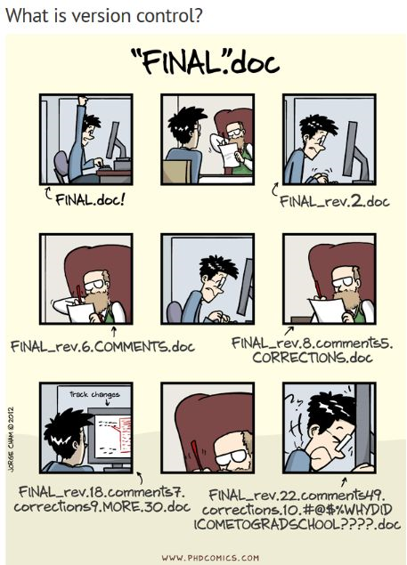
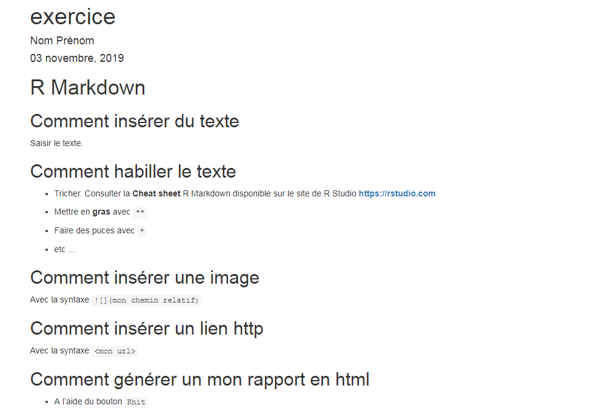
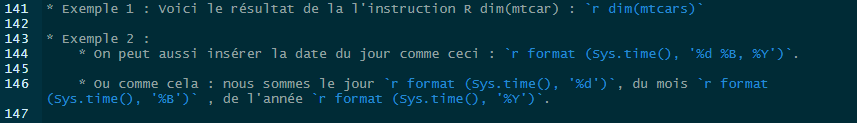
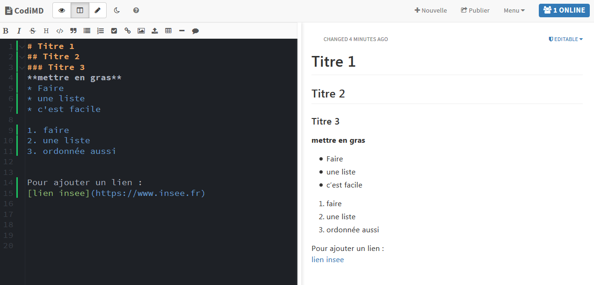

# `R Markdown`

```{r setup, include=FALSE}
knitr::opts_chunk$set(echo = FALSE)
knitr::opts_chunk$set(warning = FALSE)
```

```{r, echo=FALSE, message=FALSE}
library(knitr)
```

## Présentation générale de `R Markdown`

Grâce au cadavre exquis du chapitre précédent, vous avez découvert le format `Markdown`. Le présent chapitre vise à aller plus loin dans cet apprentissage en présentant les `R markdown` qui sont, comme le nom l'indique, une manière de lier du texte avec du code `R` (permettant de produire des sorties, d'expliciter du code...):

* `Markdown` est un système d'édition doté d'une syntaxe simplifiée souvent utilisé pour faire de la documentation de projet. Le format de fichier est `.md`;
* Un fichier `R Markdown` est suffixé `.Rmd`.

Un fichier `R Markdown`, à la différence d'un fichier `Markdown` classique, ne fait pas que présenter un code `R`, il l'exécute également, et peut intégrer les sorties du code `R` (par exemple un graphique produit avec `ggplot2`). Cela donne, par exemple, le rendu suivant:


`Rmarkdown` est une extension de `R` qui se présente sous la forme d'un package. `Rmarkdown` permet ainsi d'intégrer nativement du code `R` dans un document (pour le rendre public, pour générer des sorties...). Pour la reproductibilité des publications, il s'agit d'une innovation fondamentale car elle réduit le nombre de gestes manuels. Plutôt qu'avoir un code `SAS` ou `stata` ayant généré des sorties `excel`/`calc` intégrées dans un document `word` ou transformées en table `latex`, on dispose d'un seul document qui interprète et compile code et texte. 
ce qui réduit la difficulté à articuler un document. 


### Que peut produire `R markdown` ?


Il y a une grande liberté dans les formats de sortie disponibles pour un fichier `markdown`: 

* Des rapports en pdf, en html;
* Des présentations sous forme de slides;
* Des sites *web* (comme celui-ci);
* ...


### Comment fonctionne `R markdown` ? 


`R markdown` fonctionne : 

* différemment de la suite Office, et de Word en particulier. C’est un éditeur qui n'est pas *WYSIWYG* (*What you see is what you get*) : le fichier est composé de texte brut et éventuellement de code informatique, et doit compilé pour produire le fichier de sortie. Le document final ne peut être visualisé qu'après compilation.
* en dissociant le fond de la forme. Le fichier `.Rmd` contient donc à la fois le texte brut et des commandes de mise en forme. On parle de *WYSIWYW* (*What you see is what you want*). A noter que les illustrations sont générées dynamiquement à partir des blocs de code `R` intégrés, ou insérées par des liens.
   
Les connaisseurs du format `LaTeX` reconnaîtront une grande proximité entre `LaTeX` et `Markdown`. En effet, dans les deux cas, la mise en forme est appelée par des commandes spéciales. Toutefois, `Markdown` se distingue de `LaTeX` par des commandes de mise en forme beaucoup plus légères. Par exemple, il faut utiliser la fonction `\textit{italique}` en `LaTeX` pour mettre du texte en italique, alors qu'en `Markdown` il suffit de mettre le texte entre deux astériques `*italique*`.

## Pourquoi utiliser `R markdown`, quels sont ses avantages ? 

1. `R markdown` dissocie le fond et la forme du document, ce qui:

* allège les mises à jour ou correctifs;
* donne de la visibilité au code ayant généré les résultats et illustrations.

2. Il est possible de mettre des commentaires partout dans le document, ce qui:

* permet de détailler un résultat spécifique, d'expliquer les choix d'analyse faits;
* facilite le suivi de l'analyse, ou son appropriation par une personne externe à l'équipe projet (un membre intervenant ponctuellement à titre d'expert sur un sujet, ou encore un nouveau membre venu en renfort).

3. La syntaxe `R markdown` a été pensée pour avoir deux grandes qualités:

* Elle est simple et rapide à prendre en main; il est notamment beaucoup plus simple que la syntaxe `html`;
* Elle est très légère visuellement, ce qui fait qu'un code brut `R Markdown` reste lisible même pour des personnes qui ne connaissent la syntaxe (contrairement à `LaTeX`...).

4. Lorsqu'on associe `R markdown` et un outil de *versioning* (git par exemple), les modifications successives apportées au document sont facilement traçables, ce qui permet de:
    * maîtriser l'évolution du document, par exemple sur la succession de corrections, apportées tout au long d'un circuit de relecture;
    * ne pas multiplier les versions d'un même document;
    * combiner facilement les modifications apportées par plusieurs utilisateurs.

5. `R Markdown` est bien intégré à `Rstudio`. Les extensions `.Rmd` sont reconnues automatiquement par `Rstudio` ce qui permet d'avoir de l'autocomplétion également lors de la rédaction de blocs de texte, la possibilité d'exécuter des bouts de code uniquement lors d'une phase d'exploration...




`R markdown` est une alternative aux [notebook jupyter](https://jupyter.org/) qui permettent de lier du code et du texte. Pour la reproductibilité, les `R markdown` sont préférables car l'exécution du code dans le document est linéaire alors que les blocs de code des `notebook jupyter` peuvent être exécutés dans le désordre. 


### Outils de révision avec `R markdown`

**TO DO**

## Avant de commencer

### Les points de vigilance lorsqu'on débute 

* `R Markdown` est un outil collaboratif en plus dont l'utilisation nécessite l'adhésion de l'ensemble de l'équipe. 
* L'ensemble des contributeurs doit donc s'approprier à la fois ses principes et sa syntaxe (hors contexte collaboratif, ses avantages demeurent pour un document réalisé seul).
* Il faut paramétrer le correcteur automatique de document. Pour le paramétrer en français, aller dans le menu `Tools > Global Options > Spelling` et dans le menu déroulant _Main dictionary language_, sélectionner _Français_.
* les outils ne remplacent pas la communication dans l'équipe projet. La production collaborative d'un document R Markdown nécessite de se mettre d'accord sur sa structure. Il est donc nécessaire de faire des points d'équipe. Pour vous aider, il existe un [chat Insee] (https://rocket-chat.stable.innovation.insee.eu)

Pour le moment, il n'existe pas d'outil pour intégrer automatiquement la charte graphique Insee dans un document `Markdown`. Des thèmes `ggplot` et des feuilles de style (*template*) adaptées aux différents formats de publication Insee permettraient de rédiger des publications en `R Markdown`. Elles seraient plus faciles à faire évoluer au fil des relectures et plus reproductibles que les publications actuellement construites sur LibreOffice.

### Quelques bonnes pratiques

Il faut viser la **reproductibilité** : le document doit pouvoir être généré par chacun des membres de l'équipe projet. Voici quelques bonnes pratiques pour y parvenir:

* Tout comme pour un script R, les ressources (images, données, ...) doivent être appelées via des chemins d'accès relatifs au dossier du projet. Il faut donc utiliser des chemins relatifs, et non absolus:
    - **A ne pas faire : ** inclure un lien vers "D:/projets gitlab/couverturenumerique/donnees/depReg16.txt";
    - **mais faire plutôt : ** inclure un lien vers "./donnees/depReg16.txt";
* L'emplacement de ces ressources doit respecter une arborescence connue et utilisée par tous.

Les fichiers `.Rmd` s'intègrent bien avec `git` car il s'agit de fichiers textes. En revanche, on évite de mettre sous contrôle de version les output (`.pdf`, `.html`). Dans ce cas, on ajoute au fichier `.gitignore` les extensions associées, par exemple `*.pdf` ou `*.html`


## Comment construire un document `Rmarkdown`?

### Produire son premier document en trois étapes

1. **Créer** un nouveau fichier `Rmarkdown`: `File > New File > R Markdown...`.


2. **Saisir** du texte en l'habillant avec des commandes de mise en forme : 
* titres de niveaux différents avec `#`;
* liste non ordonnnée avec `*`;
* liste ordonnée avec `1.`;
* mise en italique en encadrant le texte avec `*`, par exemple `*youpi*`;
* mise en gras en encadrant le texte avec `**`, par exemple `**youpi**`.

3. **Tricoter** (*knit*) pour visualiser le résultat (avec la mise en forme) dans l'onglet `Viewer`.


### Anatomie de la structure d'un document `R Markdown`

Un document `R Markdown` comprend un **En-tête**. Il est délimité par deux lignes de pointillés et sert à contient les métadonnées du document (titre, auteurs, options générales de mise en page...). il contient au minimum le titre du document et le format de sortie. L'en-tête est parfois appelé `YAML header`. Voici par exemple l'en-tête général du fichier `.Rmd` de la formation *Travail collaboratif avec R*:

```
--- 
title: "Travail collaboratif avec R"
author: "Lino Galiana"
date: "`r Sys.Date()`"
knit: "bookdown::render_book"
site: bookdown::bookdown_site
documentclass: book
bibliography: [book.bib, packages.bib]
biblio-style: apalike
link-citations: yes
description: "Support associé à la formation Travail collaboratif avec R"
---
```
Ensuite, le corps d'un document `R Markdown` comprend deux types de **blocs**:

3. Des **blocs de texte brut**:
    * Habillage (mise en forme) selon la syntaxe markdown;
2. Des **blocs de code `R`** (appelés *chunks*) encadrés par les balises ```
    - ces *chunks* peuvent être nommés;
    - des options peuvent être spécifiées (par exemple: ne pas intégrer l'output du code dans le document final);
    - Il est possible d'ajouter en dessous de l'en-tête un *chunk* de *set up* pour définir les options par défaut de tous les *chunks*.

Deux points importants sur la structure des documents `R Markdown`:

* On peut alterner librement les blocs de texte et les blocs de code `R`;
* On peut ajouter des commentaires et commenter des morceaux du document:

    - Dans le texte, pour activer/désactiver un commentaire c'est facile (balises de commentaire équivalentes à celle du format `html`) : **Ctrl + Shift + C**;
        ```
    Un paragraphe sur les avantages de `R Markdown`.
    <!-- Un commentaire très utile -->
    Un autre paragraphe sur la syntaxe de `R Markdown`.
    ```
    - à l'intérieur des blocs de code `R`, les commentaires se font comme dans un script `R` (avec le commentaire classique en `R`: `#`). Voici un exemple de bloc de code `R` avec un commentaire:

~~~markdown
`r ''````{r}
# Commentaire: charger le package ggplot2
library(ggplot2)
`r ''````
~~~

### Mise en forme de texte


Quand des niveaux de titre ont été définis, une table des matières dans laquelle on peut naviguer avec Rstudio est générée automatiquement.


### Insérer un lien hypertexte

Il y a deux manières de faire, selon qu'on désire que le lien soit apparent ou non:


1. Lien apparent: une adresse utile <https://rmarkdown.rstudio.com/>.

~~~markdown
1. Lien apparent: une adresse utile <https://rmarkdown.rstudio.com/>.
~~~

2. En remplaçant l'url par un alias: une adresse utile [ici](https://rmarkdown.rstudio.com).

~~~markdown
2. En remplaçant l'url par un alias: une adresse utile [ici](https://rmarkdown.rstudio.com).
~~~

### Insérer une image

Pour insérer une image, on utilise la syntaxe suivante: 

~~~markdown

~~~

ce qui donne le résultat suivant dans la mise en forme:


:::: {.exercice data-latex=""}
::: {.center data-latex=""}
**Exercice 1**
:::

**Créer un fichier `R Markdown` produisant la sortie suivante :** 

::::

### Insérer du code `R`

Il y a trois méthodes pour insérer du code `R` dans un document `R Markdown`. 


#### Insertion dans le texte d'une petite instruction `R` 

On utilise la syntaxe suivante (le délimiteur \` s'obtient avec `Alt Gr + 7`):



* Exemple 1 : Voici le résultat de l'instruction `R` `dim(mtcar)` : `r dim(mtcars)`;

* Exemple 2 : 
    * On peut aussi insérer la date du jour comme ceci : `r format (Sys.time(), '%d %B, %Y')`.
    
    * Ou comme cela : nous sommes le jour `r format (Sys.time(), '%d')`, du mois `r format (Sys.time(), '%B')` , de l'année `r format (Sys.time(), '%Y')`.


#### Insertion d'un bloc de code `R` : les * **chunks** *.

Pour insérer des instructions plus longues ou moins élémentaires dans un fichier `R Markdown`, le code doit être délimité avec \`\`\` de la façon suivante :


~~~markdown
`r ''````{r, message = FALSE}
# Insérer du code R dans un fichier R Markdown c est facile
dim(mtcars) 
`r ''````
~~~

Le résultat ci-dessous:

```{r, message = FALSE}
# Insérer du code R dans un fichier R Markdown c est facile
dim(mtcars) 

```

Quelques remarques sur l'utilisation des *chunks*:

* **à chaque compilation du document `R Markdown`, une nouvelle session R est lancée, vierge de tout objet créé**. Par conséquent, les premiers blocs de code `R` d'un document sont souvent dédiés au chargement des packages, à l'importation des données, à la définition de l'environnement et au recodage. Sinon ça plante...
* Par défaut, le document final contient l'instruction demandée, ainsi que le résultat de son exécution;
* Raccourci clavier pour insérer un bloc de code `R` : **Ctrl + Alt + I**;
* Remarque pratique: dans le cas du format de sortie html, par défaut le fichier `.html` est créé. Ce dernier contient le résultat du code (mise en forme, illustrations), et peut être facilement transmis.
* On peut contrôler l'exécution de chaque *chunk* par des options qui s'écrivent sur la première ligne du *chunk*. Plusieurs options sont disponibles: 
    
    - **echo** mis à `FALSE` permet de ne pas afficher l'instruction `R`;
    - **eval** mis à `FALSE` permet de ne pas exécuter le code du *chunk*;
    - **message** mis à `FALSE` permet de ne pas afficher les messages d'information;
    - **warning** mis à `FALSE` permet de ne pas afficher les messages de warning;
    - **cache** mis à `TRUE` permet de mettre le résultat du *chunk* en cache. En effet, il est à la fois coûteux et inutile d'exécuter certaines instructions `R` à chaque fois (l'importation de grosses tables par exemple). Dans ce cas, au moment d'une première exécution, le résultat d'un *chunk* peut être mis en cache, c'est-à-dire en mémoire grâce à l'option **cache = TRUE**. Attention si vous utilisez le cache : vous ne devez jamais le *pusher* sur GitLab et donc ajouter la ligne `*_cache/` au fichier `.gitignore` de votre projet.

    
#### Appeler un script

Afin de mieux organiser son code, un même projet peut avoir plusieurs scripts. Même s'il est possible d'utiliser la fonction `source()` dans un document R Markdown, cette pratique n'est pas recommandée. Dans ce cadre, il est préférable d'utiliser l'option `code` pour le chunk.

Voici un exemple qui appelle un script `R` qui installe et charge des *packages*:

~~~markdown
`r ''````{r, message=TRUE, echo=TRUE, code=readLines("./pgm/librairies.R", encoding="UTF-8")}
`r ''````
~~~

```{r, message=TRUE, echo=TRUE, code=readLines("./pgm/librairies.R", encoding = "UTF-8")}
```


### Insérer de beaux tableaux

Avec la fonction **kable** du package `knitr` on peut produire de beaux graphiques. On peut aussi utiliser le package `kableExtra` qui permet d'aller plus loin dans la *customisation* du tableau. 

Exemple avec le jeu de données Insee `histoires de vie 2003 (hdv2003)` inclus directement dans le *package* **questionr**. Avant de commencer, on va utiliser le `pipe` du package `magrittr`, plutôt que d'attacher le package (cf. Section \@ref(functions), on va uniquement importer la fonction `%>%` grâce au *package* `import`:

```{r}
import::from("magrittr","%>%")
```

1. Sans fonction `kable`:

```{r, echo=TRUE, cache = TRUE}
data(hdv2003, package = "questionr")

res <- hdv2003 %>% 
    dplyr::group_by(bricol, cuisine) %>% 
    dplyr::summarise(sum = round(sum(poids)))

res
```

* Avec l'instruction `knitr::kable`: 

```{r, echo=TRUE}
knitr::kable(res, caption = "hdv2003 - bricol x cuisine - affichage avec la fonction kable")
```


:::: {.exercice data-latex=""}
::: {.center data-latex=""}
**Exercice 2**
:::

Modifier le fichier précédent en ajoutant une instruction R de votre choix.
Vous pourrez par exemple utiliser les données `mtcars`.
::::

### [Avancé] Utilisation d'un *template*

`TO DO`

### Boîte à outils 

* Vous pouvez consulter la **Cheat sheet** `R Markdown` disponible sur le site de [R Studio](https://rstudio.com).


* Il existe un éditeur de `markdown` (pas de `R markdown`) sur la plateforme innovation: [`CodiMD`](https://hackmd.beta.innovation.insee.eu). Par rapport à une approche via `Rstudio`, l'avantage de `CodiMD`, permet de visualiser immédiatement le résultat sur le même écran.




### Résumé
> 
>- Réaliser un document `R Mardown` est simple, mais la visualisation du résultat final requiert une étape de compilation du fichier `.Rmd`;
>- Un fichier `.Rmd` mélange :
>     * du texte balisé selon la syntaxe `Markdown`;
>     * des bouts de code `R`;
>- Le résultat d'une instruction `R` peut soit s'insérer directement dans le texte, soit être contenu dans un bloc de code appelé *chunk*.


-------------------

## Exercice: créer son propre document 

<!----
---
title: "monProjet_enonce"
author: "Annie Moineau"
date: "`r format (Sys.time(), '%d %B, %Y')`"
output: html_document
---
------->


### Objectif

L'objectif est d'exploiter et analyser les données sur les naissances 2017. L'analyse sera centrée sur les 3 axes définis dans l'expression des besoins. Le travail sera réalisé en mode collaboratif par des équipes de 2 à 4 personnes.

* Un premier temps sera consacré à la production d'une première version de document
* Un second temps sera consacré aux modifications  (amélioration, évolution, modifications).


### Le produit attendu

* Un rapport au format `html` centralisant les résutats attendus. Ce rapport sera généré par un fichier `.Rmd`
* Le rapport final ainsi que les fichiers constitutifs du projet seront contenus dans un projet `monprojet.Rproj`. 
* Ce projet sera d'une part stocké sur `Gitlab`, d'autre part accédé via `R Studio` par chaque contributeur. 


### Expression des besoins

L'étude des naissances sera réalisée sur une région au choix. Elle devra comporter les éléments suivants : 

* Un rapide descriptif de la source 
* Nombre de naissance dans la région choisie et comparaison avec les autres régions de France hexagonale
* Part des naissances hors mariage pour chaque région
* Part des naissances hors mariage par tranche d'âge de la mère pour la région de votre choix, avec comparaison France métropolitaine.


Les 3 derniers parties devront intégrer des illustrations de votre choix ou celles proposées. 
Le texte devra contenir au moins un résulat d'une instruction R.


### Données mobilisées

* Fichier des naissances 2017 présent sous GEN, également déposé dans le répertoire données situé à la racine du projet (_attention, il y a un piège à éviter_).


### Organisation de l'équipe projet

####  Comment s'organiser ?

... Proposition des stagiaires ...

####  Comment s'organiser ?

Pour le temps un :

* A. Se mettre d'accord sur la trame qui sera le squelette du rapport
* B. Identifier les tâches
* C. Se mettre d'accord sur l'organisation des fichiers, et les branches à créer
* D. Affecter les tâches (possibilité de le faire sur Trello si l'équipe est d'accord)
* E. (si nécessaire prioriser les tâches)
* F. Assembler les pièces

Pour le temps 2 : 

* A. Mettre en oeuvre les modifications demandées.
* B. Mettre à jour le dépôt distant


### Organisation de l'équipe projet - étape 1/4


* **A. se mettre d'accord sur une trame de travail qui sera le squelette du rapport:** 

    1. Source et définition : quelles naissances (naissances vivantes)
    2. Nombre de naissances vivantes en 2017 par région ?
        * tableau
        * histogramme, carte ... 
    3. Part de naissances vivantes, hors mariage en 2017 par région ?
        * tableau
        * histogramme, carte ...
    4. Nombre de naissances vivantes en 2017 par tranche d'âge ?
        * tableau
        * histogramme  
* B. Identifier les tâches 
* C. Se mettre d'accord sur l'organisation des fichiers, et les branches à créer
* D. Affecter les tâches
* E. (prioriser les tâches)
* F. Assembler les pièces

### Organisation de l'équipe projet - étape 2/4 

* A. se mettre d'accord sur une trame de travail qui sera le squelette du rapport 
* **B. Identifier les tâches : ** 
    * Créer le projet 
    * Initier le document Rmardown avec le squelette  de la trame de travail
    * récupérer et vérifier les données 
    * préparer les données 
    * produire les données pour la carte de naissance 
    * produire les données sur les part de naissance hors mariage ?
    * produire les données sur les parts de naissances hors mariage par tranche d'âge 
    * fonction qui génère la carte des naissances vivantes 2017 
    * fonction qui génère l'histogramme des part de naissance hors mariage par région 
    * `Remarque :`  
    `Lors de cette étape penser : 1. reproductibilité. 2. quelles instructions externaliser du fichier Rmd ?`
    
* C. Se mettre d'accord sur l'organisation des fichiers, et les branches à créer
* D. Affecter les tâches
* E. (si nécessaire, prioriser les tâches)
* F. Assembler les pièces

### Organisation de l'équipe projet - étape 2/4 bis

* A. se mettre d'accord sur une trame de travail qui sera le squelette du rapport 
* **B. Identifier les tâches : ** 
    * Créer le projet 
    * Initier le document Rmardown avec le squelette  de la trame de travail
    * récupérer et vérifier les données **--> coeur de l'instruction R dans un chunk ou dans un script R ?**
    * préparer les données **--> même question **
    * produire les données pour la carte de naissance **--> même question **
    * produire les données sur les part de naissance hors mariage **--> même question **
    * produire les données sur les parts de naissances hors mariage par tranche d'âge **--> même question **
    * fonction qui génère la carte des naissances vivantes 2017 **--> même question **
    * fonction qui génère l'histogramme des part de naissance hors mariage par région **--> même question **
    * `Remarque : `  
    `Lors de cette étape penser : 1. reproductibilité. 2. quelles instructions externaliser du fichier Rmd ?`
    
* C. Se mettre d'accord sur l'organisation des fichiers, et les branches à créer
* D. Affecter les tâches
* E. (si nécessaire, prioriser les tâches)
* F. Assembler les pièces

## Organisation de l'équipe projet - étape 3/4

* A. se mettre d'accord sur une trame de travail qui sera le squelette du rapport 
* B. Identifier les tâches 
* **C. Se mettre d'accord sur l'organisation des fichiers, , et les branches à créer**

    * Un exemple d'arborescence de projet
    
    
    
    * Créer une branche par partie
    
    
* **D. Affecter les tâches**
* **E. (si nécessaire, prioriser les tâches)**
* F. Assembler les pièces

### Organisation de l'équipe projet - étape 4/4

* A. se mettre d'accord sur une trame de travail qui sera le squelette du rapport 
* B. Identifier les tâches  
* C. Se mettre d'accord sur l'organisation des fichiers, et les branches à créer
* D. Affecter les tâches
* E. (si nécessaire, prioriser les tâches)
* **F. Assembler les pièces**
    
    * Intégerer les éléments dans le document squelette Rmd
        * quelles instructions R externaliser du fichier R Markdown
    * commiter via Git depuis RStudio (_attention, il y a un piège_)
    * mettre à jour le dépôt via Git depuis RStudio et Gitlab

    

:::: {.exercice data-latex=""}
::: {.center data-latex=""}
**Exercice 3**
:::

Réaliser ce premier document qui contiendra à la fois résultats et commentaires associés.

A vous de jouer !
::::
    


## Correction de l'exercice

Le fichier **METTRE LIEN VERS CORRECTION** 

### Demande de modifications

L'un des avantages de `R Mardown` est la mise à jour dynamique de document. Nous allons voir comment intégrer facilement : 

* d'évolution
* amélioration
* modification

#### Cas d'une demande d'amélioration

Améliorer les illustrations : Titre, étiquette des données, couleurs, ... 

#### Cas d'une demande d'évolution

Produire le même rapport avec les données millésimées 2018.

#### Cas d'une demande de modification

Finalement la maitrise d'ouvrage/le partenaire suggère une analyse par département. Apporter les modifications nécessaires pour produire ce nouveau rapport.

## Correction

**METTRE UN LIEN **

<!----------

---
title: "exercice"
author: "Nom Prénom"
date: "`r format (Sys.time(), '%d %B, %Y')`"
output: html_document
---

# R Markdown
## Comment insérer du texte

Saisir le texte.

## Comment habiller le texte

* Tricher. Consulter la **Cheat sheet** R Markdown disponible sur le site de R Studio **https://rstudio.com**

* Mettre en **gras** avec `**`

* Faire des puces avec `*`

* etc ...

## Comment insérer une image
Avec la syntaxe ``

## Comment insérer un lien http

Avec la syntaxe `<mon url>`

## Comment générer un mon rapport en html
* A l'aide du bouton `Knit`


---
title: "Mon premier fichier R Markdown"
author: "Prénom Nom"
date: "`r format (Sys.time(), '%d %B, %Y')`"
output: html_document
---


## R Markdown

This is an R Markdown document. Markdown is a simple formatting syntax for authoring HTML, PDF, and MS Word documents. For more details on using R Markdown see <http://rmarkdown.rstudio.com>.

When you click the **Knit** button a document will be generated that includes both content as well as the output of any embedded R code chunks within the document. You can embed an R code chunk like this:

```{r cars}
summary(cars)
```

## Including Plots

You can also embed plots, for example:

```{r pressure, echo=FALSE}
plot(pressure)
```

Note that the `echo = FALSE` parameter was added to the code chunk to prevent printing of the R code that generated the plot.

---->