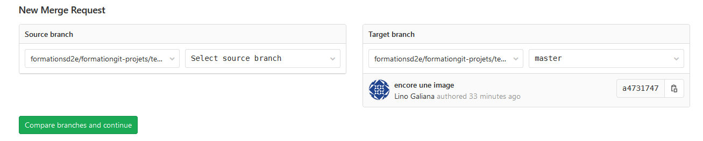

# Organiser le travail collaboratif {#orgagit}

Les outils de gestion de version permettent des usages multiples afin d'organiser efficacement la collaboration. Cette section propose une synthèse des usages de `Git` dans la communauté `R`, adaptés à fois à la configuration à l'Insee et au mode de travail des statisticiens.

:::: {.remarque data-latex=""}

Cette formation adopte le parti pris de suivre le `GitHub Flow` dont une rapide description peut être trouvée sur [cette page](https://guides.github.com/introduction/flow/) et qui a pour mérite d'être le plus simple.  

En effet, des habitudes se sont imposées peu à peu dans la
communauté R, essentiellement au travers des collaborations sur la plateforme
`GitHub` (plateforme de gestion de code similaire à GitLab). Ces usages, semblables à des normes sociales, vous permettront d'acquérir une certaine maîtrise de `Git`. Ensuite, au fur et à mesure de l'avancée de vos projets, vous pourrez adapter plus finenement ce fonctionnement à vos besoins et exploiter les nombreuses possibilités offertes par le contrôle de version. Cela n'est absolument pas gênant, à partir du moment où vous comprenez ce que vous faites.

Vous devez savoir qu'il y a plusieurs méthodes de travail avec `git` (_flow_, en anglais). Vous pourrez trouvez des dizaines d'articles en ligne et d'ouvrages sur ce sujet dont chacun prétend avoir trouvé la meilleure organisation du travail (`Git flow`, `GitHub flow`, `GitLab flow`...). Ne lisez pas trop ces livres ou articles sinon vous serez perdus (un peu comme avec les magazines destinés aux jeunes parents ou les conseils pour devenir millionnaires).
::::

Voici la marche à suivre lors de la création d'un nouveau projet :

- Vous devez identifier les responsables de la maintenance du projet. Dans `GitLab`, c'est facile, c'est le rôle de _Mainteneur_ (droits d'écriture sur `master`).
- Chaque mainteneur a une responsabilité identique et élevée : n'accordez pas les droits de mainteneur sur votre repository à la légère, vous pourriez le regretter.
- C'est au(x) mainteneur(s) du `r with_def("repository")` de définir les règles d'organisation du travail (ici, ce sera le `GitHub flow`).
- Idéalement, ces règles doivent être précisément décrites dans un fichier nommé `CONTRIBUTING.md` placé à la racine du projet. Il permettra à toute personne rejoignant le projet en cours de route de comprendre les différentes modalités de contribution.
- Il est essentiel que chaque personne qui contribue au projet se conforme à ces règles.

`Git` est un outil puissant et flexible, adaptable à un grand nombre d'organisation du travail.
Dès lors, les problèmes rencontrés ne sont généralement pas liés à `Git`
mais à une mauvaise définition en amont de l'organisation du travail ou bien
à son non-respect par les mainteneurs. 

L'expérience enseigne que si vous n'avez pas réfléchi à l'organisation du travail,
il est à peu près certain que vous rencontrerez des problèmes.
Des difficultés peuvent en particulier apparaître dans une
équipe dont personne n'aurait d'expérience avec `Git`. Grâce aux fonctionnalités
de `Gitlab`, toutes les contributeurs d'un projet n'ont pas besoin de connaître
`Git`. Néanmoins, il est mieux que ceux ayant la responsabilité la plus élevée, à savoir
les droits d'écriture dans `master`, aient des connaissances en `Git` pour
ne pas mettre en péril un projet par une manipulation hasardeuse
(ça n'arrive pas souvent et il y a des filets de sécurité avant de le faire).

Pour les modifications quotidiennes,
il est possible d'effectuer un `commit` sur `master`.
Cela est possible si dans l'organisation du travail, vous avez les droits
de type _Mainteneur_. Le premier exercice [**`Git` en local**](#gitlocal) en
donne un exemple. Cependant, pour des changements plus profonds ou 
avec des collaborateurs moins réguliers, il est recommandé d'organiser le
 travail selon les cinq étapes suivantes.

## Créer une branche

Une branche permet de développer "dans son coin" (seul ou à plusieurs) et d'expérimenter des modifications et des améliorations avant de les proposer au dépôt commun.

## Modifier et valider ces changements 

C'est l'étape des `commits`. Le travail se fait sur la branche en veillant à bien commenter les modifications et à bien les distinguer (il vaut mieux trop de `commit` que pas assez). 

## Ouvrir une demande de fusion 

Une fois la série de modifications terminée ou le temps venu de rassembler les différents travaux, c'est par l'intermédiaire de la fusion entre la branche et le `master` (`Pull Request` sur `GitHub` ou `Merge Request` sur `GitLab`). Il faut alors "demander" de fusionner et c'est très bien intégré dans l'environnement `GitLab` (cf. ci-après). Cela initie un échange sur les modifications apportées.

## Échanger entre collaborateurs et vérifier le code

Une fois la `Merge Request` ouverte, il est possible d'échanger des images, de commenter, de poser des questions et d'y répondre. Il est par exemple possible de mentionner un membre de l'équipe par l'intermédiaire de `@personne`.

## Fusionner la branche avec `master`

Une fois les vérifications faites, la fusion conserve l'historique des modifications et l'ensemble des `commits`.

## Exercice 6 : Résoudre les conflits, c'est facile.

Si vous adoptez les règles précédentes, `master` sera surtout modifié via des `merge requests`. Vous ne devriez donc jamais avoir de conflits sur master.

Tous les conflits devraient donc survenir dans les branches. Les `merge requests` en conflit sont impossibles à merger. Il n'y a donc pas de possibilité de commettre un erreur par mégarde (c'est la raison pour laquelle il est interdit de merger dans master localement).

Si votre branche est en conflit, **le conflit doit être résolu dans la branche et pas dans master**. Voici la marche à suivre :

- appliquez le conseil de survie : faites une copie de sauvegarde de votre clone (avec l'expérience, vous pourrez vous passer de cette étape)
- dans votre clone, placez vous sur la branche en question `git checkout nom-de-la-branche`
- mergez master dans la branche `git merge master`
- résolvez les conflits
- finalisez le commit de merge
- poussez vers GitLab

Rappel : **Il est interdit de faire l'inverse (merger localement la branche dans master)**

:::: {.exo data-latex=""}
Exercice 6 : Gérer des conflits dans une branche

**Question a.** Revenez sur la branche `master`. Vous êtes subitement atteint
d'une double personnalité `r emo::ji("dizzy_face")`
et oubliez que vous avez déjà proposé des changements. 
Vous ouvrez une branche. Refaire l'exercice 3
(questions `a` à `d`) avec une branche nommée `nom-prenom-double` et ouvrir une
*merge request*. 

**Question b.** Vous revenez tous deux à votre état normal. Sur `Gitlab`, une première personne
valide sa *merge request*

**Question c.** En local, vous faites tous deux un `pull` pour récupérer la modification
du dépôt:

* La personne qui n'a pas fait le `merge` de sa branche se place sur sa branche. Elle doit mettre à jour
sa branche pour tenir compte des modifications de `master`:
    + Il faut taper dans l'invite de commande `git merge master` 
    + Un conflit doit apparaître : il se résout en éditant directement le fichier. Ne pas supprimer la phrase
de votre camarade mais accoler votre texte à celle-ci

* La personne qui a fait le `merge` retombe dans sa deuxième personnalité et se place dans sa branche `*-double`. Elle doit mettre à jour
sa branche `*-double` pour tenir compte des modifications de `master`:
    + Il faut taper dans l'invite de commande `git merge master` 
    + Un conflit doit apparaître : il se résout en éditant directement le fichier. Ne pas supprimer la phrase
de votre première personnalité mais accoler votre nouveau texte à celle-ci

**Question d.** Sur Gitlab, valider la *merge request* de la personne qui n'a pas eu de MR validée jusqu'à présent.
Regarder dans l'interface Gitlab, le fichier `cadavre_exquis.md`

**Question e.** Retour dans la deuxième personnalité aussi pour la deuxième personne. Chacun sur sa branche `-double`, suivre
la procédure de nettoyage du conflit pour être raccord avec `master`. La personne la plus rapide à régler le conflit valide sa
*merge request*, la suivante devra à nouveau harmoniser sa version avec `master`

::::

## Exercice 7 : Contribuer à un dépôt sans droits sur `master`

À l'issue de cet exercice, vous devriez avoir un premier cadavre exquis. Pour garder trace de ces monuments de littérature, vous allez les 
soumettre au dépôt d'exemple. Il est tout à fait possible de soumettre des modifications à un dépôt sur lequel on n'a pas le droit d'écriture
par l'intermédiaire d'un `fork`:

:::: {.exo data-latex=""}
Exercice 7 : Travail en collaboration directe

1. Se trouver un nom de groupe qui va servir à nommer le fichier. 
L'une des personnes du groupe crée une branche `finalisation`. Elle se place dessus et change le nom du `cadavre-exquis.md`. Par exemple, si vous avez décidé d'être l'équipe Oulipo, nommer le fichier `oulipo.md`
2. Ne pas oublier de faire add, commit, push 
3. Dans le dépôt d'[exemple](https://gitlab.com/linogaliana/template-projet), ouvrir une `merge request` en mettant votre dépôt et la branche `finalisation` dans la partie `Source branch` . Remplir la *merge request*

::::

:::: {.recommandation data-latex=""}
Faire une *merge request* via la branche `master` d'un `fork` est très mal vu. En effet,
il faut souvent faire des contorsionnements pour réussir à faire coïncider deux histoires
qui n'ont pas de raison de coïncider.
[L'aide officielle de `GitHub`](https://gist.github.com/Chaser324/ce0505fbed06b947d962#submitting-a-pull-request)
recommande de faire un `rebase`: souvenez-vous, on vous a dit que c'était mal de faire ça ! On s'évite beaucoup
de peine (et on évite une grosse galère au mainteneur du dépôt forké) en évitant simplement de faire le
merge depuis son propre `master`. L'astuce de le faire depuis une branche différente fonctionne très bien.
::::

/* faute de frappe dans le dernier mot de la note de bas de page 2 (mais absente ici) : travailler et non travaillr */
