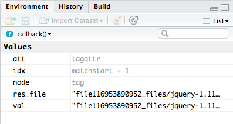
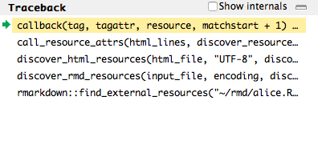

```{r setup, include=FALSE}
knitr::opts_chunk$set(echo = TRUE, eval = FALSE)
```

## Pourquoi utiliser Rstudio?

* `Rstudio` est un éditeur de code (IDE) très complet:
    + Outils pour écrire et exécuter du code `R`
    + Extensions pour écrire des documents (`R markdown`)
    + Possibilité d'exécuter d'autres langages (`Python`,`C++`...)
    + Brancher à `git`, visualiser du `html`, des `shiny`...

{width=80%}     

# Utiliser des projets R

## Principe

* Les `projets` sont un outil pour faciliter la collaboration...
    + Pour faciliter la reproductibilité du code, le contexte doit être homogène 

* ... mais aussi mieux s'organiser lors d'un travail individuel
    
</br></br>

* Un projet bien organisé facilite la vie: 
    + Centraliser l'ensemble des productions d'un projet: codes, articles, présentations, documentation...
    + Faciliter la compréhension et la reproducibilité d'un travail à partir de 0
    + Permettre l'interaction entre les fichiers (plusieurs documents codes, R markdown...) et avec les données
    + Faciliter des évolutions postérieures avec un projet organisé
    
</br></br>
    
* Ne contient pas que du code `R`:
    + ensemble des documents (documation incluse) pour permettre la compréhension et l'exécution d'un projet


## Principe

* `Rproject`: Associer à chaque projet personnel un contexte
    + Chaque projet a un contexte: espace de travail, historique de commandes, variables d'environnement...
    + Projet: pas seulement fichier `.R` mais un ensemble plus global
    
{width=60%} 


## Créer un projet R

3 possibilités:

{width=60%} 


## Créer un projet R

1. Dans un nouveau dossier:

    + Pour un projet tout nouveau

{width=60%} 


## Créer un projet R

2. Dans un dossier existant:

    + Commencer à organiser un projet dans lequel des documents ont déjà été produits

{width=60%} 


## Créer un projet R

3. Cloner un projet depuis un dépôt:

    + Pour récupérer depuis un dépôt git distant et se connecter à celui-ci
    + Nous verrons cela plus tard

{width=60%}


## Types de projets possibles

* `Rstudio` facilite l'initialisation de différents types de projets
* On peut avoir des projets emboîtés
    + Ex: un projet maître centralisant plusieurs projets, dont des packages

{width=80%}

## A la création du projet: intégrer `git` ?

* On peut initialiser `git` en même temps que le projet
    + Ou l'initialiser à tout moment (cf. suite)
    + Ou initaliser le projet à partir d'un dépôt git existant (plus simple, cf. suite)

{width=80%}


## `RProject`: structure

1. Création d'un fichier `.Rproj` dans le dossier principal.
    + Centralise les options (présentées dans la suite)
    + Raccourci pour ouvrir le projet

{width=80%}

## `RProject`: structure

2. Création d'un dossier caché (nommé `.Rproj.user`)
    + Où sont stockés les fichiers temporaires du projet (scripts sauvegardés automatiquement...)
    + Automatiquement ignoré par `.Rbuildignore`, `.gitignore`


{width=80%}


## `RProject`: structure

3. Charge le projet dans `Rstudio` et affiche son nom dans la barre de projets


{width=80%}
    

# Travailler sur un projet

## A l'ouverture d'un projet
 
Lorsqu'on ouvre un `Rproject`:

* Une nouvelle session `R` est ouverte
* Le `.Rprofile` du projet (si présent) est chargé
* Le `.RData` du projet (si présent) est chargé (si les options du projet l'autorisent)
* Le `.Rhistory` du projet (si présent) est chargé dans le cadre `History` (et permet l'utilisation des boutons haut/bas pour remonter l'histoire des commandes). \hyperlink{label}{\beamerbutton{Exemple de cadre `History`}}
* Le *working directory* est fixé au niveau du dossier maître du projet
* Les documents précedemment ouverts sont restaurés dans l'éditeur `Rstudio`
* Les autres paramètres `RStudio` (e.g. position du curseur, etc.) sont restaurés à leur valeur précédent la fermeture du projet

## A la fermeture du projet


* `.RData` et/ou `.Rhistory` sont sauvegardés dans le projet (si les options du projet l'autorisent)
* Les documents ouverts non sauvegardés sont sauvergardés temporairement
* Les autres paramètres RStudio sont sauvés
* La session R associée au projet est arrêtée


# Options du projet (`Tools > Project Options...`)

## Options générales 

* `(Default)`: utiliser les options globales
* *Restore .RData into workspace at startup* —  N'est pas recommandé si les données sont volumineuses (ralentissement du démarrage de la session)
* *Always save history (even when not saving .RData)* — Ajouter la ligne `.Rhistory` dans le fichier `.gitignore` (si existe) si l'histoire des commandes est conservée


{width=60%}

## Options `build` (développement package uniquement)

{width=60%}


## Options `git` 

{width=60%}


# Edition de code dans `Rstudio`

## Raccourcis utiles

Utiliser les raccourcis pour les commandes répétitives:

* `Ctrl`+`Enter`: exécuter les lignes sélectionnées 
* `Tab`: autocomplétion
* `Ctrl` + `Alt` + `R`: exécuter l'ensemble d'un script
* `Ctrl` + `I`: réindenter code
* `Ctrl` + `Shift` + `A`: reformater code
* `Alt` + `Up/Down`: déplacer une ligne sans faire copier-coller
* `Ctrl` + `Deplacement souris`: passage en édition verticale (curseur en colonne)
* `Ctrl` + `Shift` + `M`: insérer pipe `%>%`
* `Alt`+ `F6`: insérer opérateur assignation `<-`

# Utiliser le debuggeur

## Debuggeur

* Utiliser des fonctions est une bonne manière d'assurer la reproducibilité du code
* Comment faire lorsqu'une fonction provoque une erreur ? 
    + Rstudio propose, parfois, une fenêtre appelée *debuggeur*

{width=60%}

## Utiliser le debuggeur: *"fenêtre environnement"*

* `R`: interagit généralement avec l'*environnement global*
* Les fonctions exécutent leur code interne dans un environnement séparé
    + Mode debug: possibilité d'interagir avec cet environnement plutôt que l'environnement global
    + S'assurer que l'environnement accède bien aux objets désirés (packages, paramètres, dataframe, functions...)

{width=50%}

## Traceback

* Montre le chemin suivit par l'exécution de la fonction:
    + du point départ (première fonction exécutée)
    + à la dernière fonction exécutée (celle provoquant l'erreur)

* En cliquant sur une fonction, on voit son environnement ainsi que sa place dans le code, si `R` parvient à la determiner


{width=50%}

## Console

* L'invite de commande de la forme `Browse[1]>` nous montre qu'on est pas dans l'environnement habituel
* Les commandes sont exécutées dans l'environnement de la fonction. Si la fonction a une variable nommée `x`, taper `x` permettra d'afficher sa valeur


* On presse `Enter` pour exécuter des commandes plutôt que `CTRL` + `Enter` en mode debug

{width=50%}


# Addins Rstudio

## Addins

* Les `addins` sont des outils pratiques pour gagner du temps dans l'édition du code
    + Installation simple grâce à addinslist: `install.packages('addinslist')`
    + Ceux sur `CRAN` sont disponibles pour tous, ceux sur `github` nécessitent d'avoir configuré le proxy 
    + Génèrent automatiquement du code ou du texte utile pour les markdown

{width=60%}

## Addins

Avec `addinslist`, on peut installer des addins à partir d'une fenêtre graphique

{width=60%}

<!-----------
## Un exemple


---------> 

## Quelques addins utiles


* `snippetsaddins`: convertir slash automatiquement pour avoir des chemins valide
    + *"monchemin/toto/fichier.csv"* -> *"monchemin\\toto\\fichier.csv"*
* `ggedit`: aide pour générer un code pour graphiques `ggplot2`
* `JADD`: en sélectionnant une fonction, on assigne les paramètres par défaut dans l'environnement
* `questionr`: recodage facilité des variables `factor`
* `trackmd`: un outil de *track change* pour `markdown`


# Annexe

## Rhistory

\hypertarget{label}{\beamerbutton{Exemple de cadre `History`}}

{width=100%}
    