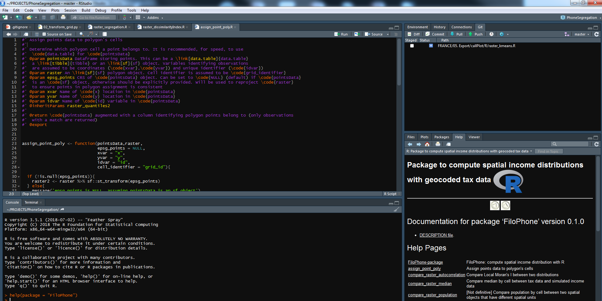

<script src="../js/hideOutput.js"></script>


```{r setup, include=FALSE}
knitr::opts_chunk$set(echo = TRUE)
```


> To understand computations in R, two slogans are helpful:
>
>  * Everything that exists is an object.
>  * Everything that happens is a function call.
>
> *John Chambers*


 
`R` est, dans son essence, un langage de programmation fonctionnelle. L'utilisation de fonctions est ainsi la manière privilégiée de développer un programme en `R`: comprendre la manière dont elles fonctionnent, interagissent avec l'environnement de l'utilisateur, est la meilleure manière de développer, par la suite, un programme reproductible. 

Construire un *workflow* à partir de fonctions est une pratique qui permet de réduire les risques de *bug* (en identifiant mieux leur origine) et, surtout, assure un code plus flexible et reproductible. Cela renvoie au paradigme informatique du *“do not repeat yourself”*.


> “Every piece of knowledge must have a single, unambiguous, authoritative representation within a system”
>
> Dave Thomas and Andy Hunt, *The Pragmatic Programmer*

Cette approche nous intéresse particulièrement car elle rend le code plus clair, plus robuste, plus facile à répliquer et à faire évoluer.


# Distinguer noms et valeurs

Avoir un code fonctionnel sur son ordinateur n'assure pas qu'un autre utilisateur soit en mesure de le faire tourner. La source la plus commune d'erreur est que les environnements ne coïncident pas. Pour assurer un code fonctionnel lors d'un partage, il est important de comprendre la manière dont `R` gère les objets, environnements et dépendances. 

La première distinction importante est celle entre un objet et son nom. A ce stade, vous devriez être habitué à l'assignation

```{r}
x <- c(1, 2, 3)
```

On serait tenté de lire *"je crée un objet appelé 'x' contenant les valeurs 1,2 et 3"*. En réalité, R procède de la manière suivante:

* `R` crée un vecteur de valeurs `c(1, 2, 3)`
* `R` lie (*binds*) ce vecteur a un nom, ici `x`

Autrement dit, l'objet/la valeur n'a pas de nom ; c'est le nom qui a une valeur. L'opérateur  assignation `<-` crée donc un lien entre un nom et une valeur. Un nom est une référence à une valeur: cela évite que le code ci-dessous

```{r}
y <- x
```

crée une copie (mobilisant de la mémoire) d'un objet déjà existant (`x`). Ce qu'il fait, c'est créer une référence supplémentaire pour accéder au vecteur `c(1,2,3)`

## Copie

Le code ci-dessous lie `x` à `y` puis modifie `y`:
```{r}
x <- c(1, 2, 3)
y <- x

y[[3]] <- 4
x
```

Cela ne modifie pas `x`. Alors que la valeur associée à *y* a changé, l'objet original n'a pas changé. A la place, `R` a créé un nouvel objet. 

Ce comportement est appelé **copy-on-modify**. C'est parce que les objets R sont, en principe, immutables et que, ainsi, les faire évoluer implique de modifier la valeur sous-jacente. Parler d'immutabilité à propos des objets `R` peut paraître surprenant puisqu'on peut, *a priori*, ajouter des élements à un objet `R`:

```{r}
a <- list()
a[[1]] <- "je remplis ma liste"
a
```

En réalité, on a dupliqué temporairement `a` (*copy*) et ensuite associé modifié cet objet avant le ré-assigner au nom `a` '(*modify*). Cette approche rend le langage `R` très flexible en permettant, par exemple, de faire évoluer la classe d'un objet (à partir d'une réassignation)
```{r}
a <- c(1,2,3)
a <- data.frame("a" = a)
class(a)
```


# Créer des fonctions

La fonction est l'objet de base de `R`: tout objet est un appel de fonction. Bien comprendre celles-ci est donc essentiel. 

## Fonctions avec un seul argument

Supposons qu'on ait chargé une base de données qui utilise le code `−99` pour représenter les valeurs manquantes. On désire remplacer l'ensemble des `−99` par des `NA`s.

```{r}
# On fixe la racine pour être sûr de tous avoir le même dataset
set.seed(1014)

# On créé un dataframe
df <- data.frame(replicate(6, sample(c(1:10, -99), 6, rep = TRUE)))
names(df) <- letters[1:6]
df
```

Un premier jet de code pourrait prendre la forme suivante:

```{r}
df2 <- df
df2$a[df2$a == -99] <- NA
df2$b[df2$b == -99] <- NA
df2$c[df2$c == -99] <- NA
df2$d[df2$d == -99] <- NA
df2$e[df2$e == -98] <- NA
df2$f[df2$g == -99] <- NA
df2
```

Quelque chose ne vous choque pas ? Regardez précisément le code et le dataframe (indice: surveillez la colonne `e`)

On a introduit une erreur humaine dans le code, difficile à détecter. La tâche ici est identique entre les colonnes, on a envie de mettre en place une structure générale, qu'on appliquerait *n* fois, qui éviterait ce problème (quitte à avoir une erreur, mieux vaut s'en rendre compte en la faisant systématiquement). 

Construire une fonction est simple en `R` et emboîter ou enchaîner des fonctions également. Cela prend la forme suivante
```{r, eval = FALSE}
nom_fonction <- function(arg1,arg2,...,argK){
  
  # fait qqch
  # ...
  
  # Retourne resultat
  return(mon_output)
}
```

Pour généraliser le code précédent, on voit qu'il y a une structure commune à toutes nos lignes de la forme `.[. == -99] <- NA`: cela servira de base à notre fonction. 

Ecrivez un exemple de fonction `fix_missing` qui généralise, simplement, ce travail de nettoyage. Elle prendra en entrée x (un vecteur) et retourne ce vecteur avec les valeurs manquantes corrigées


<div class="fold o s">
```{r}
fix_missing <- function(x) {
  x[x == -99] <- NA
  x
}
```
</div>

On peut l'appliquer avec le code suivant:
```{r}
df2 <- df
df2$a <- fix_missing(df2$a)
df2$b <- fix_missing(df2$b)
df2$c <- fix_missing(df2$c)
df2$d <- fix_missing(df2$d)
df2$e <- fix_missing(df2$e)
df2$f <- fix_missing(df2$f)
df2

# On va comparer au resultat donc on le garde
df2_good <- df2
```

C'est mieux (on ne fait plus l'erreur précédente), mais cela n'élimine pas encore toute possibilité d'erreur: il n'est plus possible de taper `-98` au lieu de `-99`, mais il est toujours possible de se tromper dans le nom des variables
```{r}
df2 <- df
# On se trompe à nouveau
df2$a <- fix_missing(df2$a)
df2$b <- fix_missing(df2$b)
df2$c <- fix_missing(df2$c)
df2$d <- fix_missing(df2$d)
df2$d <- fix_missing(df2$d)
df2$f <- fix_missing(df2$e)
df2
```
par exemple, l'erreur typographique ci-dessus reste vicieuse. La prochaine étape est ainsi d'éliminer ce risque d'erreur en combinant deux fonctions (ce qu'on appelle combinaison de fonctions). La première `fix_missing()` sert à régler le problème sur un vecteur. La seconde généralisera ce procédé à toutes les colonnes. Comme `R` est un langage vectoriel, c'est une approche fréquente de construire des fonctions sur des vecteurs et les appliquer ensuite à plusieurs colonnes.

La famille des fonctions `apply` est conçue pour appliquer une même fonction à plusieurs objets. La plus puissante, celle qu'il faut normalement utiliser, est la fonction `lapply` qui permet de stocker le résultat sous forme de liste. Celle-ci est à préférer à la fonction `sapply` qui effectue des conversions de type de données, ce qui peut être dangereux. Un peu plus bas, vous trouverez une approche alternative qui évite le `lapply` mais qui implique d'utiliser le package `reshape2`. Comme `R` est un langage vectoriel, de manière générale, les *dataframes* sous format *long* sont plus maniables que les *dataframes* sous format *wide* lorsqu'on veut leur imposer des opérations vectorielles

`lapply()` est ce qu'on appelle une *fonctionnelle* car elle prend une fonction comme argument. Les dataframes étant en fait des listes, `lapply` s'applique. On a juste besoin d'une petite astuce pour s'assurer que la sortie de la fonction soit bien un *dataframe* et non une liste. A la place d'assigner le résultat sous la forme `df <- lapply(.....)` on va faire `df[] <- lapply(.....)`. Ecrivez la boucle `lapply` permettant de faire cela:

```{r}

# METHODE 1
df2 <- df
fix_missing <- function(x) {
  x[x == -99] <- NA
  x
}
df2[] <- lapply(df2, fix_missing)
df2

# METHODE 2
df3 <- df
df3[] <- lapply(df3, function(x) ({
  x[x == -99] <- NA
  return(x)
  }))
identical(df2,df3)


# Approche équivalente avec purrr::map
df2_map <- df2
df2_map[] <- purrr::map(df2_map,fix_missing)
df2_map
identical(df2,df2_map)
```

Le dernier bloc de code montre une manière équivalente de procéder dans le cadre du `tidyverse` à partir de la fonction `purrr::map` à la place de `lapply`^[Si la structuration de données choisie est le *tibble* (approche `tidyverse`), `purrr::map` est probablement à privilégier car `purrr` est conçu pour fonctionner en conjonction avec `dplyr`. `lapply`, parce qu'il s'agit d'une fonction de base, est mobilisable pour une très grande variété de problèmes. Parce que `R` est un langage de programmation où les fonctions sont centrales et où les listes sont une structure de données très riche, `lapply` reste très malléable et s'intègre très bien avec une grande variété d'objets `R`]

Ce code a plusieurs avantages sur le copier-coller:

1. Il est plus concis
2. Si on a un changement de code pour les valeurs manquantes, il suffit de le mettre à un seul endroit
3. Il fonctionne quelque soit le nombre de colonnes.
4. On ne peut pas traiter par erreur une colonne différemment d'une autre

De plus, le code est facilement généralisable. Par exemple, à partir de la même structure, écrire le code qui permet de ne traiter que les colonnes *a*,*b* et *e*

```{r}
df2 <- df
df2[c("a","b","e")] <- lapply(c("a","b","e"), function(col) fix_missing(df2[col]))

# ou approche équivalente avec purrr::map
df2_map <- df
df2_map[c("a","b","e")] <- purrr::map(c("a","b","e"), function(col) fix_missing(df2_map[col]))
identical(df2,df2_map)
```

Cette approche de composition de fonctions est très précieuse et explique la grande flexibilité du langage `R`. Ecrire des fonctions simples et les composer dans une ou plusieurs fonctions maîtres est très précieux dans un travail collaboratif car cela permet de mieux comprendre le déroulé d'un traitement de données.


Il y aurait une autre manière de traiter ce problème évitant d'appliquer la fonction `lapply` mais qui, ici, ne produit pas de résultats plus rapide. En transformant le format du *dataframe* de *wide* (beaucoup de colonnes) en *long* (beaucoup de lignes), on évite le *lapply* et on peut ainsi appliquer la fonction `fix_missing` facilement. 


<div class="fold s">
```{r}
#' Version alternative du programme évitant une boucle \code{lapply}
#' 
#' @param df Dataframe
#' @return \code{df} avec les valeurs manquantes transformées

fix_missing_long <- function(df){
  
  # On transforme les données au format 'long'
  df2 <- reshape2::melt(df)
  
  # On applique la transformation au vecteur de 'valeurs'
  df2$value <- fix_missing(df2$value)
  
  # On utilise une fonction de 'base' pour numéroter les lignes par variable (une approche avec 'dplyr' serait plus simple)
  df2$id <- ave(df2$val, df2$variable, FUN = seq_along)
  
  # On revient au format 'wide' initial
  df2 <- reshape2::dcast(df2, id~variable, value.var = "value")[,-1]
  
  return(df2)
}

fix_missing_long(df)

identical(fix_missing_long(df),df2_good)

```
</div>

Néanmoins, ici, ce n'est pas la méthode la plus appropriée car le jeu n'en vaut pas la chandelle. C'est une opération couteuse de reformater un *dataframe* et, ici, l'opération vectorielle n'est pas assez complexe pour que la répétition $K$ fois de celle-ci prenne plus de temps que deux formatage de données (*wide* -> *long* -> *wide*)


Comment faire maintenant si on désire autoriser d'autres valeurs que `-99` ? Il faut utiliser une fonction plus générale, avec deux arguments. 


## Fonctions à plusieurs arguments

Notre fonction précédente prenait comme donnée que la valeur pour les valeurs manquantes est `-99`. On peut en faire un paramètre d'une fonction plus générale qui serait de la forme `fix_missing <- function(x, na.value)`. Ecrire cette fonction et l'appliquer à nouveau

<div class="fold s">
```{r}
fix_missing <- function(x, na.value) {
  x[x == na.value] <- NA
  x
}

fix_missing(x = df,na.value = -99)
```
</div>

On peut omettre les noms d'arguments en `R` dans l'appel d'une fonction (`fix_missing(df,-99)` fonctionne). Néanmoins, il s'agit d'une pratique dangereuse qu'il vaut mieux éviter:

* En l'absence du nom des arguments, `R` détermine à quels arguments renvoient `df`, `-99` en fonction de l'ordre. Pour les fonctions à nombreux arguments, on peut facilement inverser deux arguments ce qui provoquera une erreur ou un résultat non conforme à la volonté
* Un appel de fonctions sans le nom des arguments est plus compliqué à débugger car il faut aller vérifier les arguments dans l'aide ou le code source pour savoir ceux dont il s'agit

Mieux vaut être explicite donc. Avec l'autocomplétion de `Rstudio`, ce n'est pas vraiment plus long à écrire. 

Imaginons maintenant qu'un code supplémentaire de valeur manquante doive être introduit. Supposons, en supplément de `-99`, que les valeurs manquantes sont aussi codées `10`. Comment feriez-vous ?

<div class="fold s">
```{r}
fix_missing2 <- function(x, na.value) {
  x[x %in% na.value] <- NA
  x
}

fix_missing2(x = df$d, na.value = c(-99,10))

df2 <- df
df2[] <- lapply(colnames(df2), function(col) fix_missing2(df2[,col], na.value = c(-99,10)))
```
</div>

Il suffit en effet d'une transformation mineure de la fonction `fix_missing2`. Notez que cette fois, dans le `lapply`, on a écrit `df2[,col]` et non `df2[col]`.

Maintenant, on généralise encore une fois le programme. Imaginons, que toutes les variables ne soient pas codées de la même manière. Pour simplifier, réduisons le problème aux variables `a`, `b` et `c`. Imaginons que la variable `a` ait des valeurs 1 à 3 qui sont en fait des codes manquants, la variable `b` des valeurs 4 à 6 qui soient manquantes et la variable `c` des valeurs 7 à 10.

Une manière appropriée de traiter ce problème est de stocker ces formats sous forme de liste. L'argument sera ainsi celui-ci

```{r}
codes_na <- list("a" = 1:3, "b" = 4:6, "c" = 7:9)
```

Dans un premier temps, effectuez ceci avec un `lapply`

<div class="fold s">
```{r}
df2 <- df
df2[names(codes_na)] <- lapply(names(codes_na), function(variable) fix_missing2(df2[,variable], na.value = codes_na[[variable]]))
df2
```
</div>

Maintenant, généralisez en créant une fonction à partir de ce code
<div class="fold s">
```{r}
fix_multiple_missing <- function(data,codes_na){
  data[names(codes_na)] <- lapply(names(codes_na), function(variable) fix_missing2(data[,variable], na.value = codes_na[[variable]]))
  return(data)
}

fix_multiple_missing(df, codes_na = list("a" = 1:3, "b" = 4:6, "c" = 7:9))
```
</div>

<!-----
TROP COMPLIQUE JE PENSE

## Closures


    “An object is data with functions. A closure is a function with data.” — John D. Cook


closures are functions that make other functions.

```{r}
add_x <- function(x) {
    function(y) { x + y }
}
```

Closures enclose access to the environment in which they were created – so you can nest functions within other functions.

Closures get their name because they enclose the environment of the parent function and can access all its variables. This is useful because it allows us to have two levels of parameters: a parent level that controls operation and a child level that does the work.


Are you repeating code, but instead of variables or data that’s changing – it’s the function instead? That’s a good case for a closure. Especially as your code gets more complex, closures are a good way of modularising and containing concepts.
What are the steps for creating a closure?

Building a closure happens in several steps:

    Create the output function you’re aiming for. This function’s input is the same as what you’ll give it when you call it. It will return the final output. Let’s call this the enclosed function.
    Enclose that function within a constructor function. This constructor’s input will be the parameters by which you’re varying the enclosed function in Step 1. It will output the enclosed function. Let’s call this the enclosing function.
    Realise you’ve got it all wrong, go back to step 1. Repeat this multiple times. (Ask me how I know..)
    Next you need to create the enclosed function(s) (the ones from Step 1) by calling the enclosing function (the one from Step 2).
    Lastly, call and use your enclosed functions.

An example

Say I want to calculate the mean, SD and median of a data set. I could write:
x <- c(1, 2, 3)
mean(x)
median(x)
sd(x)

stat <- function(stat_name){

function(x){
stat_name(x)
}

}

This is made up of two parts: function(x){} which is the enclosed function and stat() which is the enclosing function.
---->


# Documenter des fonctions

Décrire l'objectif d'une fonction, ses arguments (le type d'objet, une petite description de ceux-ci...) est fondamental pour la compréhension d'un programme, de sa structure et de sa finalité.

Le package `roxygen2` facilite la structuration de la documentation d'une fonction (en fait, comme on le verra dans la leçon sur les *packages*, `roxygen` permet de structurer l'ensemble de la documentation d'un package). Une documentation de fonction a une architecture traditionnelle: un titre, des labels pour les paramètres... Les exemples ne manquant pas, par exemple en tapant `?sum`, `?gsub`...

Tout de suite documenter les fonctions sous standard `roxygen` permet d'économiser beaucoup de temps lors du passage d'un ensemble de fonctions en *package*. Même sans passage sous forme de *package*, la documentation `roxygen` rend intelligible l'objet d'une fonction. Pour ce qui est du fonctionnement interne, on peut toujours laisser des commentaires standards à l'intérieur de celle-ci.

Un commentaire `roxygen` prend la forme `#'` et se distingue d'un commentaire standard `#`. Toutes les lignes `roxygen` précédant une fonction sont appelées un bloc. 

Par exemple, une documentation simple prend la forme

```{r}
#' Add together two numbers.
#' 
#' @param x A number.
#' @param y A number.
#' @return The sum of \code{x} and \code{y}.
#' @examples
#' add(1, 1)
#' add(10, 1)
add <- function(x, y) {
  x + y
}
```

Les blocs sont décomposés sous forme de tags `@****`. Le texte avant le premier tag est l'introduction qui se décompose de la manière suivante:

1. La première phrase est le titre de la documentation. C'est cette phrase qu'on retrouve en tapant `help(package = mypackage)` et qu'on retrouve en tête de chaque fichier d'aide `?myfunc`. Cette phrase doit être écrite sur une ligne et ne pas terminer par un point




2. Le second paragraphe est la section *description*. C'est le premier élément d'une documentation de fonction qui explique de manière succincte l'objet d'une fonction

3. Le troisième paragraphe, s'il a lieu d'être, et les suivants avant le premier tag, constituent la section *details*. C'est une partie plus longue de documentation qui permet d'approfondir l'objet, ou les subtilités, d'une fonction

Toutes les fonctions doivent avoir un titre et une description. Les détails sont optionnels. En supplément du bloc introductif, la plupart des fonctions nécessitent les trois tags `@param`, `@examples` et `@return`.

* `@param name description`: décrit les inputs d'une fonction. Par exemple, `@param data Un dataframe duquel on veut extraire les années`. Il est souvent judicieux d'évoquer le type d'input autorisé (un vecteur numérique, de caractère, un dataframe...). Il est possible de décrire plusieurs *inputs* à la fois en séparant les noms par des virgules: `@param x,y Numeric vectors`. Si la fonction hérite de paramères d'une autre fonction, on peut éviter de réécrire les paramètres concernés en mettant le tag `@inheritParams`

* `@examples`: code d'exemple. Attention, si la fonction documentée est incorporée dans un package, ce code est exécuté. Pour éviter cela, il convient d'encapsuler les exemples dans une commande `\dontrun`, par exemple

```{r, eval = FALSE}
#' Ma fonction
#' 
#' @param df Un dataframe qui n'est pas disponible à tous les utilisateurs de la fonction
#' @examples \dontrun{
#'  # Le code n'est pas exécuté
#'  chaine_traitement <-  my_big_func(df)
#' }

my_big_func <- function(df){
  # Plein de calculs
}
```


* `@return description`: description de l'*output* d'une fonction. Ce n'est pas toujours nécessaire, si la description de la fonction est suffisamment claire

Par exemple, la fonction précédente peut être enrichie

```{r}
#' Sum of vector elements.
#'
#' \code{sum} returns the sum of all the values present in its arguments.
#'
#' This is a generic function: methods can be defined for it directly
#' or via the \code{\link{Summary}} group generic. For this to work properly,
#' the arguments \code{...} should be unnamed, and dispatch is on the
#' first argument.
#'
#' @param ... Numeric, complex, or logical vectors.
#' @param na.rm A logical scalar. Should missing values (including NaN)
#'   be removed?
#' @return If all inputs are integer and logical, then the output
#'   will be an integer. If integer overflow
#'   \url{http://en.wikipedia.org/wiki/Integer_overflow} occurs, the output
#'   will be NA with a warning. Otherwise it will be a length-one numeric or
#'   complex vector.
#'
#'   Zero-length vectors have sum 0 by definition. See
#'   \url{http://en.wikipedia.org/wiki/Empty_sum} for more details.
#' @examples
#' sum(1:10)
#' sum(1:5, 6:10)
#' sum(F, F, F, T, T)
#'
#' sum(.Machine$integer.max, 1L)
#' sum(.Machine$integer.max, 1)
#'
#' \dontrun{
#' sum("a")
#' }
sum <- function(..., na.rm = TRUE) {}
```

On peut ajouter autant de sections que nécessaire à la documentation d'une fonction avec le tag `@section`, par exemple `@section Warning:`


# Fonctions: un peu de formalisme

<!--------------------
-------- METTRE CA AILLEURS

Changing the value of a supplied argument within a function will not affect the value of the variable in the calling frame

```{r}
f <- function(a) {
  a
}

x <- c(1,2,3)
f(x)
```


While f() is running, the a inside the function points to the same value as the x does outside the function
--------------->

Formellement, on peut décomposer une fonction en trois parties:

* Arguments (ex: `formals(lm)`): la liste des arguments qui contrôlent l'appel à une fonction
* Corps (ex: `body(lm)`): les commandes internes à la fonction
* Environnement (ex: `environment(lm)`): le contexte qui détermine comment la fonction trouve des valeurs associées aux noms évoqués

Alors que les arguments et le corps de la fonction sont définis explicitement, l'environnement est lui défini implicitement, selon le contexte dans lequel est évoqué la fonction. 


```{r}
f02 <- function(x, y) {
  # A comment
  x + y
}

formals(f02)

body(f02)

environment(f02)
```

A noter qu'il n'est pas obligatoire d'associer un nom à une fonction: on appelle cela une fonction *anonyme* (équivalent des fonctions *lambda* en `python`). C'est une démarche fréquente dans les commandes `lapply`, par exemple `lapply(mtcars, function(x) length(unique(x)))`.^[Les *closures*, qui sont des listes qui capturent l'environnement d'une fonction, fonctionnent aussi sur ce modèle]
<!--------
```{r}
funs <- list(
  half = function(x) x / 2,
  double = function(x) x * 2
)

funs$double(10)
```
-------> 

## Portée (*scoping*) d'une fonction

L'assignation est l'acte d'associer un nom à une valeur. Le *scoping* (portée) est l'acte de trouver une valeur associée à un nom. 

Par exemple, que va renvoyer le code suivant: 10, 20, 25 ? 
```{r}
x <- 10
g01 <- function() {
  x <- 20
  x
}

g01()
```

Une bonne compréhension de la portée des fonctions est essentiel pour écrire des fonctions réplicables. 


<!---------
R uses lexical scoping26: it looks up the values of names based on how a function is defined, not how it is called. “Lexical” here is not the English adjective that means relating to words or a vocabulary. It’s a technical CS term that tells us that the scoping rules use a parse-time, rather than a run-time structure.
----------->

<!----------
La portée des objets en `R` suit 4 règles primaires:


R’s lexical scoping follows four primary rules:

    Name masking
    Functions versus variables
    A fresh start
    Dynamic lookup

---------->

### Noms masqués

Le principe de base de la portée est que les noms définis au sein d'une fonction masquent les noms définis en dehors. Le code suivant montre un exemple de cette régle: que renvoie la fonction suivante?

<div class="fold o">
```{r}
x <- 10
y <- 20
g02 <- function() {
  x <- 1
  y <- 2
  c(x, y)
}
g02()
```
</div>


Si `R` ne trouve pas un nom dans une fonction, il cherchera celui-ci dans un environnement situé un niveau au-dessus (cf. plus tard)


```{r}
x <- 2
g03 <- function() {
  y <- 1
  c(x, y)
}
g03()

# And this doesn't change the previous value of y
y
```

Cette règle s'applique de la même manière pour les fonctions emboîtées: `R` cherche d'abord dans l'environnement de la fonction, puis dans celui de la fonction au dessus et ainsi de suite jusqu'à l'environnement global. S'il ne trouve toujours pas le nom recherché (par exemple une fonction `sum`), R finira par chercher dans la liste des packages chargés.   

Un bon exemple de portée d'une fonction est le suivant:

```{r}
g11 <- function() {
  if (!exists("a")) {
    a <- 1
  } else {
    a <- a + 1
  }
  a
}

g11()
g11()
```

Pourquoi `g11()` retourne-t-elle toujours la même valeur ? C'est parce que chaque fois qu'une fonction est appelée, un nouvel environnement est créé pour héberger son exécution. Une fonction est donc incapable de connaître les noms qui ont pu être créés par une fonction passée sans `return`. 


La portée permet de lier des objets entre eux mais ne permet pas de déterminer quand ce lien prendra place (on parle d'évaluation paresseuse ou *lazy evaluation*: on donne un plan à `R` pour lier les objets, on ne lui dit pas encore quand la commande aura lieu). `R` associera les noms aux valeurs quand la fonction sera exécutée, et pas à sa création. 

Cela implique que l'output d'une fonction peut différer selon les objets hors de l'environnement de la fonction (ces objets sont parfois appelés variables globales parce qu'ils affectent l'ensemble des fonctions, par opposition aux variables locales qui sont propres à une fonction). 

```{r}
g12 <- function() x + 1
x <- 15
g12()

x <- 20
g12()
```

La modification de `x` (variable globale) change donc l'output de la fonction. Une manière de rapidement savoir quelles sont les variables globales qui peuvent avoir un effet sur les résultats est d'utiliser la fonction `codetools::findGlobals()`. Cette fonction liste toutes les dépendances externes appelés dans une fonction 

```{r}
codetools::findGlobals(g12)
```


### Promesse et évaluation paresseuse

Comme on l'a dit, les arguments d'une fonction en `R` sont évalués de manière paresseuse: ils ne sont évalués que s'il est nécessaire d'y aller dans le plan qu'on a défini. 

Par exemple, le code suivant ne provoquera pas d'erreur car `x` n'est jamais utilisé:

```{r}
h01 <- function(x) {
  10
}
h01(stop("This is an error!"))
```

C'est très pratique car cela permet de créer des fonctions qui peuvent avoir des calculs très différents selon le type d'argument

Par exemple, créez une fonction `add(x,y)` qui

* si `x` et `y` sont numériques, ajouter `x` et `y`
* si `x` et `y` sont des caractères, concatène `x` avec `y` ^[Notez qu'en Python, la distinction de type ne devrait pas être nécessaire car la concaténation de *string* passe directement par l'opérateur `+`]
* si `x` et `y` ne sont pas de même type, on renvoie l'erreur *"'x' et 'y' ne sont pas de même nature"*"

```{r, error=TRUE}
add <- function(x,y){
  if ((class(x) == "numeric") & (class(y) == "numeric")){
    x + y
  } else if ((class(x) == "character") & (class(y) == "character")){
    paste0(x,y)
  } else{
    stop("'x' et 'y' ne sont pas de même nature")
  }
}
add(1,2)
add("a","b")
add(1,"b")
```

Dans le cadre de l'évaluation paresseuse, ce qui permet à `R` de lier les objets et environnements entre eux est la `promesse`. Elle a trois éléments

* Une *expression*, comme `x + y`, qui amènera à de futures calculs
* Un *environement*, où l'expression sera évaluée, i.e. l'environnement où la fonction est évaluée
* Une *valeur* qui est calculée et gardée en mémoire au sein de l'environnement (de manière à éviter de faire deux fois le même calcul si le même plan est appelé deux fois dans le même environnement). 

<!-----------
A value, which is computed and cached the first time a promise is accessed when the expression is evaluated in the specified environment. This ensures that the promise is evaluated at most once, and is why you only see “Calculating…” printed once in the following example.

double <- function(x) { 
  message("Calculating...")
  x * 2
}

h03 <- function(x) {
  c(x, x)
}

h03(double(x))
#> Calculating...
#> [1] 40 40


Thanks to lazy evaluation, default values can be defined in terms of other arguments, or even in terms of variables defined later in the function:

h04 <- function(x = 1, y = x * 2, z = a + b) {
  a <- 10
  b <- 100
  
  c(x, y, z)
}

h04()


Many base R functions use this technique, but I don’t recommend it. It makes the code harder to understand: to predict what will be returned, you need to know the exact order in which default arguments are evaluated.

The evaluation environment is slightly different for default and user supplied arguments, as default arguments are evaluated inside the function. This means that seemingly identical calls can yield different results. It’s easiest to see this with an extreme example:

h05 <- function(x = ls()) {
  a <- 1
  x
}

# ls() evaluated inside h05:
h05()
#> [1] "a" "x"

# ls() evaluated in global environment:
h05(ls())
#> [1] "h05"

To determine if an argument’s value comes from the user or from a default, you can use missing():
------------>

<!-----------
## Dot ...

There are two primary uses of ...

* If your function takes a function as an argument, you want some way to pass additional arguments to that function. In this example, lapply() uses ... to pass na.rm on to mean():

x <- list(c(1, 3, NA), c(4, NA, 6))
str(lapply(x, mean, na.rm = TRUE))
#> List of 2
#>  $ : num 2
#>  $ : num 5

* If your function is an S3 generic, you need some way to allow methods to take arbitrary extra arguments. For example, take the print() function. Because there are different options for printing depending on the type of object, there’s no way to pre-specify every possible argument and ... allows individual methods to have different arguments
------>

# Les environnements: encore du formalisme

L'environnement est la structure qui assure la portée. Un environnement est en fait une liste nommée d'objets avec des règles un peu plus restrictive qu'une liste classique:

1. Chaque nom doit être unique
2. Les noms dans un environnement n'ont pas d'ordre
3. Un environnement a un *parent* 
4. La copie d'environnements ne suit pas le principe de *copy-on-modified*

Un environnement sert à lier un ensemble de noms à un ensemble de valeurs. On peut dessiner un environnement de cette manière:


Quelques fonctions du package `rlang` sont dédiées aux environnements. Par exemple, créons un nouvel environnement `e1` contenant 4 objets

```{r}
e1 <- rlang::env(
  a = FALSE,
  b = "a",
  c = 2.3,
  d = 1:3
)
e1
```

Si on désire connaître les caractéristiques de celui-ci, on peut utiliser la fonction `rlang::env_print`. A noter que la fonction `names` renvoie les noms des objets internes à `e1` de la même manière qu'avec une liste normale

```{r}
rlang::env_print(e1)
names(e1)
```

On a plusieurs environnements en `R` qui communiquent entre eux avec des relations de hiérarchie. 

Le *current environment* ou environnement d'exécution, qu'on peut afficher avec `rlang::current_env()` est l'environnement dans lequel les commandes sont actuellement exécutées. Quand vous expérimentez avec `R`, l'environnement d'exécution est l'environnement global (`.GlobalEnv`). L'environnement global est l'espace de travail (*workspace*) car c'est là où tous les objets sont stockés. 

Comme toute fonction est appelée avec un nouvel environnement, l'environnement d'exécution se distingue de l'environnement global dès qu'on appelle une fonction. 

```{r}
print(rlang::current_env())

a <- function() print(rlang::current_env())
a()
a()
```

<!-------
To compare environments, you need to use identical() and not ==. This is because == is a vectorised operator, and environments are not vectors.

```{r}
identical(globalenv(), environment())
```
------>

Tout environnement a un *parent*, qui est lui-même un environnement. Le *parent* sert à définir la portée: si un nom n'est pas trouvé dans le *current environment*, `R` cherchera dans son *parent* puis dans le *parent* de celui-ci et ainsi de suite. 

On peut afficher le *parent* d'un environnement avec la fonction `rlang::env_parent` ou la fonction de base `parent.env`:

```{r}
rlang::env_parent(e1)
parent.env(e1)
```

On appelle *ancêtres* l'ensemble des environnements *parents* d'un environnement. Le principe du masquage de nom qu'on a évoqué fait que le nom d'un objet pris en compte par le `current_env` est toujours le premier trouvé dans les environnements ancêtres.

L'assignation traditionnelle, `<-`, crée toujours une variable dans l'environnement actuel. La *super assignation*, `<<-`, ne crée jamais la variable dans l'environnement courant mais, à la place, modifie la variable trouvée dans l'ancêtre le plus récent. 

```{r}
x <- 0
f <- function() {
  x <<- 1
  return(2)
}
f()
x
```

Si `<<-` ne trouve pas de variable existant sous ce nom, elle sera créée dans l'environnement global. Cela implique de manier `<<-` avec précaution car les variables globales créent des risques de non reproducibilité du code.


<!----
You can get and set elements of an environment with $ and [[ in the same way as a list:

e3 <- env(x = 1, y = 2)
e3$x
#> [1] 1
e3$z <- 3
e3[["z"]]
---------->

## L'environnement des packages et le chemin de recherche (*search path*)

Tous les *packages* attachés par la commande `library()` ou `require()` devient un environnement parent de l'environnement global. La parent immédiat de l'environnement global est le dernier environnement attaché, le parent suivant est celui attaché avant, etc. 

Le principe de l'héritage des fonctions s'applique de la même manière qu'expliqué précedemment pour les environnements. Si un nom de fonction n'est pas trouvé dans l'environnement global, `R` va donc chercher ce nom jusqu'au premier parent où ce nom fera référence à un objet. C'est une source commune d'erreur lors d'un partage de code. 

En effet, en cas de conflits entre noms de fonctions, la priorité sera Environnement Global > Dernier package chargé > Avant dernier package chargé > ... Donc, si deux personnes n'ont pas chargé de *package* dans le même ordre, elles peuvent ne pas parvenir à obtenir le même résultat (une erreur vs un output). Un cas typique est la fonction `select`. 

### Enjeu: un exemple

Les *packages* `MASS` et `dplyr` proposent une fonction ayant le même nom mais dont l'objet est différent (la fonction de `dplyr` sélectionne des colonnes, la fonction de `MASS` a vocation à entraîner un modèle *ridge* pour faire de la sélection de variable).

Voyons comment fonctionne le code dans un sens: imaginons que nous ayons d'abord attaché `MASS`, puis `dplyr`

```{r}
library(MASS)
library(dplyr)

iris %>% select(Sepal.Length) %>% head()
```

le code fonctionne bien. On a un indice d'un possible conflit entre noms de fonctions lorsqu'on attache un deuxième *package* quand `R` nous signale qu'un objet est masqué du `package:***`. Détachons d'abord les packages (remettre à jour les *parents* de l'environnement global) 

```{r}
# On detache les packages du search path pour les charger dans l'ordre inverse
detach("package:dplyr")
detach("package:MASS")
```

Maintenant, attachons les packages dans le sens inverse et essayons de lancer la même commande

```{r, error = TRUE}
library(dplyr)
library(MASS)
iris %>% select(Sepal.Length) %>% head()

detach("package:dplyr")
detach("package:MASS")
```

cette fois on a une erreur. Pourquoi ? Parce que la fonction `select` renvoie maintenant à celle du package `MASS` (le dernier chargé). Celle-ci n'admet pas une colonne, source de l'erreur. 

Si on pense régulièrement à nettoyer notre environnement, voire à repartir d'un environnement propre avec la commande `lm(list = ls())`, on ne pense pas nécessairement à nettoyer les *packages* chargés. C'est un vrai enjeu de replicabilité et robustesse du code. La bonne pratique à adopter est de systématiquement écrire les fonctions sous la forme `pkg::function`, par exemple `dplyr::select`. Cela enlève toute ambiguïté à la fonction: `R` sait qu'il est nécessaire d'aller chercher la fonction select dans l'espace de noms (*namespace*) `dplyr`. Quelques soient les packages chargés ou les fonctions dans l'environnement, la commande `dplyr::select` répondra toujours à l'intention du développeur^[Les utilisateurs de `Python` sont plus habitués à ce formalisme qui est appréciable. Les habitués de `Python` devraient reconnaître dans le code suivant une syntaxe habituelle `import numpy as np ; np.array([1, 2, 3])`]. Cette syntaxe, *a priori* plus lourde, rend néanmoins moins ambigu les fonctions utilisées

```{r, message=FALSE, warning=FALSE}
library(dplyr)
library(MASS)
iris %>% dplyr::select(Sepal.Length) %>% head()

detach("package:MASS")
detach("package:dplyr")
```

Notez la différence entre un package *attaché* et *chargé*:

* Un package est chargé automatiquement dès qu'on accède à une de ses fonctions avec `::`. Le chargement est une dépendance souple: elle n'amène pas le package à devenir un *parent* mais permet quand même de trouver l'aide d'une fonction facilement (une fois que vous avez appelé une fonction `dplyr`, par exemple `dplyr::select`, vous pouvez trouver l'aide de `dplyr::filter` avec tapant `?filter`)
* Un package est attaché quand on fait `library(pkg)` ou `require(pkg)`. Dans ce cas, `pkg` devient un parent de l'environnement global. En fait, `pkg` est attaché au chemin de recherche (*search path*) de `R`


En suivant à rebours l'ensemble des environnements parents (le *search path*), on voit l'ordre dans lequel les packages ont été attachés. On peut afficher le nom de tous les environnements présents dans le *search path* avec la fonction `base::search()`

```{r}
search()
library(rlang)
library(dplyr)
search()
detach("package:rlang")
detach("package:dplyr")
```

Quand vous attachez un nouveau package avec `library()`, l'environnement parent du global environnement change


## Namespaces

L'objectif des espaces de noms (*namespaces*) est d'assurer que chaque package fonctionne de la même manière quels que soient les autres *packages* attachés par l'utilisateur.


Prenons un exemple à partir de la fonction `sd()` pour calculer des écarts-types. `sd()` est calculée à partir de la fonction `var()` (variance). `sd` est-elle affectée si une fonction s'appelle `var` dans l'environnement global ou dans les packages attachés ? 

`R` évite ce problème en prenant avantage de la différence entre l'environnement d'une fonction et les environnements liés à cette fonction. Chaque fonction intégrée dans un package est associée à deux environnements:

* environnement du package (*package environment*): interface externe d'un package. C'est la manière dont `R` trouve une fonction dans un package attaché ou avec `::`. Ce package a comme parent le *search path*
* environnement de l'espace de nom (*namespace environment*): interface interne du package. Il contrôle la manière dont une fonction trouve les objets internes (fonctions, variables...)

Chaque environnement de noms a le même ensemble d'ancêtres:

* Chaque package contient un fichier *NAMESPACE* qui contient le lien entre le package et ses dépendances
* Parce qu'importer toutes les fonctions de base `R` serait pénible, l'espace de noms des fonctions de base est un parent de tout espace de noms. 
* Le dernier parent, i.e. le premier dans la lignée des ancêtres, est l'environnement global. Donc, si un package nécessite une variable `myvar` et ne la trouve dans aucun parent, il considérera qu'il s'agit d'une variable globale et donc ira chercher dans l'environnement global.

<!-----------
```{r, eval = FALSE}
import(ggplot2)
import(lest)
import(scales)
import(stringr)
importFrom(Rcpp,evalCpp)
importFrom(data.table,"%between%")
importFrom(data.table,melt)
```
------>


<!--------
## Function environments


Most environments are not created by you with new.env() but are created as a consequence of using functions. This section discusses the four types of environments associated with a function: enclosing, binding, execution, and calling.

The enclosing environment is the environment where the function was created. Every function has one and only one enclosing environment. For the three other types of environment, there may be 0, 1, or many environments associated with each function:

    Binding a function to a name with <- defines a binding environment.

    Calling a function creates an ephemeral execution environment that stores variables created during execution.

    Every execution environment is associated with a calling environment, which tells you where the function was called.

The enclosing environment belongs to the function, and never changes, even if the function is moved to a different environment. The enclosing environment determines how the function finds values; the binding environments determine how we find the function.

The distinction between the binding environment and the enclosing environment is important for package namespaces. Package namespaces keep packages independent. For example, if package A uses the base mean() function, what happens if package B creates its own mean() function? Namespaces ensure that package A continues to use the base mean() function, and that package A is not affected by package B (unless explicitly asked for). 

Namespaces are implemented using environments, taking advantage of the fact that functions don’t have to live in their enclosing environments. For example, take the base function sd(). Its binding and enclosing environments are different:

----> 

Reprenons l'exemple de `sd`. On peut vérifier l'environnement dans lequel on trouve `sd`:

```{r}
environment(sd)
# pryr::where("sd")
body(sd)
```

La définition de `sd()` utilise donc `var()`. Qu'arrive-t-il lorsqu'on crée notre propre version de `var` ? 

```{r}
x <- seq_len(10)
sd(x)

var <- function(x) "I do something really different"
sd(x)
var(x)
```

Cela n'affecte pas `sd`. 

<!----


When we type var into the console, it’s found first in the global environment. When sd() looks for var() it finds it first in its namespace environment so never looks in the globalenv().

----> 

