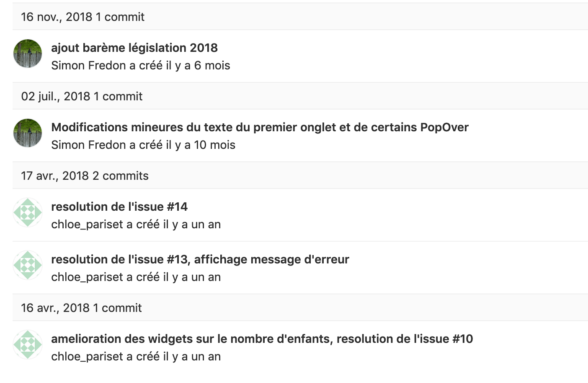
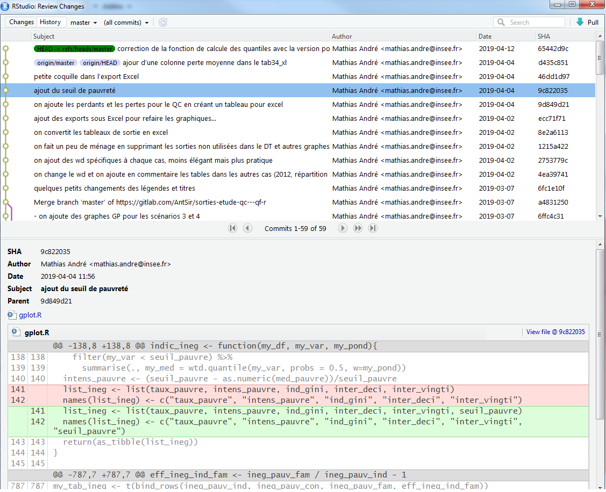
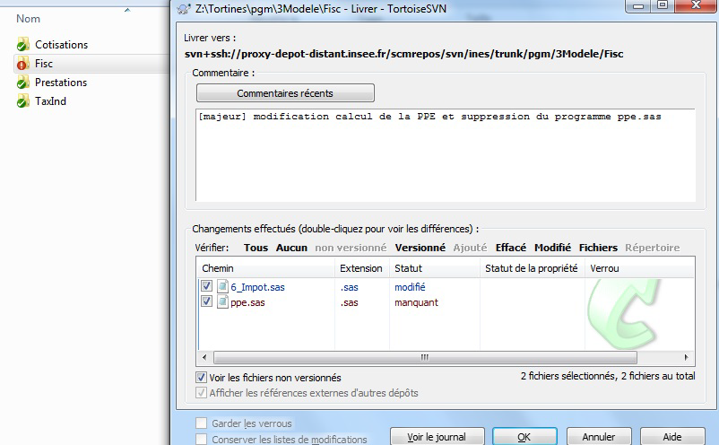
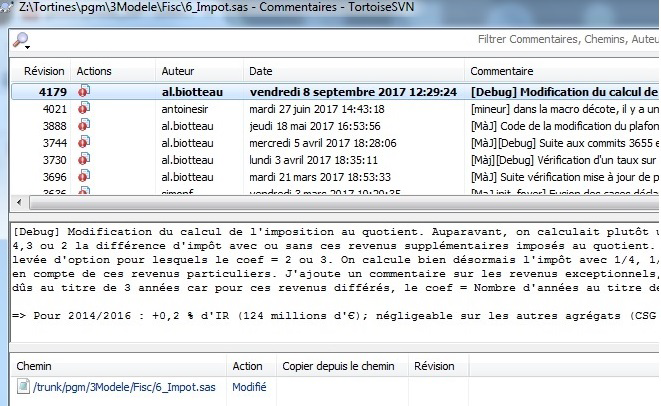
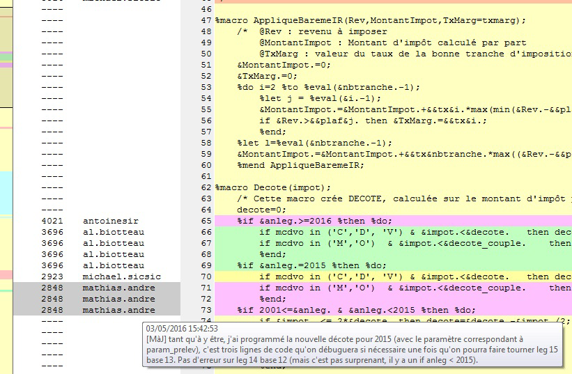
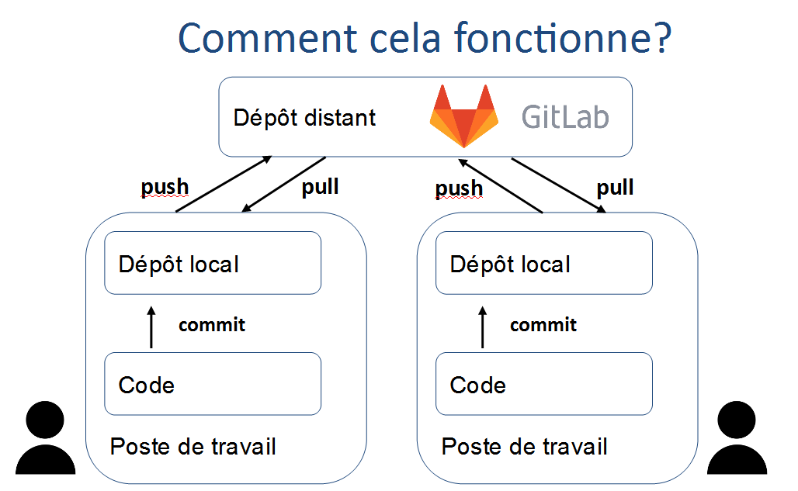
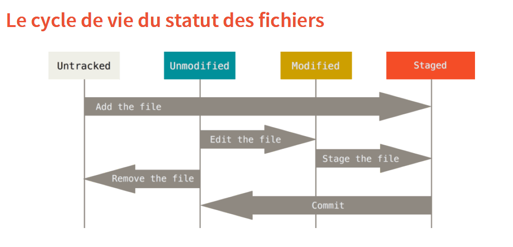
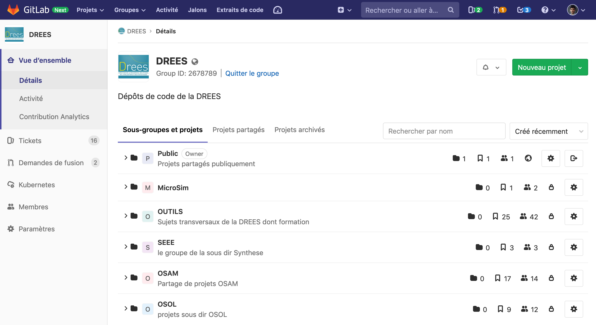
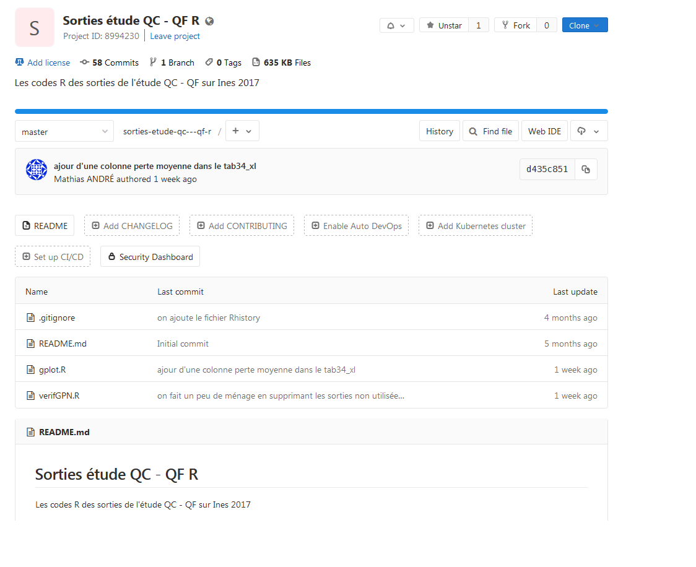

```{r setup, include=FALSE}
knitr::opts_chunk$set(echo = TRUE, eval = FALSE)
```


# Pourquoi utiliser la gestion de version ?

Nos travaux statistiques évoluent constamment (productions annuelles, nouvelles enquêtes, etc.) et nous travaillons souvent à plusieurs. En outre, nous avons également un besoin d'un archivage détaillé et facilement accessible pour nos chaînes de traitement. 

Tous les statisticiens se sont déjà demandé (ou à leurs collègues) : 

* quelle était la bonne version d'un programme 
* qui était l'auteur d'un bout de code en particulier
* si un changement était important ou juste un essai
* etc.

**Exemple d'une organisation de fichiers à l'ancienne**
{width=100%}  

Il existe un outil informatique très puissant afin de répondre à tous ces besoins : la gestion de version (*version control system* (VCN) en anglais). Ses avantages sont incontestables et permettent de facilement :

* enregistrer l'historique des modifications d'un ensemble de fichiers 
* revenir à des versions précédentes d'un ou plusieurs fichiers
* rechercher les modifications qui ont pu créer des erreurs
* partager ses modifications et récupérer celles des autres
* proposer des modifications, les discuter, sans pour autant modifier la dernière version existante
* identifier les auteurs et la date des modifications

En outre, ces outils fonctionnent avec tous les langages informatiques (texte, R, Python, SAS, LaTeX, Java, etc.) car reposent sur la comparaison des lignes et des caractères des programmes.

## Conserver et archiver du code

Une des principales fonctionnalités de la gestion de version est conserver l'ensemble des fichiers de façon sécurisée et de proposer un archivage structuré des codes. Les fichiers sont stockés dans un dépôt, qui constitue le projet (par exemple, le modèle Ines).

Tout repose dans la gestion et la présentation de l'historique des modifications. Chaque modification (ajout, suppression ou changement) sur un ou plusieurs fichiers est identifiée par son auteur, sa date et un bref descriptif. Chaque changement est donc unique et aisément identifiable quand ils sont classés par ordre chronologique.

**Un exemple d'historique d'un projet sur GitLab**
{width=100%}  

**Un exemple d'historique d'un projet via RStudio**
{width=100%} 

Sur son poste de travail, il n'y a plus des dizaines (centaines ?) de codes organisés à la main. Au sein du dépôt, tout l'historique est stocké et accessible rapidement. Si on souhaite travailler sur la dernière version des programmes (ou sur une ancienne version spécifique), il n'y a plus besoin de conserver les autres fichiers car ils sont dans l'historique du projet.

## Travailler efficacement en équipe

Le deuxième avantage de la gestion de version représente une immense amélioration du travail en équipe sur des codes en commun. Que ce soit au sein d'un modèle cogéré (Ines, Destinie, etc.), de gros projets (Nautile) ou de chaînes de traitement récurrentes (enquête emploi, comptes trimestriels, etc.), la collaboration est courante lors des travaux statistiques. La gestion de version permet collaborer simplement et avec méthode. Elle permet de:

* travailler en parallèle et fusionner facilement du code
* partager une documentation des programmes grâce :
 + aux commentaires des modifications
 + à la possibilité d'une documentation commune et collaborative
* trouver rapidement des erreurs et en diffuser rapidement la
correction

**Exemple de détails d'une modification**
{width=100%} 

L'usage individuel, c'est-à-dire seul sur son projet, permet aussi de "travailler en équipe avec soi même" car il permet de retrouver des mois plus tards le contenu et le contexte des modifications. Cela est notamment précieux lors des changements de poste.


## Améliorer la qualité des codes

Le fonctionnement du gestion de version reposant sur l'archivage structuré des modifications et les commentaires les accompagnant renforce la qualité des programmes informatiques. Ils sont plus documentés, plus riches et mieux structurés. 

Quand il s'agit de modèles statistiques, ou de chaînes de traitement statistique, constitués de nombreux programmes, la gestion de version permet :

* l'amélioration la qualité des modèles par des méta-données riches, 
* un gain de place pour stocker les historiques
* leur diffusion simplifiée et harmonisée. 

Lors de l'ouverture des modèles, leur diffusion publique correspond aux standards des communautés de logiciels libres et aux usages recommandés pour documenter des programmes informatiques. Cela permet aux utilisateurs ou aux agents découvrant des chaînes de traitement de mieux s'approprier les programmes.

## Usage quotidien : un exemple avec le modèle Ines

Le modèle Ines est co-développé par l'Insee et la Drees ainsi que la Cnaf depuis 2018. Sous licence libre, il est disponible en *open-source*. Il est organisé dans une forge qui regroupe le code, un wiki, une documentation, un forum et différents outils collaboratifs. Les utilisateurs y ont accès via la (plateforme Adullact)[https://adullact.net/projects/ines-libre]. Le dépôt regroupe donc les programmes et historique des modifications et les archives des différentes versions ('Ines 2018' par exemple).

Les chargés d'étude ont une copie locale du projet sur leur poste de travail. Les changements sont mis à jour et disponible en temps réel.

**Envoi d'une modification avec TortoiseSVN : commit**

{width=100%}   

**Historique d’un fichier ou dossier : log**
{width=100%}  

**Recherche efficace une erreur : blame**
{width=100%}  


## Avec ou sans gestion de versions

Le tableau suivant compare les usages au temps (pré-historique ?) de la programmation sans gestion de version avec les modes de travail si on y a recours.

|                      |      Avant            |  Gestion de version  |
| :------------------- | :-------------------: | :------------------: |
|Archivage             | à la main             | automatique          |
|Envoi de modification | mail, dossier partagé | code partagé         |
|Fusion de code        | copié-collé           | simple, sûr          |
|Versions du modèle    | dossiers archivés     | historique riche     |
|Gestion des erreurs   | à la main             | méthodique           |
|

Que ce soit au sein d'un travail collaboratif en équipe ou sur ses propres projets individuels, notre temps est consacré à la programmation réellement utile. L'organisation du travail est efficace grâce :
* aux améliorations rapides des codes
* au partage efficace des tâches
* à la recherche puissante des erreurs
* à un archivage géré automatiquement avec des méta-données
* à des outils généralisés et documentés en ligne.

C'est donc le meilleur moyen de partager du code (entre équipes internes,
lors des changements de poste, pour l'archivage, lors de l'ouverture au libre, etc.). Ces outils viennent de l'informatique et de la création du logiciel. Les traitements statistiques sont des chaînes informatiques et sont donc pleinement adaptés pour être traités avec les outils de gestion de version.

# Des bases de GIT 

Les deux langages de gestion de version les plus répandus sont GIT et SVN. L'Insee a utilisé SVN pendant un temps mais privilégie GIT maintenant.

GIT est open source, gratuit et très répandu. Une très vaste documentation est disponible en ligne ou les forums d'entraide de type 'stackoverflow' (voir par exemple le tag ['GIT'](https://stackoverflow.com/questions/tagged/git) ). Sur la plateforme 'github', il y a un rapide tutoriel en ligne : http://try.github.io/


Genèse de Git
1991 – 2002 : Noyau Linux géré via des patchs et des archives
À partir de 2005 : Linus Torvalds développe un successeur, objectifs :
– vitesse
– simplicité
– développements non linéaires (branches)
– compacité des données

Centralisé (SVN) vs distribué (GIT) : avantage de GIT sont la sécurité (dépôts copiés localement) et la  rapidité. Contrairement à SVN pour lequel il faut être connecté à un serveur, il n'est pas besoin d'être connecté avec GIT : on transmet ses modifications quand on le souhaite ou peut, cela facilite le travail distant.

GIT est directement intégré dans l’interface RStudio


## Le B.A-BA
 

[documentation en ligne](https://git-scm.com/doc) `GIT` 

[livre en français](https://git-scm.com/book/fr/v2)

{width=100%} 

{width=100%} 

{width=100%} 

Les programmes s’organisent sur un répertoire distant commun
(repository) et sont manipulés sur les postes indidivuels dans des
dossiers locaux (working directory).
Les trois commandes principales :
* diff : fichiers modifiés, ajoutés ou supprimés
* staging area puis commit : sélection et validation des modifications
* push et pull : mise à jour du local par rapport au distant (et
réciproquement)

Inspecter les modifications : git diff

Soumettre des modifications : git commit

Le message de validation est très important
– décrit brièvement les modifications contenues dans le commit
– importance de l’homogénéité des modifications contenues dans un commit
– à l’attention des autres développeurs

push 

pull


Mieux vaut éviter les conflits que les résoudre
Valider souvent
– des petits lots de modifications homogènes
Préférer de petits fichiers
– bien découper les classes selon leurs responsabilités
Communiquer avec les autres membres de l’équipe
– dire sur quoi on travaille
– bien prévenir en cas de refactoring important
Mettre à jour sa copie locale régulièrement

## Quelques éléments de GIT avancé

Création de branches pour développer de longs projets, en
parallèle, sans perturber le dépôt commun : git branch
* Fusionner des projets (branches) : git merge
* Conserver des fichiers en privé : git ignore
* Sauvegarder une version figée : git tag
En savoir plus : https://git-scm.com/.

retour en arrière dans l'historique

Qui a modifié en dernier une ligne donné dans un fichier donné ? git blame 

Fusion de branches
Rebasage
Réécriture de l'historique


Pour aller plus loin :

https://romain-warnan.github.io/git-au-quotidien 


# Utiliser Gitlab, plateforme de partage de code 

Gitlab est une plateforme facilitant l’utilisation de git, qui permet de travailler de façon collaborative dans le développement informatique, par équipe ou non, pour un code qui évolue constamment.

Inspecter un dépôt distant : onglet branches, commits etc

[documentation](https://docs.gitlab.com/ee/user/index.html)  `GitLab`

## Un réseau social du code

cf. Drees : groupes publics et privé, profils, pages projet etc.

{width=100%} 


## Principales fonctionnalités

{width=100%} 

* Explorations du code

* Tickets

* Fusion de branches


# Configurer un projet GIT avec Rstudio à l'Insee


    