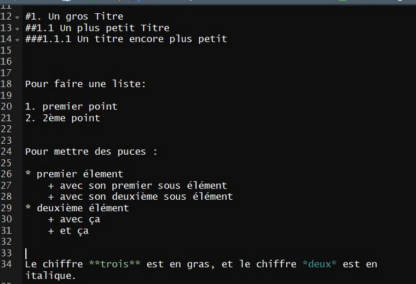
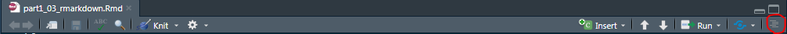
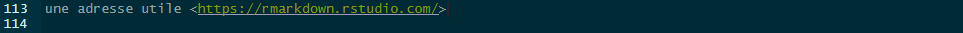
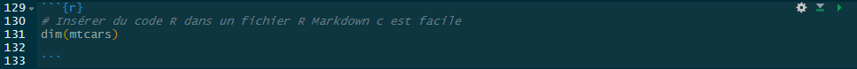

```{r setup, include=FALSE}
knitr::opts_chunk$set(echo = FALSE)
```

```{r, echo=FALSE, message=FALSE}
library(knitr)
library(dplyr)
library(questionr)
```


# Présentation générale de R Markdown

## C'est quoi
* Un mélange de R et de Markdown. 
* Markdown est un système d'édition doté d'une syntaxe simplifiée souvent utilisé pour faire de la documentation de projet sous forme de fichier .md
* Un fichier R Markdown est suffixé .Rmd

## Que peut produire `R markdown` ?
* des rapports en pdf, en html
* des présentations sous forme de slides
* ...


## Comment fonctionne `R markdown` ? 

### La philosophie

R Markdown fonctionne : 

* différemment d’Office. C’est un éditeur qui n'est pas WYSIWYG (What you see is what you get) : le fichier est composé de texte brut. C'est une fois le fichier compilé que la mise en forme peut être visualisée dans le fichier de sortie. 
* en dissociant le fond de la forme : 
   * séparation entre le texte et sa mise en forme. 
   * les illustrations sont générées dynamiquement à partir des blocs de code R intégrés, ou insérées par lien. 

## Pourquoi utiliser `R markdown`, quels sont ses avantages ? 
* la dissociation entre le fond de la forme, ce qui
    * allège les mises à jour ou correctifs
    * donne de la visibilité au code ayant généré les résultats et illustrations
* la possibilité de commenter l'ensemble du document, ce qui
    * permet de détailler un résultat spécifique, d'expliquer les choix d'analyse faits
    * facilite le suivi de l'analyse, ou son appropriation par une personne externe à l'équipe projet (un membre intervenant ponctuellement à titre d'expert sur un sujet, ou encore un nouveau membre venu en renfort)
    * pour commenter : 
        * Dans le texte, pour activer/désactiver un commentaire c'est facile : **ctl + Maj + c**
            * 
        * à l'intérieur des blocs de code R, les commentaires se font comme dans un script R
    
* R Mardown a été pensé pour permettre une prise en main rapide et simple. Plus simple que le langage Html.
* combiné au versionning, les modifications successives apportées au document sont facilement traçables, ce qui permet 
    * maitriser l'évolution du document, par exemple sur la succession de corrections, apportées tout au long d'un circuit de relecture.
    * sans empiler les fichiers
    
    

    


# Avant de commencer

## Les points de vigilance lorsqu'on débute 
* R Markdown est un outil collaboratif en plus, son utilisation nécessite l'adhésion de l'ensemble de l'équipe. 
* L'ensemble des contributeurs doit donc s'approprier à la fois ses principes et sa syntaxe (hors contexte collaboratif, ses avantages demeurent pour un document réalisé seul).
* correcteur automatique de document. Pour le paramétrer en français, aller dans le menu `Tools > Global Options > Spelling` et dans le menu déroulant _Main dictionary language_, sélectionner _Français_.
* actuellement pas d'outils disponible pour intégrer automatiquement la charte graphique Insee dans un document Markdown.
* les outils ne remplacent pas la communication dans l'équipe projet. La production collaborative d'un document R Markdown nécessite de se mettre d'accord sur sa structure. Il est donc nécessaire de faire des points d'équipe. Pour vous aider, il existe un chat Insee https://rocket-chat.stable.innovation.insee.eu)


## Les conseils lorsqu'on débute
* viser la reproductibilité : le document doit pouvoir être généré par l'ensemble de l'équipe projet.
    * tout comme pour un script R, les ressources (images, données, ...) doivent être appelées via des chemins d'accès relatifs au dossier du projet. Donc pas de chemin complet.
        * **A ne pas faire : ** d:/projets gitlab/couverturenumerique/donnees/depReg16.txt
        * **mais faire plutôt : ** ./donnees/depReg16.txt
    
    * l'emplacement de ces ressources doit respecter une arborescence connue et utilisée par tous.

# Produire son premier document

1. **Créer** un nouveau fichier Rmarkdown.


2. Tester. **Saisir** du texte en l'habillant de mises en formes : 
* titres de niveaux différents avec **#** 
* liste avec *
* liste ordonnée avec **1.**
* mise en italique en encadrant avec *
* mise en gras en encadrant avec **


3. **Tricoter** (knit) pour visualiser le résultat (avec la mise en forme) dans le l'onglet Viewer.


## Anatomie d'un document R Markdown

1. en-tête contenant les métadonnées du document. Elle est délimitée entre deux lignes de pointillés. 
    * au minimum : titre du document et format de sortie.
2. des blocs de code R (chunk) encadrés par les balises `
    * ces chunks peuvent être nommés
    * des options peuvent être spécifiées
    * en dessous de l'en-tête : un chunk de set up pour régler les options par défaut de tous les chunks
3. des blocs de texte brut
    * habillage (mise en forme) selon la syntaxe R markdown
* Texte et code R s'alternent à volonté     


## Syntaxe de base 

### Mise en forme de texte



Quand des niveaux de titre ont été définis, une table des matières est générée automatiquement.


### Insérer un lien hypertexte




une adresse utile <https://rmarkdown.rstudio.com/>


En remplaçant l'url par un alias


une adresse utile [ici](https://rmarkdown.rstudio.com)

### Insérer une image


### Exercice 1

**Créer un fichier R Markdown produisant la sortie suivante :** 


### Insérer du code R : 3 options
#### 1. Insertion par délimiteur **`** (alt Gr + 7)
Pour insérer le résultat d'une instruction simple, à l'intérieur d'un texte : 


* Exemple 1 : Voici le résultat de l'instruction R dim(mtcar) : `r dim(mtcars)`

* Exemple 2 : 
    * On peut aussi insérer la date du jour comme ceci : `r format (Sys.time(), '%d %B, %Y')`.
    
    * Ou comme cela : nous sommes le jour `r format (Sys.time(), '%d')`, du mois `r format (Sys.time(), '%B')` , de l'année `r format (Sys.time(), '%Y')`.

#### 2. Insertion d'un bloc de code R : chunks

Pour réaliser l'insertion de d'instructions moins élémentaires dans un fichier R Markdown, le code doit être délimité de la façon suivante :



```{r, message = FALSE}
# Insérer du code R dans un fichier R Markdown c est facile
dim(mtcars) 

```

* Par défaut, l'instruction demandée s'affiche, ainsi que le résultat.
* **Remarque importante** : à chaque compilation une nouvelle session R est lancée, vierge de tout objet créé. Les premiers blocs de code sont alors souvent dédiés au chargement des packages, à l'importation des données, au recodage.

* Raccourci clavier pour insérer un bloc de code R : **Ctrl + Alt + i**
* Remarque pratique : dans le cas du format de sortie Html, par défaut le fichier .html est créé. Ce dernier contient le résultat du code (mise en forme, illustrations), et peut être facilement transmis.

* Plusieurs options sont disponibles : 
    
    * **echo** mis à FALSE permet de ne pas afficher l'instruction R
    * **eval** mis à FALSE permet de ne pas exécuter le code du chunk
    * **message** mis à FALSE permet de ne pas afficher les messages d'information
    * **warning** mis à FALSE permet de ne pas afficher les messages de warning
    * **cache** mis à TRUE permet de mettre le résultat du chunk en cache. En effet, il est à la fois coûteux et inutile d'exécuter certaines instructions R à chaque fois (importation de tables par exemple). Dans ce cas, au moment d'une première exécution, le résultat d'un chunk peut être mis en cache, c'est à dire en mémoire grâce à l'option **cache = TRUE**. Attention si vous utilisez le cache : vous ne devez jamais le pousser sur GitLab et donc ajouter la ligne `*_cache/` au fichier `.gitignore` de votre projet.

    
#### 3. Appeler un script

Afin de mieux organiser son code, un même projet peut avoir plusieurs scripts. Même s'il est possible d'utiliser la fonction `source()` dans un document R Markdown, cette pratique n'est pas recommandée. Dans ce cadre, il est préférable d'utiliser l'option `code` pour le chunk.

Voici un exemple :

~~~markdown
`r ''````{r, message=TRUE, echo=TRUE, code=readLines("./pgm/librairies.R", encoding="UTF-8")}
`r ''````
~~~

```{r, message=TRUE, echo=TRUE, code=readLines("./pgm/librairies.R", encoding = "UTF-8")}
```


### Insérer de beaux tableaux

La fonction **kable** du package `knitr` permet très facilement d'améliorer l'affichage de tableaux.

Exemple avec le jeu de données Insee `histoires de vie 2003 (hdv2003)` inclus directement dans la package **questionr**.

* Sans fonction kable

```{r, echo=TRUE, cache = TRUE}
data(hdv2003)
hdv2003 %>% 
    group_by(bricol, cuisine) %>% 
    summarise(sum = round(sum(poids))) -> res;res
```

* Avec l'instruction kable : 

```{r, echo=TRUE}
kable(res, caption = "hdv2003 - bricol x cuisine - afichage avec la fonction kable")

```

### Exercice 2

Modifier le fichier précédent en ajoutant une instruction R de votre choix.
Vous pourrez par exemple utiliser les données mtcars.

## Boite à outils 

* Consulter la **Cheat sheet** R Markdown disponible sur le site de R Studio **https://rstudio.com**


* **CodiMD** : interface disponible sur la plateforme innovation
[lien](https://hackmd.beta.innovation.insee.eu)

Permet de visualiser en direct le résultat


># Résumé
>* Réaliser un document R Mardown est simple, mais la visualisation du résultat requiert une étape de compilation du fichier .Rmd
>* Un fichier .Rmd mélange :
>    * du texte balisé selon la syntaxe Markdown
>    * des bouts de code R
>* Le résultat d'une instruction R peut soit, s'insérer directement dans le texte, soit être contenu dans un bloc de code appelé chunk.


